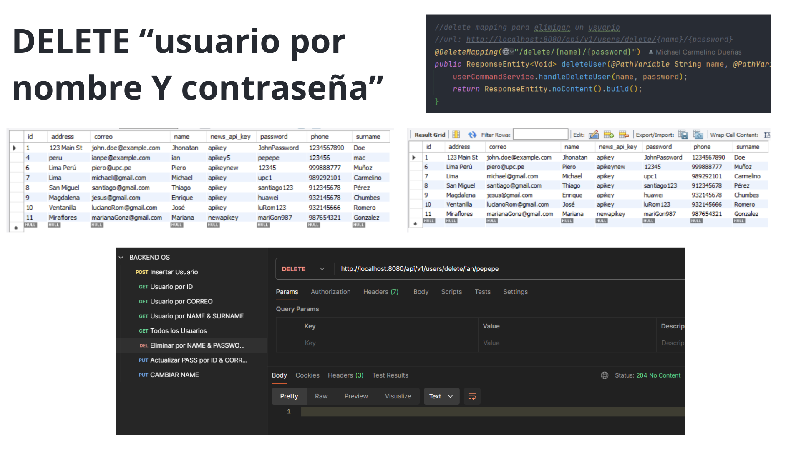
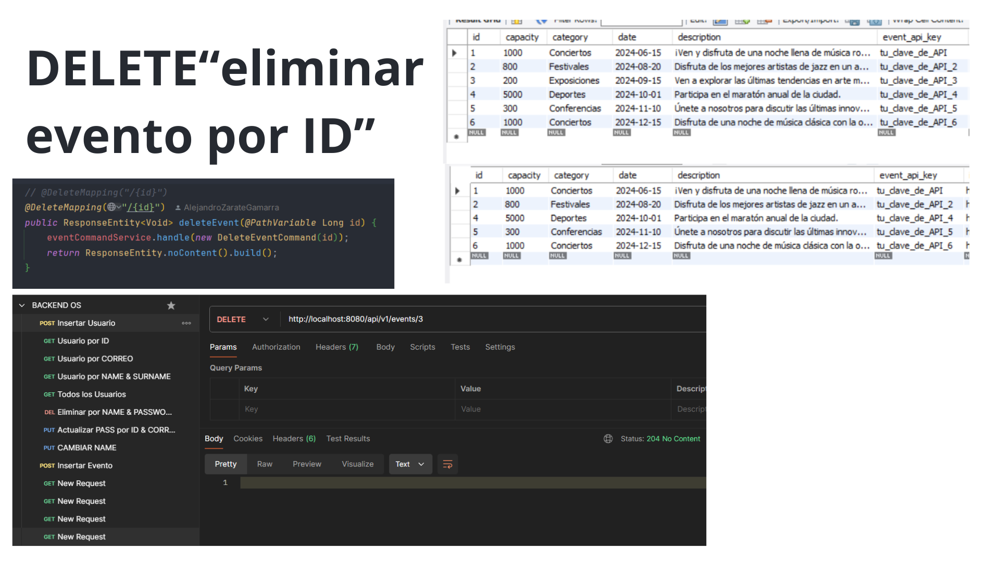

# Universidad Peruana de Ciencias Aplicadas

## *Ingeniería de Software*
**Quinto Ciclo**

**Desarrollo de Aplicaciones Open Source**

**Sección:** WS52

**Profesor:** Elio Jefferrson Navarrete Vilca

---

## Informe de TB2

## Grupo 2

**Startup:** Eventec

**Producto:** MyEvent

**Relación de Integrantes:**

Michael Stefano Carmelino Dueñas - U202212760

Luis Mario Gonzales Anaya - U20201C585

Piero Jhoynner Muñoz Salcedo - U202224446

Luis Alejandro Zárate Gamarra  - U20181H198

Alessandro Joaquin Bernardo Eusebio  - U202113640

**Junio - 2024** 

<h2>Registro de versiones del informe</h2>

<table style="width: 100%;">
    <tr>
        <th>Versión</th>
        <th>Fecha</th>
        <th>Autor</th>
        <th>Descripción de la modificación</th>
    </tr>
    <tr>
        <td><strong>TB1</strong></td>
        <td>10 de abril de 2024</td></td>
        <td>
            <ul>
                <li>Michael Stefano Carmelino Dueñas</li>
                <li>Luis Mario Gonzales Anaya</li>
                <li>Piero Jhoynner Muñoz Salcedo</li>
                <li>Luis Alejandro Zárate Gamarra</li>
                <li>Alessandro Joaquin Bernardo Eusebio</li>

</ul>
        </td>
        <td>Se formuló una solución para abordar la oportunidad identificada y se procedió a desarrollar los primeros cinco capítulos del proyecto, desde la Introducción hasta la Implementación del Producto, Validación y Despliegue. De esta manera, hemos completado la fase inicial del proyecto según la estructura indicada en este informe.</td>
    </tr>
    <tr>
        <td><strong>TP</strong></td>
        <td>3 de mayo de 2024</td></td>
        <td>
            <ul>
                <li>Michael Stefano Carmelino Dueñas</li>
                <li>Luis Mario Gonzales Anaya</li>
                <li>Piero Jhoynner Muñoz Salcedo</li>
                <li>Luis Alejandro Zárate Gamarra</li>
                <li>Alessandro Joaquin Bernardo Eusebio</li>

</ul>
        </td>
        <td>Se implementaron cambios basados en los comentarios recibidos en la retroalimentación de la TB1. Estos cambios se reflejaron en las secciones de análisis de la problemática, registros y análisis de usuario. Además, se definieron épicas globales e historias técnicas relacionadas con el backend. En cuanto al desarrollo, se completó el segundo sprint, centrándose en la implementación inicial del frontend de la aplicación. Esta implementación proporciona una vista general para el usuario, con todas las disposiciones y validaciones necesarias para la administración y gestión completa de los procesos principales de la aplicación.</td>
    </tr>
    <tr>
        <td><strong>TB2</strong></td>
        <td>8 de junio de 2024</td></td>
        <td>
            <ul>
                <li>Michael Stefano Carmelino Dueñas</li>
                <li>Luis Mario Gonzales Anaya</li>
                <li>Piero Jhoynner Muñoz Salcedo</li>
                <li>Luis Alejandro Zárate Gamarra</li>
                <li>Alessandro Joaquin Bernardo Eusebio</li>

</ul>
        </td>
        <td>Se replanteó la presentación para la interfaz del cliente siguiendo las pautas deifinidas en la retroalimentación. Asimismo, se desarrolló de forma parcial funciones del backend consumidas directamente en el frontend.</td>
    </tr>
    <tr>
        <td><strong>TF</strong></td>
        <td>26 de junio de 2024</td></td>
        <td>
            <ul>
                <li>Michael Stefano Carmelino Dueñas</li>
                <li>Piero Jhoynner Muñoz Salcedo</li>
                <li>Luis Alejandro Zárate Gamarra</li>
                <li>Alessandro Joaquin Bernardo Eusebio</li>

</ul>
        </td>
        <td>Se realizó la implementación final del backend y frontend. Se validaron los bounded context necesarios según el replanteamiento elegido para poder considerar los objetivos principales de calificación.</td>
    </tr>
    
</table>
<h1 style="color: red;">STUDENT OUTCOME</h1>

<table style="width: 100%;">
    <tr>
        <th>Criterios específicos</th>
        <th>Acciones realizadas</th>
        <th>Conclusiones</th>
    </tr>
    <tr>
        <td><strong>Comunica oralmente sus ideas y/o resultados con objetividad a público de diferentes especialidades y niveles jerárquicos, en el marco del desarrollo de un proyecto en ingeniería</strong></td>
        <td>
            <ul style="list-style-type: none;">
                <li><strong>Michael Stefano Carmelino Dueñas</strong></li>
                

                    <strong>TB1</strong>
                    

                        En el proyecto, las parte que realicé fue la elabolaración del To-Be Scenario Mapping, el User Stories y mis entrevistas que realizar, una a cada segmento objetivo,
                        desarrollé tambíen el product backlog y la pogramación del Landing Page, demostrando la coordianción y liderazgo que tengo tanto como para poder realizar reuniones
                        separación de partes y un trabajo igualitario para todos.
                    

                <strong>TP</strong>
                    
Durante el proyecto, logré la corrección de ciertos apartados del informe, además de agregar la tabla de Historias Técnicas que se requería para este entregable. En el apartado de Angular, logré realizar
                    la interfaz de inicio de sesión y de registro, con sus respectivas funcionalidades y almacenamiento de los datos en un json. Coordiné reuniones con mis compañeros para la repartición en el tema de correciones, dando a conocer mis habilidades de coordinación y comunicación con el equipo.
                    

                <strong>TB2</strong>
                    
Durante el proyecto, logré la corrección de ciertos apartados del Front-end que nos pidieron hacer después de la entrega del TP, En el apartado del Back-end, me encargué de la creación de la tabla User y las peticiones que se podían realizar en el Postman, tanto como Post, Get, Delete y Put. Logré realizar cambios en el informe y organización de reuniones para verificar los procesos de mis compañeros
                    

                <li><strong>Luis Mario Gonzales Anaya</strong></li>
                

                    <strong>TB1</strong>
                    

                        En el proyecto, me encargué de comunicar de forma clara y objetiva conceptos técnicos a audiencias diversas. Esto implicó presentar User Personas, el User Task Matrix y entrevistar a clientes clave. Además, desarrollé Diagramas de Clases y de Base de Datos, demostrando habilidades de comunicación efectiva en un contexto de ingeniería.
                    

                    <strong>TB2</strong>
                    

                   En el proyecto, mi responsabilidad principal fue desarrollar y comunicar los aspectos técnicos relacionados con el acceso a la membresía premium. Esto implicó diseñar y programar la interfaz de usuario (UI) y la experiencia de usuario (UX) específica para la membresía premium. También fui responsable de explicar la lógica de acceso y sus beneficios.
                    

                

                <li><strong>Piero Jhoynner Muñoz Salcedo</strong></li>
                

                    <strong>TB1</strong>
                    

En el marco del desarrollo del landing page de MyEvent y la creación de wireframes y mockups, nuestro equipo ha trabajado en colaboración para garantizar que la interfaz y el diseño sean intuitivos y atractivos para nuestros usuarios. Al elaborar los wireframes, nos enfocamos en definir la estructura y disposición de los elementos clave, como la ubicación estratégica de los botones de llamada a la acción, la distribución del contenido y la navegación fluida. Esto nos ha permitido visualizar de manera precisa cómo se organizará la información y cómo interactuarán los usuarios con la página.
                  

                 <strong>TP</strong>
                    
Durante el proyecto, participé activamente en sesiones de trabajo en equipo donde compartí actualizaciones, discutí ideas y coordiné acciones con el equipo y partes interesadas. Mi habilidad para comunicar de manera efectiva y adaptar el mensaje según la audiencia facilitó la comprensión y colaboración en el proyecto.

                 

                    <strong>TB2</strong>
                    
En el proyecto, mi responsabilidad principal fue desarrollar y comunicar los aspectos técnicos relacionados con el acceso a la membresía premium. Esto implicó diseñar y programar la interfaz de usuario (UI) y la experiencia de usuario (UX) específica para la membresía premium. También fui responsable de explicar la lógica de acceso y sus beneficios a diversas audiencias, demostrando habilidades de comunicación efectiva en un contexto técnico.

              
   
            

                <li><strong>Luis Alejandro Zárate Gamarra</strong>
                  

                    <strong>TB1</strong>
                    
De acuerdo al objetivo en las etapas de análisis de competidores y desarrollo de estrategias se mantuvo una comunicación efectiva con los diversos usuarios involucrados en las etapas de investigación, análisis y estudio. Asimismo, se presentaron los resultados de forma clara en las secciones de los empathy maps y as-is scenario mapping. 

                    <strong>TP</strong>
                    
Durante el proyecto, logré comunicar mis ideas y resultados de manera objetiva a diferentes audiencias. En las etapas de corrección, desarrollo, implementación y despliegue mantuve una comunicación efectiva con usuarios de diversas especialidades y niveles jerárquicos. Presenté los resultados de manera clara en secciones como los apartados de visualización principales, adaptándome a las necesidades de cada grupo. Este enfoque contribuyó al éxito general del proyecto.

                    <strong>TB2</strong>
                    
Durante el proyecto, logré comunicar mis ideas y resultados de manera objetiva a diferentes audiencias. En las etapas de replanteo, desarrollo, implementación y despliegue mantuve una comunicación efectiva con usuarios de diversas especialidades. Presenté los resultados de manera clara en secciones como los apartados de visualización principales, adaptándome a las necesidades de cada grupo. Este enfoque contribuyó al éxito general del proyecto.
 
                    <strong>TF</strong>
                    
En la fase final del desarrollo del proyecto, logré comunicar mis ideas y resultados de manera objetiva a diferentes audiencias. En las etapas de desarrollo, implementación y despliegue; mantuve una comunicación efectiva con usuarios de diversas especialidades. Presenté los resultados de manera clara en secciones como la realización de la logica de negocio para los eventos principales. Este enfoque contribuyó al éxito general del proyecto.
                    
                  

                </li>   
                <li><strong>Alessandro Joaquin Bernardo Eusebio</strong>
                  

                    <strong>TB1</strong>
                    
Durante las fases de elaboración de los journey maps y análisis de entrevistas al segmento organizador de eventos, se mantuvo una comunicación fluida y efectiva con los diversos usuarios involucrados en estas actividades. Se realizaron entrevistas exhaustivas para comprender las necesidades y expectativas del segmento objetivo, y los resultados se presentaron de manera clara y concisa en los journey maps y en el análisis correspondiente. Además, durante la elaboración del prototipo de la aplicación web y la creación del capítulo 5 sobre la implementación del producto, se continuó esta comunicación eficaz, asegurando que los usuarios estuvieran involucrados en el proceso y que los resultados se presentaran de forma accesible y comprensible en el prototipo y en el documento final.

                    <strong>TP</strong>

La capacidad para comunicar de manera escrita ideas y resultados de forma objetiva fue fundamental en el proceso de desarrollo del proyecto de elaboración de flujos para la aplicación web de eventos y venta de entradas en Angular. A través de la redacción de documentación técnica detallada, informes de progreso y correos electrónicos claros y concisos, se logró mantener a todos los miembros del equipo informados y alineados con los objetivos del proyecto.

                    <strong>TB2</strong>

Durante el desarrollo del backend para MyEvent, el equipo demostró una habilidad destacable para comunicar oralmente sus ideas y resultados de manera objetiva a un público diverso, incluyendo personas de diferentes especialidades y niveles jerárquicos. Este éxito se reflejó en la presentación del backend desarrollado y desplegado, así como en la base de datos implementada con IntelliJ. La capacidad de explicar técnicamente el proceso de realizar un POST exitoso a la base de datos, y la adaptación del frontend para integrarse con el backend, permitió que todos los involucrados comprendieran el progreso y los desafíos del proyecto, facilitando la toma de decisiones y la colaboración interdisciplinaria.

                    <strong>TF</strong>

Durante el desarrollo del backend para MyEvent, el equipo mostró una habilidad sobresaliente para comunicar sus ideas y resultados de manera objetiva a un público diverso, que incluía personas de diferentes especialidades y niveles jerárquicos. Este éxito se evidenció en la presentación del backend desarrollado y desplegado, así como en la implementación del sistema de gestión de identidades y accesos (IAM) para las funcionalidades de login y sign up. La capacidad del equipo para explicar técnicamente el proceso de realizar un login y sign up exitoso utilizando IAM, y la integración del frontend con el backend, permitió que todos los involucrados comprendieran el progreso y los desafíos del proyecto. Esta comunicación clara y efectiva facilitó la toma de decisiones y la colaboración interdisciplinaria, asegurando el éxito del proyecto y la satisfacción de los stakeholders..

                </li> 
            </ul>
                </li>
            </ul>
        </td>
        <td>
          
        
            <strong>TF</strong>

  A lo largo de este proyecto, nuestro equipo, compuesto por cuatro integrantes, se embarcó en el ambicioso desafío de desarrollar un producto web utilizando Angular. Desde el inicio, llevamos a cabo una exhaustiva investigación para fundamentar sólidamente nuestra solución al problema identificado. Este proceso incluyó un análisis detallado de los casos que afectan a dos segmentos clave: los clientes y los organizadores de eventos.
Nos sumergimos en la comprensión de las necesidades y desafíos enfrentados por estos dos segmentos, lo cual nos permitió obtener una visión integral de los problemas existentes. Esto fue fundamental para desarrollar una solución efectiva y orientada a satisfacer las demandas de ambos grupos de manera simultánea.

Siguiendo las mejores prácticas de desarrollo de software, implementamos un enfoque iterativo y colaborativo en el desarrollo de la solución. Esto implicó la creación de diferentes iteraciones del producto, donde cada versión fue refinada y mejorada en respuesta a los comentarios y las necesidades emergentes de nuestros usuarios.

La dedicación y el esfuerzo continuo de nuestro equipo han resultado en un producto que no solo aborda las necesidades iniciales identificadas, sino que también se adapta y evoluciona conforme se presentan nuevos desafíos y oportunidades. Estamos orgullosos de los logros alcanzados y confiamos en que esta experiencia ha fortalecido nuestras habilidades y conocimientos, preparándonos para enfrentar futuros proyectos con la misma determinación y capacidad de adaptación.

Agradecemos el apoyo y la retroalimentación recibida a lo largo de este proyecto, y esperamos que nuestra solución continúe aportando valor tanto a los clientes como a los organizadores de eventos.

        </td>
        <tr>
            <td><strong>Comunica en forma escrita ideas y/o resultados con objetividad a público de diferentes especialidades y niveles jerárquicos, en el marco del desarrollo de un proyecto en ingeniería.</strong></td>
            <td>
                <ul style="list-style-type: none;">
                <li><strong>Michael Stefano Carmelino Dueñas</strong>
                

                    <strong>TB1</strong>
                    

En el contexto del proyecto, desempeñé un papel fundamental en la elaboración del To-Be Scenario Mapping, la creación de User Stories y la realización de entrevistas a cada segmento objetivo. Además, fui responsable del desarrollo del product backlog y la programación del Landing Page. Durante este proceso, demostré habilidades de coordinación y liderazgo al organizar reuniones, asignar tareas equitativamente y garantizar un trabajo colaborativo entre todos los miembros del equipo. La comunicación de estos avances se llevó a cabo de manera clara y objetiva, adaptando el lenguaje técnico según la audiencia y asegurando la comprensión tanto de expertos en la materia como de aquellos con menos experiencia en el área.

                    <strong>TP</strong>
                    
En el transcurso del proyecto, desempeñé un rol crucial al corregir secciones específicas del informe y al incorporar la tabla de Historias Técnicas necesaria para este entregable. En el área de Angular, me encargué de desarrollar la interfaz de inicio de sesión y registro, junto con sus funcionalidades correspondientes, incluyendo el almacenamiento de datos en formato JSON. Asimismo, coordiné reuniones con mis compañeros para distribuir las tareas de corrección, destacando así mis habilidades de coordinación y comunicación efectiva dentro del equipo. Esta comunicación se realizó de manera clara y objetiva, adaptando el lenguaje técnico según la audiencia para garantizar la comprensión generalizada de los avances y logros alcanzados durante el proyecto.

<strong>TB2</strong>
                    
En el contexto de proyecto, realicé un aporte importante en el apartado del Backend, ya que ahora tenmos los registros de los usuarios los cuales se quieran registrar en nuestro aplicativo web, durante el proceso, demostre mis habilidades de aprendizaje rápido y adaptación para los problemas que tuvimos durante las semanas.
                    

                </li>
                <li><strong>Luis Alejandro Zárate Gamarra</strong>
                

                    <strong>TB1</strong>
                    
De acuerdo al objetivo en las etapas de análisis de competidores y desarrollo de estrategias se mantuvo una presentación de la información óptima con los diversos usuarios involucrados en las etapas de investigación, análisis y estudio. Asimismo, se presentaron los resultados escritos de forma clara en las secciones de los empathy maps y as-is scenario mapping.

                    <strong>TP</strong>

Durante el proyecto, me enfoqué en comunicar mis ideas y resultados de manera objetiva a diversas audiencias. Durante las etapas de corrección, desarrollo, implementación y despliegue, mantuve una comunicación efectiva con usuarios de diferentes especialidades y niveles jerárquicos. Destaqué los resultados de forma clara en secciones clave, como los apartados de visualización principales, adaptándome a las necesidades específicas de cada grupo. Este enfoque contribuyó significativamente al éxito general del proyecto.

                    <strong>TB2</strong>

Durante el proyecto, me enfoqué en comunicar mis ideas y resultados de manera objetiva a diversas audiencias. Durante las etapas de replanteo, desarrollo, implementación y despliegue, mantuve una comunicación efectiva con usuarios de diferentes especialidades y niveles jerárquicos. Destaqué los resultados de forma clara en secciones clave, como los apartados de visualización principales, adaptándome a las necesidades específicas de cada grupo. Este enfoque contribuyó significativamente al éxito general del proyecto.

                    <strong>TF</strong>

Durante la finalización del proyecto, me enfoqué en comunicar mis ideas y resultados de manera objetiva a diversas audiencias. Durante las etapas de desarrollo, implementación y despliegue, mantuve una comunicación efectiva con usuarios de diferentes especialidades y niveles jerárquicos. Destaqué los resultados de forma clara en secciones clave, como la implementación de la lógica de negocio. Este enfoque contribuyó significativamente al éxito general del proyecto.

                </li>
                <li><strong>Luis Mario Gonzales Anaya</strong>
                    

                        <strong>TB1</strong>
                        
En el proyecto de ingeniería, comuniqué de manera objetiva y clara ideas y resultados por escrito a audiencias diversas. Esto incluyó la elaboración de documentos como User Personas, una User Task Matrix, informes de entrevistas y Diagramas de Clases y de Base de Datos. Mi habilidad para transmitir información técnica fue crucial para el éxito del proyecto.

                    

                    

                        <strong>TB2</strong>
                        

En el proyecto, me encargué de comunicar de forma escrita y objetiva los resultados del desarrollo del frontend para la reventa y compra de boletos a audiencias de diferentes especialidades y niveles jerárquicos. Esto incluyó la redacción de informes detallados sobre el diseño de la interfaz de usuario (UI), la experiencia de usuario (UX) y las medidas de seguridad implementadas. Además, documenté la lógica de los procesos de reventa y compra, demostrando habilidades de comunicación efectiva en un contexto de ingeniería.

                    

                </li>
                <li><strong>Alessandro Joaquin Bernardo Eusebio</strong>
            

                <strong>TB1</strong>
                

En el contexto del desarrollo de un proyecto en ingeniería, se llevó a cabo una comunicación objetiva y clara de ideas y resultados a audiencias de diversas especialidades y niveles jerárquicos. Durante la elaboración de los journey maps y el análisis de las entrevistas al segmento organizador de eventos, se transmitieron los hallazgos de manera precisa y sin sesgos, adaptando el lenguaje técnico según la audiencia. Del mismo modo, al desarrollar el prototipo de la aplicación web y al redactar el capítulo 5 sobre la implementación del producto, se mantuvo una comunicación que permitió la comprensión tanto a expertos en ingeniería como a aquellos con menos experiencia en el área, asegurando la objetividad y la claridad en la presentación de los resultados y las ideas.

            

            <strong>TP</strong>
                    
Durante el desarrollo del proyecto de elaboración de flujos para la aplicación web de eventos y venta de entradas en Angular, se evidenció una habilidad destacada para comunicar oralmente ideas y resultados de manera objetiva. Durante las reuniones de equipo y presentaciones ante diferentes especialidades y niveles jerárquicos, se demostró una capacidad sólida para transmitir información de manera clara y concisa. La comunicación fue efectiva tanto con colegas del equipo de desarrollo como con otros departamentos, lo que facilitó la comprensión y colaboración en el proyecto. 

                    <strong>TB2</strong>
                    
En el contexto del desarrollo del proyecto MyEvent, el equipo también mostró una excelente competencia en la comunicación escrita de ideas y resultados. Los informes y documentación elaborados reflejaron objetividad y claridad, permitiendo a los lectores de diferentes especialidades y niveles jerárquicos comprender fácilmente los avances del proyecto. La documentación detallada sobre el despliegue de la base de datos, la implementación del backend, y la integración con el frontend, aseguró que todas las partes interesadas estuvieran al tanto del progreso. Esta habilidad para comunicar de manera escrita fue esencial para mantener la coherencia y alineación del equipo durante el desarrollo del proyecto, contribuyendo significativamente a su éxito. 

                    <strong>TF</strong>
                    
En el contexto del desarrollo del proyecto MyEvent, el equipo también demostró una excelente competencia en la comunicación escrita de ideas y resultados. Los informes y la documentación elaborados reflejaron objetividad y claridad, permitiendo a lectores de diferentes especialidades y niveles jerárquicos comprender fácilmente los avances del proyecto. La documentación detallada sobre el despliegue del sistema de gestión de identidades y accesos (IAM) para las funcionalidades de login y sign up, así como la implementación del backend y su integración con el frontend, aseguró que todas las partes interesadas estuvieran al tanto del progreso. 

    </li>
        <li><strong>Piero Jhoynner Muñoz Salcedo</strong>
            

                <strong>TB1</strong>
                

En el marco del desarrollo del landing page y la creación de mockups, redacté documentación detallada que comunicó de forma efectiva y concisa el diseño, la estructura y la funcionalidad del proyecto, facilitando la colaboración y la toma de decisiones informadas dentro del equipo de desarrollo.

            

            <strong>TP</strong>
                    
Durante la definición y desarrollo de las epics de las User Stories, se comunicó de manera efectiva y objetiva las metas, funcionalidades y requisitos de cada epic a todo el equipo. Esto aseguró una comprensión clara y alineada con los objetivos del proyecto en cada fase de desarrollo, facilitando la planificación, implementación y evaluación de las User Stories asociadas a cada epic.

                    <strong>TB2</strong>
                    
En el proyecto MyEvent, el equipo demostró una excepcional capacidad para comunicar de manera clara y objetiva los avances y las decisiones tomadas en el desarrollo del backend. La documentación técnica elaborada fue fundamental para garantizar una comprensión adecuada entre los integrantes del equipo, facilitando así la colaboración efectiva y la toma de decisiones informadas.

    </li>
                </ul>
        </td>
        <td>
            

            <strong>TF</strong>

  A lo largo de este proyecto, nuestro equipo, compuesto por cuatro miembros, asumió el reto de desarrollar un producto web utilizando Angular. Desde el inicio, realizamos una investigación minuciosa para fundamentar de manera sólida nuestra solución al problema identificado. Este proceso incluyó un análisis detallado de los casos que afectan a dos segmentos clave: los clientes y los organizadores de eventos.
Nos adentramos en la comprensión de las necesidades y desafíos que enfrentan estos dos grupos, lo cual nos permitió obtener una visión completa de los problemas existentes. Esto fue esencial para crear una solución efectiva que satisficiera las demandas de ambos grupos simultáneamente.

Siguiendo las mejores prácticas en el desarrollo de software, adoptamos un enfoque iterativo y colaborativo en el desarrollo de la solución. Esto implicó la creación de diversas iteraciones del producto, en las cuales cada versión fue refinada y mejorada según los comentarios y necesidades emergentes de nuestros usuarios.

La dedicación y el esfuerzo continuo de nuestro equipo han dado como resultado un producto que no solo aborda las necesidades iniciales identificadas, sino que también se adapta y evoluciona conforme surgen nuevos desafíos y oportunidades. Estamos orgullosos de los logros alcanzados y creemos que esta experiencia ha fortalecido nuestras habilidades y conocimientos, preparándonos para futuros proyectos con la misma determinación y capacidad de adaptación.

Agradecemos el apoyo y la retroalimentación recibida a lo largo de este proyecto, y esperamos que nuestra solución continúe aportando valor tanto a los clientes como a los organizadores de eventos.

            

</table>

# Tabla de Contenido

- [Registro de Versiones](#registro-de-versiones)
- [Project Report Collaboration Insights](#project-report-collaboration-insights)
- [Student Outcome](#student-outcome)
- [Capítulo I: Introducción](#Capítulo-I-Introducción)
  - [1.1. Startup Profile](#11-startup-profile)
    - [1.1.1. Descripción de la Startup](#111-descripción-de-la-startup)
    - [1.1.2. Perfiles de integrantes del equipo](#112-perfiles-de-integrantes-del-equipo)
  - [1.2. Solution Profile](#12-solution-profile)
    - [1.2.1. Antecedentes y problemática](#121-antecedentes-y-problemática)
    - [1.2.2. Lean UX Process](#122-lean-ux-process)
      - [1.2.2.1. Lean UX Problem Statements](#1221-lean-ux-problem-statements)
      - [1.2.2.2. Lean UX Assumptions](#1222-lean-ux-assumptions)
      - [1.2.2.3. Lean UX Hypothesis Statements](#1223-lean-ux-hypothesis-statements)
      - [1.2.2.4. Lean UX Canvas](#1224-lean-ux-canvas)
  - [1.3. Segmentos objetivo](#13-segmentos-objetivo)
- [Capítulo II: Requirements Elicitation & Analysis](#Capítulo-II-Requirements-Elicitation--Analysis)
  - [2.1. Competidores](#21-competidores)
    - [2.1.1. Análisis competitivo](#211-análisis-competitivo)
    - [2.1.2. Estrategias y tácticas frente a competidores](#212-estrategias-y-tácticas-frente-a-competidores)
  - [2.2. Entrevistas](#22-entrevistas)
    - [2.2.1. Diseño de entrevistas](#221-diseño-de-entrevistas)
    - [2.2.2. Registro de entrevistas](#222-registro-de-entrevistas)
    - [2.2.3. Análisis de entrevistas](#223-análisis-de-entrevistas)
  - [2.3. Needfinding](#23-needfinding)
    - [2.3.1. User Personas](#231-user-personas)
    - [2.3.2. User Task Matrix](#232-user-task-matrix)
    - [2.3.3. User Journey Mapping](#233-user-journey-mapping)
    - [2.3.4. Empathy Mapping](#234-empathy-mapping)
    - [2.3.5. As-is Scenario Mapping](#235-as-is-scenario-mapping)
  - [2.4. Ubiquitous Language](#23-ubiquitous-language)
- [Capítulo III: Requirements Specification](#Capítulo-III-Requirements-Specification)
  - [3.1. To-Be Scenario Mapping](#31-to-be-scenario-mapping)
  - [3.2. User Stories](#32-user-stories)
  - [3.3. Impact Mapping](#33-impact-mapping)
  - [3.4. Product Backlog](#34-product-backlog)
- [Capítulo IV: Product Design](#Capítulo-IV-Product-Design)
  - [4.1. Style Guidelines](#41-style-guidelines)
    - [4.1.1. General Style Guidelines](#411-general-style-guidelines)
    - [4.1.2. Web Style Guidelines](#412-web-style-guidelines)
  - [4.2. Information Architecture](#42-information-architecture)
    - [4.2.1. Organization Systems](#421-organization-systems)
    - [4.2.2. Labeling Systems](#422-labeling-systems)
    - [4.2.3. SEO Tags and Meta Tags](#423-seo-tags-and-meta-tags)
    - [4.2.4. Searching Systems](#424-searching-systems)
    - [4.2.5. Navigation Systems](#425-navigation-systems)
  - [4.3. Landing Page UI Design](#43-landing-page-ui-design)
    - [4.3.1. Landing Page Wireframe](#431-landing-page-wireframe)
    - [4.3.2. Landing Page Mock-up](#432-landing-page-mock-up)
  - [4.4. Web Applications UX/UI Design](#44-web-applications-uxui-design)
    - [4.4.1. Web Applications Wireframes](#441-web-applications-wireframes)
    - [4.4.2. Web Applications Wireflow Diagrams](#442-web-applications-wireflow-diagrams)
    - [4.4.3. Web Applications Mock-ups](#443-web-applications-mock-ups)
    - [4.4.4. Web Applications User Flow Diagrams](#444-web-applications-user-flow-diagrams)
  - [4.5. Web Applications Prototyping](#45-web-applications-prototyping)
  - [4.6. Domain-Driven Software Architecture](#46-domain-driven-software-architecture)
    - [4.6.1. Software Architecture Context Diagram](#461-software-architecture-context-diagram)
    - [4.6.2. Software Architecture Container Diagrams](#462-software-architecture-container-diagrams)
    - [4.6.3. Software Architecture Components Diagrams](#463-software-architecture-components-diagrams)
  - [4.7. Software Object-Oriented Design](#47-software-object-oriented-design)
    - [4.7.1. Class Diagrams](#471-class-diagrams)
    - [4.7.2. Class Dictionary](#472-class-dictionary)
  - [4.8. Database Design](#48-database-design)
    - [4.8.1. Database Diagram](#481-database-diagram)
- [Capítulo V: Product Implementation, Validation & Deployment](#Capítulo-V-Product-Implementation-Validation--Deployment)
  - [5.1. Software Configuration Management](#51-software-configuration-management)
    - [5.1.1. Software Development Environment Configuration](#511-software-development-environment-configuration)
    - [5.1.2. Source Code Management](#512-source-code-management)
    - [5.1.3. Source Code Style Guide & Conventions](#513-source-code-style-guide--conventions)
    - [5.1.4. Software Deployment Configuration](#514-software-deployment-configuration)
  - [5.2. Landing Page, Services & Applications Implementation](#52-landing-page-services--applications-implementation)
    - [5.2.1. Sprint n](#521-sprint-n)
      - [5.2.1.1. Sprint Planning n](#5211-sprint-planning-n) -[5.2.1.2. Sprint Backlog n](#5212-sprint-backlog-n)
      - [5.2.1.3. Development Evidence for Sprint Review](#5213-development-evidence-for-sprint-review)
      - [5.2.1.4. Testing Suite Evidence for Sprint Review](#5214-testing-suite-evidence-for-sprint-review)
      - [5.2.1.5. Execution Evidence for Sprint Review](#5215-execution-evidence-for-sprint-review)
      - [5.2.1.6. Services Documentation Evidence for Sprint Review](#5216-services-documentation-evidence-for-sprint-review)
      - [5.2.1.7. Software Deployment Evidence for Sprint Review](#5217-software-deployment-evidence-for-sprint-review)
      - [5.2.1.8. Team Collaboration Insights during Sprint](#5218-team-collaboration-insights-during-sprint)
  - [5.3. Validation Interviews](#53-validation-interviews)
    - [5.3.1. Diseño de Entrevistas](#531-diseño-de-entrevistas)
    - [5.3.2. Registro de Entrevistas](#532-registro-de-entrevistas)
    - [5.3.3. Evaluaciones según heurísticas](#533-evaluaciones-según-heurísticas)
  - [5.4. Video About-the-Product](#54-video-about-the-product)
- [Conclusiones](#conclusiones)
  - [Conclusiones y recomendaciones](#conclusiones-y-recomendaciones)
- [Video About-the-Team](#video-about-the-team)
- [Bibliografía](#bibliografía)
- [Anexos](#anexos)

<h2>Registro de versiones del informe</h2>

<h1>CAPÍTULO I: INTRODUCCIÓN</h1>
<h2>1.1 Startup Profile</h2>
<h3>1.1.1 Descripción de la Startup</h3>

Nuestra startup ofrece una plataforma de venta de entradas centrada en usuarios y organizadores de eventos. Proporcionamos una amplia gama de eventos y funcionalidades como registro de usuarios, creación de eventos y venta de entradas. Nuestro enfoque en la satisfacción del cliente se refleja en nuestras políticas de recompensas y membresías premium. Con un modelo de negocio transparente, estamos transformando la experiencia de descubrir y participar en eventos.

<h3>1.1.2 Perfiles de integrantes del equipo</h3>

  
<strong>Alessandro Joaquin Bernardo Eusebio</strong>

  
  
Soy estudiante de la carrera de Ingeniería de software en la UPC, tengo conocimientos básicos sobre programación
  en el lenguaje de C++ y Python, conocimiento básico sobre configuración de redes y aplicación de la complejidad 
  algorítmica. Tengo además conocimientos básicos sobre ciberseguridad y fundamentos de probabilidad y sus aplicaciones
  . Siempre dispuesto a trabajar en equipo. Me considero una persona paciente y respetuosa que tiene como objetivo 
  llevar a cabo este proyecto de forma satisfactoria.

  
<strong>Michael Stefano Carmelino Dueñas</strong>

   
  
Estudio la carrera de Ingeniería de Software en la UPC, tengo conocimientos básicos en C++, Python y Java. Soy una persona que le gusta el liderazgo y organización en equipo, coordinación y poder generar un buen entorno. Ayudo a quienes lo necesiten con lo máximo que pueda. De igual forma tengo conocimientos en los que son fundamentos en Ciencia de Datos.

  
<strong>Piero Jhoynner Muñoz Salcedo</strong>

  
  
Soy estudiante de Ingeniería de Software en la UPC. Me considero una persona entusiasta y muy creativa, predispuesta a trabajar en proyectos relacionados con la tecnología. Cuento con conocimiento basico en lenguajes de programación como python y java, además de un buen nivel en HTML y CSS. Me gusta trabajar en equipo y siempre trato de mejorar como persona cada día.

  
<strong>Luis Alejandro Zárate Gamarra</strong>

  
  
Soy estudiante de Ingeniería de Software en la UPC y cuento con conocimientos intermedios en desarrollo web, administración y gestión de entornos LMS, análisis de tecnologías móviles y diseño y maquetación de entornos web. Me considero una persona responsalbe y empática, con capacidad para trabajar de forma colaborativa. Durante el transcurso de mi desarrollo me interesa cada vez más involucrar mis conocimientos en el ámbito educativo. Me gusta realizar actividades sociales y disfrutar el tiempo con amigos y familia.

  
<strong>Luis Mario Gonzales Anaya</strong>

  
  
Estudio Ingeniería de Software en la UPC. Me gusta dibujar y ayudar a los demás en lo que mi capacidad me permite, tengo experiencia en la programación y otras ramas, me gusta aprender siempre y ser alguien parcial. Estoy encantado de ser parte de este grupo y daré todo mi esfuerzo para que este proyecto demuestre un buen rendimiento.

<h2>1.2 Solution Profile</h2>
<h3>1.2.1 Antecedentes y problemática</h3>
<h4>1.2.1.1 What?</h4>

Existe una dificultad generalizada para adquirir boletos para conciertos y otros eventos debido a la falta de acceso directo a la compra, largas filas, intermediarios poco confiables y la posibilidad de adquirir entradas falsas.

<h4>1.2.1.2 When?</h4>

Esta problemática surge en momentos cercanos a la venta de entradas para eventos populares, cuando la demanda es alta y la oferta limitada. Además, se intensifica durante la etapa de preventa y venta general de boletos.

<h4>1.2.1.3 Where?</h4>

Este problema es relevante en múltiples ubicaciones donde se realizan conciertos y eventos, especialmente en áreas urbanas densamente pobladas donde la demanda es alta y la oferta de boletos puede ser limitada.

<h4>1.2.1.4 Who?</h4>

Este problema afecta a los aficionados a la música y los eventos en general, así como a los organizadores de eventos que desean facilitar la experiencia de compra de boletos para sus seguidores.

<h4>1.2.1.5 Why?</h4>

La creación de esta aplicación surge debido a la necesidad de mejorar la experiencia de compra de boletos para eventos, ofreciendo un canal confiable y directo para adquirir entradas de manera rápida y segura, evitando intermediarios poco confiables y la posibilidad de adquirir entradas falsas.

<h4>1.2.1.6 How?</h4>

Nuestra aplicación aborda esta problemática proporcionando una plataforma segura y confiable para la compra de boletos para conciertos y eventos. A través de nuestra aplicación, los usuarios pueden buscar eventos, seleccionar asientos, y realizar la compra de boletos de manera directa y segura, eliminando intermediarios no confiables y mitigando el riesgo de adquirir entradas falsas.

<h4>1.2.1.7 How much?</h4>

En la industria de eventos, se han reportado casos de revendedores que inflan los precios de los boletos varias veces por encima de su valor original, lo que dificulta el acceso a los eventos para muchos aficionados. Con nuestra aplicación, buscamos ofrecer precios justos y transparentes para los boletos, eliminando intermediarios no confiables y evitando la inflación de precios.

    
<h3>1.2.2 Lean UX Process</h3>
<h4>1.2.2.1 Lean UX Problem Statements</h4>

Dificultad para encontrar eventos relevantes:  
 Los usuarios tienen dificultades para encontrar eventos ajustados a sus intereses y preferencias dentro de una variedad de espectáculos.

Desconfianza en la autenticidad de las entradas: 
Los usuarios se preocupan por la autenticidad de las entradas compradas en línea, por ese motivo, existe desconfianza en el proceso de compra.

Acceso limitado a eventos exclusivos para revendedores: 
Los revendedores enfrentan desafíos para acceder a eventos exclusivo debido a la falta de acceso temprano, por lo cual perderían oportunidades.

Falta de opciones para usuarios empresariales: 
Los organizadores de eventos no cuentan con plataformas efectivas donde crear, gestionar y promocionar sus eventos recreativos.

Complejidad en la compra de entradas: 
 los usuarios experimentan frustraciones, esto se debe al proceso complicado que conlleva la compra de entradas, como la falta de información clara de los precios y la disponibilidad, y la seguridad en las transacciones.
 

<h4>1.2.2.2 Lean UX Assumptions</h4>

Los usuarios prefieren una experiencia de compra intuitiva:  
suponemos que los usuarios prefieren una interfaz de usuario intuitiva que les permita navegar fácilmente por los eventos, ver los detalles de los precios y la disponibilidad de entrada, además, realizar transacciones de forma rápida y segura.

Los usuarios valoran la variedad de eventos: 
Suponemos que los usuarios valoran tener acceso a una diversidad de eventos, para satisfacer sus intereses y preferencia.

Los organizadores buscan herramientas eficientes de gestión de eventos: 
Suponemos que los organizadores de eventos valoran una plataforma que les brinde herramientas eficientes para crear, gestionar y promocionar sus eventos de manera efectiva, incluyendo procesos de revisión y aprobación para garantizar la calidad de los eventos publicados.

La es seguridad en las transacciones es clave: 
Suponemos que los usuarios consideran importante la seguridad en las transacciones al comprar las entradas por medio de una página web, además de la autenticidad de las entradas y la protección de sus datos financieros.

 Ofrecer Descuentos en Compras Futuras Aumenta la Retención de Usuarios: 
Se asume que proporcionar descuentos en compras futuras de entradas para eventos ayudara a mejorar las tasas de retención de usuarios al incentivarlos a volver a la plataforma para transacciones posteriores.

Programas de Fidelización Mejoran la Experiencia del Usuario:  
Se asume que implementar un programa de fidelización con acumulación y canje de puntos va a mejorar la experiencia del usuario al ofrecer recompensas por el compromiso continuo con la plataforma.

<h4>1.2.2.3 Lean UX Hypothesis Statements</h4>

Hypothesis 1: Si se implementa un sistema de recomendación de eventos fácil de usar, adaptado a los intereses y preferencias de los usuarios, entonces los usuarios encontrarán más fácilmente descubrir eventos relevantes en medio de una variedad de espectáculos..

Hypothesis 2: Si una plataforma de compra de boletos en línea implementa medidas robustas de autenticación y garantiza la autenticidad de los boletos, entonces la confianza de los usuarios en el proceso de compra aumentará, aliviando preocupaciones sobre boletos fraudulentos.

Hypothesis 3:  Si a los revendedores se les otorga acceso anticipado a eventos exclusivos a través de una plataforma dedicada, entonces tendrán mayores oportunidades de adquirir boletos y posteriormente expandir su negocio, reduciendo la probabilidad de oportunidades perdidas.

Hypothesis 4: Si se desarrolla una plataforma efectiva específicamente para que los organizadores creen, gestionen y promocionen eventos recreativos, entonces las empresas tendrán mejores opciones para mostrar sus eventos, lo que potencialmente conducirá a una mayor participación y ingresos.

Hypothesis 5: Si se simplifica el proceso de compra de boletos con información clara sobre precios y disponibilidad, así como una seguridad de transacción mejorada, entonces los usuarios experimentarán menos frustración y mayor confianza al realizar compras de boletos, lo que en última instancia llevará a tasas de conversión más altas.

<h4>1.2.2.4 Lean UX Canvas</h4>
   
 

<h2>1.3 Segmentos objetivo</h2>

MyEvent está diseñado para atender a dos segmentos clave en la industria del entretenimiento en vivo. El primero se compone de entusiastas de la música y los eventos en vivo, que buscan una experiencia sin complicaciones al adquirir entradas para conciertos, festivales y espectáculos locales. Para este segmento se considerará la conveniencia, la variedad de eventos disponibles y la seguridad en las transacciones en línea. El segundo segmento lo conforman los organizadores de eventos y propietarios de locales. Este grupo buscan una plataforma confiable y eficiente para vender y gestionar las entradas de sus eventos. Priorizan herramientas que les permitan alcanzar a su audiencia objetivo de manera efectiva, gestionar fácilmente el proceso de venta de entradas y obtener información detallada sobre la asistencia y las preferencias de los asistentes. Al comprender las necesidades únicas de estos dos tipos de usuarios, MyEvent se posiciona como una solución integral que ofrece una experiencia fluida tanto para los compradores de entradas como para los organizadores de eventos.

<h1>CAPÍTULO II: REQUISITOS DE ELICITACIÓN Y ANÁLISIS</h1>
<h2>2.1 Competidores</h2>

En el competitivo mercado de la venta de entradas para eventos en línea, MyEvent se enfrenta a varios competidores destacados. Entre ellos, se encuentran plataformas establecidas como Teleticket, Passline y Joinnus. Teleticket, reconocida por su amplia cobertura nacional, ofrece una amplia gama de eventos culturales y de entretenimiento. Por otro lado, Passline se destaca por su interfaz fácil de usar y su enfoque en la seguridad de las transacciones. Joinnus, por su parte, se distingue por su versatilidad, no solo como plataforma de venta de entradas, sino también como organizadora y promoción de eventos. Aunque estos competidores representan una competencia sólida, MyEvent busca diferenciarse mediante características únicas, como la opción de combos exclusivos, asociaciones con establecimientos y opciones para revendedores, para ofrecer a los usuarios una experiencia completa y emocionante al comprar entradas para eventos locales.

<h3>2.1.1 Análisis competitivo</h3>
<table>
    <tr>
        <th>¿Por qué llevar a cabo este análisis?</th>
        <th colspan="4">El análisis competitivo es fundamental para comprender el entorno en el que opera nuestro proyecto. Nos permite identificar las fortalezas, debilidades, oportunidades y amenazas de nuestros competidores, lo que a su vez nos ayuda a tomar decisiones estratégicas informadas para mejorar nuestra posición en el mercado y desarrollar ventajas competitivas.</th>        
    </tr>
  <tr>
    <th></th>
    <th>MyEvent</th>
    <th>Teleticket</th>
    <th>Passline</th>
    <th>Joinnus</th>
  </tr>
  <tr>
    <td><strong>Overview</strong></td>
    <td>MyEvent es una plataforma de venta de entradas intuitiva para usuarios y organizadores de eventos, con una amplia variedad de eventos y un enfoque en la satisfacción del cliente.</td>
    <td>Teleticket es una plataforma líder en la venta de entradas para eventos en Perú. Ofrece una amplia gama de servicios relacionados con la venta de boletos para conciertos, obras de teatro, eventos deportivos y más.</td>
    <td>Passline es una plataforma de venta de entradas que se enfoca en la facilidad de uso y la integración con redes sociales. Ofrece una experiencia de compra rápida y sencilla para los usuarios.</td>
    <td>Joinnus es una plataforma de eventos que no solo se centra en la venta de entradas, sino que también proporciona información detallada sobre eventos culturales, deportivos y de entretenimiento en Perú.</td>
  </tr>
  <tr>
    <td><strong>Ventajas Competitivas</strong></td>
    <td>Destacamos por nuestra diversidad de eventos, funcionalidades completas de plataforma y modelo de negocio transparente.</td>
    <td>Gran experiencia en el mercado local, asociaciones sólidas con organizadores de eventos, diversidad de eventos disponibles.</td>
    <td>Facilidad de uso de la plataforma, integración con redes sociales, enfoque en la experiencia del usuario.</td>
    <td>Amplia variedad de eventos, información detallada y reseñas de eventos, comunidad activa de usuarios.</td>
  </tr>
  <tr>
    <td><strong>Mercado Objetivo</strong></td>
    <td>Nuestro mercado objetivo son usuarios interesados en una variedad de eventos y organizadores que buscan una plataforma sencilla para promocionar y vender boletos.</td>
    <td>Principalmente público local interesado en una amplia gama de eventos culturales y deportivos.</td>
    <td>Usuarios que buscan una experiencia de compra rápida y sencilla, con una inclinación hacia la tecnología y las redes sociales.</td>
    <td>Personas interesadas en descubrir nuevos eventos culturales, deportivos y de entretenimiento en Perú, con una mentalidad más exploratoria.</td>
  </tr>
  <tr>
    <td><strong>Estrategias de Marketing</strong></td>
    <td>Utilizamos estrategias de marketing digital, alianzas con organizadores locales y promociones especiales para aumentar la participación de los usuarios.</td>
    <td>Campañas publicitarias locales, colaboraciones con organizadores de eventos, promociones especiales.</td>
    <td>Marketing en redes sociales, promoción de la facilidad de uso, campañas de influencer marketing.</td>
    <td>Contenido en línea relevante, colaboraciones con artistas y organizadores de eventos, estrategias de SEO.</td>
  </tr>
  <tr>
    <td><strong>Productos & Servicios</strong></td>
    <td>Ofrecemos una plataforma de venta de entradas en línea con registro de usuarios, creación de eventos y venta de boletos para diversas actividades.</td>
    <td>Venta de entradas para una amplia gama de eventos, servicios de reserva de asientos, opciones de entrega de boletos.</td>
    <td>Venta de entradas en línea, reserva de boletos, integración con redes sociales para compartir eventos.</td>
    <td>Venta de entradas, información detallada sobre eventos, reseñas de usuarios, recomendaciones personalizadas.</td>
  </tr>
  <tr>
    <td><strong>Precios & Costos</strong></td>
    <td>Nuestros precios son transparentes y competitivos, con costos operativos que incluyen mantenimiento de plataforma y marketing.</td>
    <td>Nuestros precios son transparentes y competitivos, con costos operativos que incluyen mantenimiento de plataforma, marketing y soporte al cliente.</td>
    <td>Comisiones de servicio transparentes, posibles descuentos por compras a través de la plataforma.</td>
    <td>Comisiones de servicio competitivas, posibles ofertas y promociones para usuarios frecuentes.</td>
  </tr>
  <tr>
    <td><strong>Canales de Distribución</strong></td>
    <td>Distribuimos entradas a través de nuestra plataforma en línea, asociaciones con organizadores locales y puntos de venta físicos en lugares de eventos.</td>
    <td>Venta en línea a través del sitio web, puntos de venta físicos en locales asociados.</td>
    <td>Plataforma en línea accesible desde dispositivos móviles y computadoras, integración con redes sociales.</td>
    <td>Sitio web, aplicaciones móviles para iOS y Android, redes sociales, boletines informativos.</td>
  </tr>
  <tr>
    <td><strong>Fortalezas</strong></td>
    <td>Destacamos por nuestra diversidad de eventos, funcionalidades completas de plataforma y enfoque en la satisfacción del cliente.</td>
    <td>Reconocimiento de marca, experiencia en el mercado, asociaciones estratégicas.</td>
    <td>Facilidad de uso, integración con redes sociales, enfoque en la experiencia del usuario.</td>
    <td>Amplia variedad de eventos, información detallada, comunidad activa de usuarios.</td>
  </tr>
  <tr>
    <td><strong>Debilidades</strong></td>
    <td>Necesitamos aumentar el reconocimiento de marca y fortalecer nuestras asociaciones estratégicas.</td>
    <td>Puede carecer de innovación tecnológica, posible falta de enfoque en la experiencia del usuario.</td>
    <td>Puede ser percibido como menos establecido en comparación con competidores más antiguos, posibles limitaciones en la diversidad de eventos.</td>
    <td>Menos reconocimiento de marca en comparación con competidores establecidos, posibles dificultades para atraer a usuarios más tradicionales.</td>
  </tr>
  <tr>
    <td><strong>Oportunidades</strong></td>
    <td>Vemos oportunidades en la expansión a nuevos mercados, colaboraciones con organizadores emergentes y desarrollo de nuevas características para mejorar la experiencia del usuario.</td>
    <td>Expansión a nuevos mercados, innovación tecnológica, colaboraciones estratégicas.</td>
    <td>Crecimiento en la base de usuarios a través de campañas de marketing en redes sociales, expansión internacional.</td>
    <td>Desarrollo de nuevas características en la plataforma, asociaciones con organizadores de eventos emergentes.</td>
  </tr>
</table>

<h3>2.1.2 Estrategias y tácticas frente a competidores</h3>

Considerando el rubro de eventos y los competidores en el mercado, hemos delineado las siguientes estrategias clave:

<ol>
    <li><strong>Enfoque en la diversidad de eventos:</strong> Nos centraremos en ofrecer una amplia variedad de eventos para satisfacer los diferentes gustos e intereses de nuestro público objetivo. Esto nos diferenciará de competidores que pueden tener un catálogo más limitado de eventos.</li>
    <li><strong>Promoción de eventos exclusivos:</strong> Organizaremos y promocionaremos eventos exclusivos que no estén disponibles en otras plataformas. Esto atraerá a usuarios que buscan experiencias únicas y diferenciadas.</li>
    <li><strong>Optimización para dispositivos móviles:</strong> Nos aseguraremos de que nuestra plataforma sea completamente compatible y fácil de usar en dispositivos móviles, lo que permitirá a los usuarios comprar entradas sobre la marcha. Esta facilidad de acceso puede ser una ventaja sobre competidores que pueden no tener una experiencia móvil tan fluida.</li>
    <li><strong>Colaboraciones con organizadores de eventos locales:</strong> Estableceremos relaciones sólidas con organizadores de eventos locales para ofrecer promociones especiales y acceso exclusivo a nuestros usuarios. Esto nos ayudará a fortalecer nuestra presencia en la comunidad y atraer a más usuarios a nuestra plataforma.</li>
</ol>
    
<h2>2.2 Entrevistas</h2>
<h3>2.2.1 Diseño de entrevistas</h3>
<h5>Preguntas dirigidas al segmento Organizadores de Eventos:</h5>
<ol>
    <li>¿Qué desafíos enfrentas al promocionar y vender entradas para tus eventos actualmente?</li>
    <li>¿Cómo sueles gestionar la venta de entradas para tus eventos?</li>
    <li>¿Qué funcionalidades te gustaría ver en una plataforma de venta de entradas para facilitar la organización de tus eventos?</li>
    <li>¿Qué criterios consideras al elegir una plataforma para vender tus entradas?</li>
    <li>¿Qué tipo de soporte o asistencia esperarías de una plataforma de venta de entradas?</li>
    <li>¿Qué estrategias utilizas para atraer a un público más amplio a tus eventos?</li>
    <li>¿Qué tan importante es para ti tener acceso a datos y análisis sobre la venta de entradas y la asistencia a tus eventos?</li>
    <li>¿Alguna vez te ha pasado que has vendido todas las entradas para algún evento y a la hora del show no estaba lleno? y si pasó eso. ¿Cómo te sentiste?</li>
    <li>¿Cómo te sientes acerca de compartir información sobre tus eventos en una plataforma online?</li>
    <li>¿Qué medidas de seguridad y privacidad consideras esenciales al utilizar una plataforma de venta de entradas para tus eventos?</li>
</ol>

<h5>Preguntas dirigidas al segmento Compradores de Entradas:</h5>
<ol>
    <li>¿Con qué frecuencia asistes a eventos como conciertos, festivales o espectáculos en vivo?</li>
    <li>¿Qué te motiva a comprar entradas para un evento en particular?</li>
    <li>¿Qué aspectos consideras más importantes al elegir dónde comprar tus entradas?</li>
    <li>¿Has tenido alguna experiencia negativa al comprar entradas para eventos en el pasado?</li>
    <li>¿Qué funcionalidades te gustaría ver en una plataforma de venta de entradas para mejorar tu experiencia como comprador?</li>
    <li>¿Qué tan importante es para ti tener acceso a información detallada sobre los eventos y las entradas disponibles?</li>
    <li>¿Qué opinas sobre la posibilidad de obtener recompensas o descuentos por asistir a eventos de manera regular?</li>
    <li>¿Prefieres comprar tus entradas directamente del organizador del evento o a través de una plataforma de venta de entradas?</li>
    <li>¿Qué tan importante es para ti tener opciones de pago seguras y convenientes al comprar entradas para eventos?</li>
    <li>¿Qué medidas de seguridad y privacidad consideras esenciales al comprar entradas en línea?</li>
</ol>

<h3>2.2.2 Registro de entrevistas</h3>

<h3>Segmento Cliente</h3>
<h4>Nombre: Raúl Quispe Medina</h4>
<h4>Entrevistador: Luis Alejandro Zárate Gamarra</h4>

  
Detalles:

    <ul>
    <li>Género: Masculino</li>
    <li>Edad: 22 años</li>
    <li>Ubicación: San Miguel</li>
  </ul>

 

  <table style="border: 1px solid gray;">
    <tr>
        <td></td>
    </tr>
    <tr><td class="justificado">El entrevistado asiste a eventos como conciertos, festivales o espectáculos en vivo varias veces al mes, siendo motivado principalmente por la calidad de los artistas o el tipo de evento, así como por la ubicación y el ambiente del lugar. Valora la confiabilidad del servicio al elegir dónde comprar sus entradas, buscando plataformas conocidas y seguras debido a experiencias negativas previas. Desea ver en una plataforma de venta de entradas recomendaciones personalizadas, mapas de asientos detallados y opciones como saltar colas y participar en actividades interactivas. Considera crucial tener acceso a información detallada sobre los eventos y las entradas disponibles. Aprueba la posibilidad de obtener recompensas o descuentos por asistir a eventos regularmente y prefiere comprar entradas a través de una plataforma de venta de entradas debido a su conveniencia y capacidad para comparar precios. La seguridad y la conveniencia en las opciones de pago son fundamentales, así como medidas de seguridad y privacidad en línea, como la protección de datos personales y la autenticación de dos factores.
</td></tr>
    <tr><td>Link de la entrevista: <a href="https://youtu.be/r0Uu0f3oFPU">https://youtu.be/r0Uu0f3oFPU</a></td></tr>
  </table>

<h3>Segmento Organizador de evento</h3>
<h4>Nombre: Jordy Muñoz Salcedo</h4>
<h4>Entrevistador: Piero Jhoynner Muñoz Salcedo</h4>

  
Detalles:

    <ul>
    <li>Género: Masculino</li>
    <li>Edad: 24 años</li>
    <li>Ubicación: Cercado de Lima</li>
  </ul>

 

  <table style="border: 1px solid gray;">
    <tr>
        <td></td>
    </tr>
    <tr><td class="justificado">En la entrevista Jordy nos cuenta que uno de los problemas que tiene al organizar un evento es la fuerte competencia, y que las estrategias que utiliza si bien le funcionan, no logra captar el público que espera.Además comenta que considera viable utilizar una plataforma web que facilite la compra de entradas e incorpore medios de pago como visa, bcp y otros medios de pagos conocidos. También indica que quisiera confiabilidad y seguridad en las plataformas web para que sus asistentes puedan comprar sus entradas de manera segura. Indica que quisiera que esta plataforma cuente con un sistemas optimo para que recopile la informacion de pago, y un asesoramiento para manipular esa información. Comenta que unas de sus estrategias es contratar cantantes o  animadores que puedan crear una mejor experiencia a sus asistentes.Considera que los datos son importantes para estudiar el comportamiento del publico y la rentabilidad del evento. Comenta que no es tan común que la gente pague sus entrada y no asista al evento, y que la mayoria de personas llegan tarde a este. Comenta que si bien no trabaja con ninguna plataforma web de compra de entradas, el preferiría hacerlo con las mas conocidas como passline, entre otras.
</td></tr>
    <tr><td>Link de la entrevista: <a href="https://www.youtube.com/watch?v=iP0pR0_jSx0">https://www.youtube.com/watch?v=iP0pR0_jSx0</a></td></tr>
  </table>

<h4>Nombre: Joaquin Paredes Angeles</h4>
<h4>Entrevistador: Alessandro Joaquin Bernardo Eusebio</h4>

  
Detalles:

    <ul>
    <li>Género: Masculino</li>
    <li>Edad: 21 años</li>
    <li>Ubicación: Cercado de Lima</li>
  </ul>

 

  <table style="border: 1px solid gray;">
    <tr>
        <td></td>
    </tr>
    <tr><td class="justificado">En la entrevista Joaquin nos destaca los desafíos actuales en el mercado de eventos, como la saturación y la incertidumbre en la asistencia. Se prefiere el uso de servicios de venta de entradas en línea por su conveniencia, y se desean características como personalización, integración con redes sociales y herramientas analíticas en las plataformas de venta de entradas. Al elegir una plataforma, se considera la facilidad de uso, tarifas y seguridad. Se espera un soporte completo. Las estrategias de marketing incluyen publicidad digital y colaboraciones. Acceder a datos y análisis es crucial para evaluar el rendimiento. Aunque no ha ocurrido personalmente, se reconoce el impacto negativo de una baja asistencia en un evento vendido. Se considera esencial compartir información en línea sobre eventos, siempre que se respeten las medidas de seguridad y privacidad.</td></tr>
    <tr><td>Link de la entrevista: <a href="https://www.youtube.com/watch?v=OLU-1__nHN8">https://www.youtube.com/watch?v=OLU-1__nHN8</a></td></tr>
  </table>

<h3>Segmento Organizador de Eventos</h3>
<h4>Nombre: Jesús Espinoza</h4>
<h4>Entrevistador: Michael Stefano Carmelino Dueñas</h4>

  
Detalles:

    <ul>
    <li>Género: Masculino</li>
    <li>Edad: 19 años</li>
    <li>Ubicación: Pueblo Libre</li>
  </ul>

 

<table style="border: 1px solid gray;">
    <tr>
        <td></td>
    </tr>
    <tr><td class="justificado">En la entrevista Jesús nos cuenta sus dificultades que tiene cada vez que quiere realizar eventos, como conseguir gente que quiera ser promotora
de sus eventos y las publicaciones que debe realizar para cada uno de ellos para atraer a público, también encontrar al público objetivo 
aunque en la mayoría son jóvenes. Comenta que para eventos más grandes, prefiere buscar algo más genérico para atraer atención de todo
público. Se le hace importante tener acceso a la información de participantes de sus eventos, más que todo para saber los porcentajes y 
datos sobre como va el evento. Comenta que sus eventos siempre se llenan. Sin embargo, no suelen llegar a la hora establecida, y suelen llegar
en horas tardías, generando miedo e incertidumbre sobre si su evento se llenará o no.</td></tr>
    <tr><td>Link de la entrevista: <a href="https://youtu.be/kTtdDcBem4g">https://youtu.be/kTtdDcBem4g</a></td></tr>
  </table>

<h3>Segmento Cliente</h3>
<h4>Nombre: Marco Eduardo Colca Chipana</h4>
<h4>Entrevistador: Luis Alejandro Zárate Gamarra</h4>

  
Detalles:

    <ul>
    <li>Género: Masculino</li>
    <li>Edad: 23 años</li>
    <li>Ubicación: Lince</li>
  </ul>

 

<table style="border: 1px solid gray;">
    <tr>
        <td></td>
    </tr>
    <tr><td class="justificado">En la entrevista recabamos que Marco asiste a eventos como conciertos, festivales o espectáculos en vivo varias veces al mes. Su motivación principal para comprar entradas radica en la calidad de los artistas o el tipo de evento, junto con la consideración de la ubicación y el ambiente del lugar. Al elegir dónde comprar sus entradas, valora la confiabilidad del servicio, la facilidad de uso de la plataforma y la variedad de eventos disponibles. Aunque no ha tenido experiencias negativas en el pasado, reconoce la importancia de la seguridad y la transparencia en las transacciones en línea. Para mejorar su experiencia como comprador, le gustaría ver funcionalidades como recomendaciones personalizadas y mapas de asientos detallados. Considera esencial tener acceso a información detallada sobre los eventos y las entradas disponibles, y le parece atractiva la posibilidad de obtener recompensas o descuentos por asistir a eventos de manera regular. Prefiere comprar entradas a través de una plataforma de venta de entradas debido a su conveniencia y la posibilidad de comparar precios. Considera fundamental tener opciones de pago seguras y convenientes, así como medidas de seguridad y privacidad al comprar entradas en línea.</td></tr>
    <tr><td>Link de la entrevista: <a href="https://youtu.be/LGgSQhsjqQI?si=h8IUovq9bNTRS-5z">https://youtu.be/LGgSQhsjqQI?si=h8IUovq9bNTRS-5z</a></td></tr>
  </table>

  

<h3>Segmento Cliente</h3>
<h4>Nombre: Flavio Vásquez Dorothy</h4>
<h4>Entrevistador: Michael Stefano Carmelino Dueñas</h4>

  
Detalles:

    <ul>
    <li>Género: Masculino</li>
    <li>Edad: 19 años</li>
    <li>Ubicación: Cercado de Lima</li>
  </ul>

 

<table style="border: 1px solid gray;">
    <tr>
        <td></td>
    </tr>
    <tr><td class="justificado">En la entrevista vemos como Flavio es una persona que suele asistir a ventos recurrentemente, incluso, el próximo mes ira a un concierto. Comenta que antes a comprado entradas
    en otros lugares como facebook marketplace y que por suerte no a sufrido ninguna estafa. Prefiere comprar entradas y elije las más conocidas que hay en el país para ir a sus eventos. Y cree que lo mas
    importante para el sistema de seguridad es poder tener algún tipo de contraseña, ya que sí le gustaría que haya una app para eventos y que tenga buen método de pago.</td></tr>
    <tr><td>Link de la entrevista: <a href="https://youtu.be/n3ord5Jeg0c?si=u2xW-Qqrr0w6A7WW">https://youtu.be/n3ord5Jeg0c?si=u2xW-Qqrr0w6A7WW</a></td></tr>
  </table>

<h3>Segmento Cliente</h3>
<h4>Nombre: Lizbeth Estela Gamboa Cabrera</h4>
<h4>Entrevistador: Luis Mario Gonzales Anaya</h4>

  
Detalles:

    <ul>
    <li>Género: Femenino</li>
    <li>Edad: 20 años</li>
    <li>Ubicación: Los Olivos</li>
  </ul>

 

<table style="border: 1px solid gray;">
    <tr>
        <td></td>
    </tr>
    <tr><td class="justificado">Liz Gamboa no asiste con frecuencia a eventos como conciertos, festivales o espectáculos en vivo, pero tiene experiencia en la compra de entradas, siendo su motivación principal la conveniencia, especialmente cuando se trata de eventos virtuales para ahorrar costos como el pasaje y el tiempo. Valora la eficiencia del servicio al elegir dónde comprar sus entradas y ha tenido una experiencia negativa en el pasado con largas colas de espera en una página web. Le gustaría ver funcionalidades que mejoren la capacidad de personas en las colas de espera. Considera esencial tener acceso a información detallada sobre los eventos y las entradas disponibles, incluyendo detalles como el organizador, la fecha, el lugar y la ubicación de los asientos. La posibilidad de obtener recompensas o descuentos por asistir a eventos de manera regular le parece atractiva, especialmente si incluye descuentos en cadenas de comida. Prefiere comprar en plataformas de venta de entradas por su conveniencia y la posibilidad de comparar precios, pero le es muy importante tener opciones de pago seguras y convenientes, así como medidas de seguridad y privacidad robustas al comprar en línea, para evitar posibles fraudes o robos de datos.</td></tr>
    <tr><td>Link de la entrevista: <a href="https://youtu.be/VWth4gYwdHs">https://youtu.be/VWth4gYwdHs</a></td></tr>
  </table>

<h4>Nombre: Alvaro Calderon Cristobal</h4>
<h4>Entrevistador: Alessandro Joaquin Bernardo Eusebio</h4>

  
Detalles:

    <ul>
    <li>Género: Masculino</li>
    <li>Edad: 20 años</li>
    <li>Ubicación: Huancayo</li>
  </ul>

 

<table style="border: 1px solid gray;">
    <tr>
        <td></td>
    </tr>
    <tr><td class="justificado">El entrevistado compartió experiencias pasadas, incluyendo problemas técnicos durante el proceso de compra y la ocurrencia de cargos ocultos, lo que subraya la importancia de mejorar la transparencia y la funcionalidad en las plataformas de venta de entradas. Además, expresó el deseo de acceder a información detallada sobre eventos y opciones de entradas, así como la posibilidad de recibir recompensas por su fidelidad como cliente. La seguridad y la privacidad en línea también fueron aspectos cruciales, destacando la necesidad de medidas sólidas para proteger la información personal y financiera durante las transacciones en línea. En resumen, la entrevista proporcionó una comprensión exhaustiva de las expectativas y preocupaciones de un consumidor exigente en el mercado de eventos en vivo.</td></tr>
    <tr><td>Link de la entrevista: <a href="https://www.youtube.com/watch?v=n-AxQBOF04A&ab">https://www.youtube.com/watch?v=n-AxQBOF04A&ab</a></td></tr>
  </table>

  <h4>Nombre: Renato Nazario Begazo</h4>
<h4>Entrevistador: Piero Jhoynner Muñoz Salcedo</h4>

  
Detalles:

    <ul>
    <li>Género: Masculino</li>
    <li>Edad: 22 años</li>
    <li>Ubicación: Lima</li>
  </ul>

 

<table style="border: 1px solid gray;">
    <tr>
        <td></td>
    </tr>
    <tr><td class="justificado">En la entrevista renato nos comenta que frecuenta muchos eventos al mes, ya sea eventos universitarios, conciertos o dicotecas. El afirma que le motiva y le llama atención las ofertas o descuentos para adquirir sus entradas. Indica que a la hora de comprar quisiera que la plataforma de venta de entradas entradas sea seguro e integro. Comenta que el unico inconveniente que tiene con las compra de entradas en plataformas es la saturación de esta. Ademas, Le parecería factible que se pueda visualizar la disponibilidad de las entradas en tiempo real en la plataforma. Considera importante obtener información detallada e intuitiva en las plataformas de venta de entradas. Es muy importante para el considerar la seguridad de pago a la hora de ingresar sus datos, ademas, le gustaria que hayan diversos metodos de pago. Respecto a las medidas de seguridad, considera muy seguro el pago efectivo o paypal, ya que este metodo de pago evitaria compartir sus datos finacieros por paginas que no les genera total seguridad.</td></tr>
    <tr><td>Link de la entrevista: <a href="https://www.youtube.com/watch?v=6nz1Y9Z7brA">https://www.youtube.com/watch?v=6nz1Y9Z7brA</a></td></tr>
  </table>

<h3>2.2.3 Análisis de entrevistas</h3>

<h3>Organizador de Eventos:</h3>
    <ul>
        <li>Se destacan los desafíos actuales del mercado de eventos, como la saturación y la incertidumbre en la asistencia.</li>
        <li>Existe una preferencia por los servicios de venta de entradas en línea debido a su conveniencia.</li>
        <li>Se desean características como personalización, integración con redes sociales y herramientas analíticas en las plataformas de venta de entradas.</li>
        <li>Al elegir una plataforma, se considera la facilidad de uso, tarifas y seguridad como factores importantes.</li>
        <li>Estrategias de marketing incluyen publicidad digital y colaboraciones.</li>
        <li>Acceder a datos y análisis es crucial para evaluar el rendimiento de los eventos.</li>
        <li>Se reconoce el impacto negativo de una baja asistencia en un evento vendido.</li>
    </ul>
<h3>Cliente:</h3>
<ul>
        <li>Los clientes valoran la calidad de los artistas o el tipo de evento al comprar entradas.</li>
        <li>Se valora la confiabilidad del servicio, la facilidad de uso de la plataforma y la variedad de eventos disponibles al elegir dónde comprar entradas.</li>
        <li>Se considera importante la seguridad y la transparencia en las transacciones en línea.</li>
        <li>Mejoras deseadas incluyen recomendaciones personalizadas, mapas de asientos detallados y la posibilidad de obtener recompensas o descuentos por asistir a eventos de manera regular.</li>
        <li>Se prefiere comprar entradas a través de una plataforma de venta de entradas debido a su conveniencia y la posibilidad de comparar precios.</li>
        <li>Se destaca la importancia de opciones de pago seguras y convenientes, así como medidas de seguridad y privacidad al comprar entradas en línea.</li>
</ul>
<h3>Temas Destacados</h3>
  <ul>
        <li>Conveniencia de los servicios en línea</li>
        <li>Importancia de la seguridad en las transacciones</li>
        <li>Preferencia por características específicas en las plataformas de venta de entradas</li>
  </ul>

  <h3>Factores Importantes</h3>
  <ul>
        <li>Seguridad y confiabilidad del servicio</li>
        <li>Conveniencia de uso</li>
        <li>Variedad de eventos disponibles</li>
  </ul>

  <h3>Características Valoradas</h3>
  <ul>
        <li>Personalización e integración con redes sociales para organizadores de eventos</li>
        <li>Recomendaciones personalizadas y opciones de pago seguras para clientes</li>
  </ul>

En el análisis de las preferencias y expectativas de los jóvenes respecto a su ocio nocturno, es importante considerar los hallazgos de investigaciones como las realizadas por el Injuve y el Centro Reina Sofía sobre Adolescencia y Juventud. Estos estudios indican que, a lo largo de la última década, la sensación de ruptura con el tiempo ordinario ha sido el significado más destacado para la noche del fin de semana, identificado por casi la mitad de los jóvenes encuestados. Sin embargo, se observa un aumento en el número de jóvenes que consideran que salir de noche es similar a hacerlo durante el día, lo que podría indicar una transformación en las percepciones sobre el ocio nocturno. Según datos proporcionados, en 2003, un 13,8% estaba de acuerdo con esta afirmación, pasando en 2015 a un 15% (<em>Fuente: Elaboración propia a partir de datos del Injuve y del Centro Reina Sofía sobre Adolescencia y Juventud</em>).

Este cambio en las percepciones podría tener implicaciones significativas para la industria de eventos y venta de entradas, ya que afectaría las motivaciones de los jóvenes para asistir a eventos nocturnos. Además, los datos sugieren que la sensación de libertad ha ido ganando importancia en los últimos años, lo que podría reflejar una evolución en las expectativas y prioridades de los jóvenes en relación con su tiempo de ocio. Según los datos recabados, la sensación de libertad se situó como el segundo significado más relevante en 2015, con un 47% de los encuestados que la identificaron como importante (<em>Fuente: Elaboración propia a partir de datos del Centro Reina Sofía sobre Adolescencia y Juventud</em>).

En este contexto, es crucial considerar cómo estas tendencias pueden influir en la planificación y promoción de eventos, así como en el diseño de plataformas de venta de entradas. Por ejemplo, los organizadores de eventos podrían adaptar sus estrategias de marketing para destacar la sensación de libertad y la oportunidad de experimentar algo diferente durante la noche. Asimismo, las plataformas de venta de entradas podrían incorporar características que mejoren la personalización y la integración con redes sociales, lo que podría atraer a un público joven que valora la conexión digital y la expresión individual.

En resumen, comprender las expectativas cambiantes de los jóvenes respecto a su ocio nocturno es fundamental para adaptarse a las tendencias del mercado y satisfacer las necesidades de los clientes. Las investigaciones citadas proporcionan una base sólida para entender estas dinámicas y orientar las estrategias de negocio en la industria del entretenimiento y los eventos.

Estos puntos resaltan la importancia de garantizar la seguridad, ofrecer opciones de personalización y conveniencia, e integrar características sociales y analíticas en una plataforma de venta de entradas. Además, destacan la relevancia de considerar las preferencias cambiantes de los jóvenes en relación con su ocio nocturno, como lo sugieren los datos proporcionados por el Injuve y el Centro Reina Sofía sobre Adolescencia y Juventud.

  
  <h3>Análsis estadístico</h3>
  <ul>
        <li>A continuacion mostramos los principales problemas que nuestros entrevistados consideran en un servicio de venta de entradas:</li>
        
      
Descripcion: 

  </ul>

Estos puntos resaltan la importancia de garantizar la seguridad, ofrecer opciones de personalización y conveniencia, e integrar características sociales y analíticas en una plataforma de venta de entradas.

    
<h2>2.3 Needfinding</h2>
<h3>2.3.1 User Personas</h3>
<h3><strong>Ana García</strong></h3>

<h3><strong>Diego Martinez</strong></h3>

<h3>2.3.2 User Task Matrix</h3>

<h3>Ana García</h3>
<table>
  <tr>
    <td>Tarea del Usuario</td>
    <td>Descripción</td>
    <td>Frecuencia</td>
    <td>Intensidad</td>
    <td>Condición</td>
  </tr>
  <tr>
    <td>Comprar boletos para conciertos</td>
    <td>Adquirir boletos para eventos de sus artistas favoritos</td>
    <td>Variable</td>
    <td>Alta</td>
    <td>Cuando se anuncian conciertos de artistas favoritos / Cuando quiere asistir a eventos</td>
  </tr>
  <tr>
    <td>Descubrir nuevas bandas locales</td>
    <td>Investigar y descubrir bandas y artistas emergentes locales</td>
    <td>Semanal</td>
    <td>Moderada</td>
    <td>Cuando tiene tiempo libre</td>
  </tr>
  <tr>
    <td>Informarse sobre eventos</td>
    <td>Obtener información clara sobre la disponibilidad y precios</td>
    <td>Variable</td>
    <td>Moderada</td>
    <td>Antes de decidir asistir a un evento</td>
  </tr>
  <tr>
    <td>Encontrar métodos de compra más rápidos</td>
    <td>Buscar alternativas para una compra más ágil y rápida</td>
    <td>Variable</td>
    <td>Alta</td>
    <td>Cuando ha tenido problemas anteriores con la compra de boletos</td>
  </tr>
  <tr>
    <td>Asistir a conciertos favoritos</td>
    <td>Participar en eventos de sus artistas preferidos</td>
    <td>Variable</td>
    <td>Alta</td>
    <td>Cuando se llevan a cabo los conciertos / Cuando tiene tiempo disponible</td>
  </tr>
  <tr>
    <td>Explorar experiencias culturales</td>
    <td>Buscar nuevas experiencias culturales y eventos</td>
    <td>Mensual</td>
    <td>Baja</td>
    <td>Cuando está interesada en encontrar nuevas actividades culturales</td>
  </tr>
  <tr>
    <td>Socializar en eventos</td>
    <td>Interactuar con otros asistentes en los eventos</td>
    <td>Variable</td>
    <td>Moderada</td>
    <td>Durante los eventos</td>
  </tr>
</table>

<h3>Diego Martinez</h3>
<table>
  <tr>
    <td>Tarea del Usuario</td>
    <td>Descripción</td>
    <td>Frecuencia</td>
    <td>Intensidad</td>
    <td>Condición</td>
  </tr>
  <tr>
    <td>Coordinar la venta de boletos</td>
    <td>Organizar la venta de boletos para eventos, maximizando asistencia e ingresos</td>
    <td>Variable</td>
    <td>Alta</td>
    <td>Antes de cada evento</td>
  </tr>
  <tr>
    <td>Mejorar el proceso de compra</td>
    <td>Implementar mejoras en el proceso de compra de boletos para los clientes</td>
    <td>Semanal</td>
    <td>Alta</td>
    <td>Cuando se identifica una oportunidad de mejora</td>
  </tr>
  <tr>
    <td>Controlar la reventa de boletos</td>
    <td>Implementar estrategias para controlar la reventa y mantener precios justos</td>
    <td>Semanal</td>
    <td>Alta</td>
    <td>Antes y durante la venta de boletos</td>
  </tr>
  <tr>
    <td>Desarrollar herramientas de gestión</td>
    <td>Desarrollar y utilizar herramientas eficientes para gestionar la venta y distribución de boletos</td>
    <td>Semanal</td>
    <td>Alta</td>
    <td>Cuando se requiere mejorar la eficiencia en la gestión de boletos</td>
  </tr>
  <tr>
    <td>Diferenciarse en la industria</td>
    <td>Desarrollar estrategias para destacarse entre otros organizadores de eventos</td>
    <td>Variable</td>
    <td>Alta</td>
    <td>Antes de la planificación de eventos</td>
  </tr>
  <tr>
    <td>Analizar la competencia</td>
    <td>Realizar análisis de la competencia para identificar oportunidades y amenazas</td>
    <td>Semanal</td>
    <td>Alta</td>
    <td>Antes de la planificación de eventos</td>
  </tr>
  <tr>
    <td>Mejorar la experiencia del cliente</td>
    <td>Implementar medidas para mejorar la experiencia del cliente durante la compra de boletos</td>
    <td>Semanal</td>
    <td>Alta</td>
    <td>Cuando se identifican áreas de mejora en la experiencia del cliente</td>
  </tr>
</table>

<h3>2.3.3 User Journey Mapping</h3>
<h4>Journey Map - Cliente</h4>

<h4>Journey Map - Organizador de Eventos</h4>

<h3>2.3.4 Empathy Mapping</h3>
<h4>Empathy Map - Cliente</h4>

<h4>Empathy Map - Organizador de Eventos</h4>

<h3>2.3.5 As-Is Scenario Mapping</h3>
<h4>As-Is - Organizador de Eventos</h4>

<h4>As-Is - Cliente</h4>

<h2>2.3 Ubiquitous Language</h2>
<dl>
  <dt>Event Organizers</dt>
    <dd>Individuos o entidades responsables de planificar, promocionar y gestionar eventos, incluida la venta de entradas.</dd>
  <dt>Ticket Purchase</dt>
    <dd>El proceso de comprar boletos para eventos a través de una plataforma en línea o puntos de venta físicos.</dd>
  <dt>Ticket Sale</dt>
    <dd>El proceso de vender boletos para eventos a través de una plataforma en línea o puntos de venta físicos.</dd>
  <dt>User Registration</dt>
    <dd>El proceso mediante el cual los individuos crean cuentas en la plataforma de venta de entradas, proporcionando la información necesaria para comprar boletos.</dd>
  <dt>Event Discovery</dt>
    <dd>El proceso de encontrar y explorar varios eventos disponibles para asistir, a menudo facilitado por opciones de búsqueda y filtros.</dd>

  <dt>Secure Transactions</dt>
    <dd>Transacciones realizadas en la plataforma que están protegidas y encriptadas para garantizar la seguridad de la información financiera de los usuarios.</dd>
  <dt>Event Promotion</dt>
    <dd>Actividades realizadas para aumentar la conciencia e interés en eventos específicos, a menudo involucrando campañas de marketing y colaboraciones con organizadores.</dd>
  <dt>Ticket Authenticity</dt>
    <dd>Aseguramiento de que las entradas compradas a través de la plataforma son genuinas y válidas para ingresar al evento.</dd>
  <dt>Event Variety</dt>
    <dd>La diversidad de eventos disponibles para comprar en la plataforma, que atiende a diferentes interes</dd>
</dl>
    
<h1>CAPÍTULO III: REQUIREMENTS SPECIFICATION</h1>
<h2>3.1 To-Be Scenario Mapping</h2>

<h2>3.2 User Stories</h2>
<table>
  <thead>
    <tr>
      <th>Epics</th>
      <th>Descripción</th>
    </tr>
  </thead>
  <tbody>
    <tr>
     <td>EP01</td>
      <td>Como nuevo usuario de la plataforma, quiero poder crear una cuenta con mi información, acceder y gestionar mi perfil, y tener una experiencia personalizada e intuitiva al ingresar a la plataforma web.</td> 
        </tr>
      <tr>
     <td>EP02</td>
      <td>
 Como comprador de entradas, quiero una plataforma optimizada que me permita acceder a información detallada de los eventos y comprar mis entradas de manera intuitiva, para mejorar mi experiencia de compra y asegurarme de tener toda la información necesaria.</td>
        </tr>
      <tr>
     <td>EP03</td>
      <td>Como comprador de entradas, quiero visualizar, publicar y adquirir entradas de reventa de manera eficiente y segura a través de la plataforma, para maximizar la flexibilidad y el valor de mis compras de entradas.</td> 
        </tr>
      <tr>
     <td>EP04</td>
      <td>Como organizador de eventos, quiero tener la capacidad de crear, gestionar y personalizar eventos a través de la plataforma para ofrecer una experiencia única y bien estructurada a los asistentes.
</td> 
        </tr>
      <tr>
     <td>EP05</td>
      <td>Como comprador de entradas, quiero tener acceso a una subscripción premium para acceder a beneficios únicos y personalizables, y contenido exclusivo de la plataforma.</td> 
        </tr>
</tbody>
</table>

<h4>Historias de Usuarios</h4>

<table>
    <thead>
      <tr>
        <th>Story ID</th>
        <th>Título</th>
        <th>Descripción</th>
        <th>Criterios de aceptación</th>
        <th>Relacionado con (Epic ID)</th>
      </tr>
    </thead>
    <tbody>
      <tr>
        <td>US01</td>
        <td>Creación de Cuenta</td>
        <td>Como usuario nuevo, quiero poder crear una cuenta ingresando mis datos para acceder a MyEvent.</td>
        <td>-Dado que soy un usuario nuevo en MyEvent, cuando ingreso mis datos personales en el formulario de registro, entonces debo poder crear una cuenta exitosamente y recibir una confirmación de registro por correo electrónico. 
            -Dado que soy un usuario nuevo en MyEvent y ya he creado una cuenta, cuando intento iniciar sesión utilizando las credenciales que proporcioné al registrarme, entonces debo poder acceder a MyEvent y ver mi perfil personalizado con la opción de gestionar mis eventos y ajustes de cuenta. 
   </td>
        <td>EP01</td>
      </tr>
      <tr>
        <td>US02</td>
        <td>Opción de Rol al Registrarse y Confirmación</td>
        <td>Como usuario nuevo, quiero poder seleccionar mi rol (organizador o comprador) al registrarme en MyEvent.</td>
        <td>- Dado que soy un usuario nuevo en MyEvent, cuando selecciono mi rol como "organizador" durante el registro, entonces debo poder acceder a funciones avanzadas para crear y gestionar eventos. 
            - Dado que soy un usuario nuevo en MyEvent, cuando selecciono mi rol como "comprador" durante el registro, entonces debo poder buscar, explorar y comprar entradas para eventos disponibles en la plataforma. 
            - Dado que soy un usuario nuevo en MyEvent, cuando selecciono un rol no válido durante el registro, como "espectador", entonces debo recibir un mensaje de error indicando que debo seleccionar un rol válido, como "organizador" o "comprador". 
  </td>
        <td>EP01</td>
      </tr>
      <tr>
        <td>US03</td>
        <td>Iniciar Sesión con Correo y Contraseña</td>
        <td>Como usuario registrado, quiero poder iniciar sesión utilizando mi correo electrónico y contraseña en MyEvent.</td>
        <td>- Dado que soy un usuario registrado en MyEvent, cuando ingreso mi correo electrónico y contraseña válidos en el formulario de inicio de sesión, entonces debo poder acceder a mi cuenta y ver mi perfil personalizado con la opción de gestionar mis eventos y ajustes de cuenta. 
           - Dado que soy un usuario registrado en MyEvent, cuando intento iniciar sesión con un correo electrónico válido pero una contraseña incorrecta, entonces debo recibir un mensaje de error indicando que la contraseña es incorrecta y se me debe dar la opción de restablecerla. 
  </td>
        <td>EP01</td>
      </tr>
      <tr>
        <td>US04</td>
        <td>Visualización de Opciones para Usuarios no Premium</td>
        <td>Como usuario estándar, quiero poder ver las ventajas y costos de la membresía premium en MyEvent.</td>
        <td>- Dado que soy un usuario estándar en MyEvent, cuando accedo a la sección de membresía premium, entonces debo poder ver claramente las ventajas adicionales que ofrece la membresía premium, así como los costos asociados con ella. 
            -Dado que soy un usuario estándar en MyEvent, cuando intento acceder a la sección de membresía premium y encuentro que no puedo ver las ventajas y costos, entonces debo recibir un mensaje indicando que necesito registrarme o iniciar sesión para acceder a esa información. 
 </td>
        <td>EP01</td>
      </tr>
      <tr>
        <td>US05</td>
        <td>Visualización de Perfil de Usuario</td>
        <td>Como usuario registrado, quiero poder ver mi perfil en MyEvent para gestionar mis datos personales.</td>
        <td>- Dado que soy un usuario registrado en MyEvent, cuando inicio sesión en mi cuenta, entonces debo poder acceder a mi perfil donde pueda ver y gestionar mis datos personales, como nombre, dirección de correo electrónico, información de contacto, y cualquier otra información relevante. 
  -Dado que soy un usuario registrado en MyEvent, cuando intento acceder a mi perfil y encuentro que la página no se carga o recibo un mensaje de error, entonces debo recibir asistencia para solucionar el problema o una opción para informar sobre el error. 
 </td>
        <td>EP01</td>
      </tr>
      <tr>
        <td>US06</td>
        <td>Gestión de Sesión y Contraseña</td>
        <td>Como usuario registrado, quiero poder cerrar sesión y cambiar mi contraseña en MyEvent para mantener la seguridad de mi cuenta.</td>
        <td>- Dado que soy un usuario registrado en MyEvent, cuando estoy en mi cuenta y deseo cerrar sesión, entonces debo poder encontrar una opción clara y accesible para cerrar sesión en cualquier página de la plataforma. Al hacer clic en esta opción, mi sesión actual debe finalizar y debo ser redirigido a la página de inicio de sesión. 
  - Dado que soy un usuario registrado en MyEvent, cuando deseo cambiar mi contraseña por razones de seguridad, entonces debo poder acceder a la configuración de mi cuenta donde encuentre una opción para cambiar mi contraseña. Al seleccionar esta opción, debo ser guiado a través de un proceso seguro que me permita ingresar mi contraseña actual y luego establecer una nueva contraseña. Una vez completado este proceso, mi nueva contraseña debe ser actualizada y aplicada a mi cuenta. 
  </td>
        <td>EP01</td>
      </tr> 
      <!--EP02-->
      <tr>
        <td>US07</td>
        <td>Detalles del evento</td>
        <td>Como usuario interesado en un evento, quiero poder ver todos los detalles relevantes del mismo, incluyendo la fecha, hora, lugar, artistas o participantes, descripción del evento y opciones de boletos disponibles, para tomar una decisión informada sobre mi asistencia.</td>
        <td>- Dado que soy un usuario interesado en un evento en MyEvent, cuando accedo a la página del evento, entonces debo poder ver claramente los siguientes detalles: la fecha y hora del evento, el lugar donde se llevará a cabo, los artistas o participantes que estarán presentes, una descripción del evento que me dé una idea de qué esperar y las opciones de boletos disponibles, incluyendo sus precios y categorías. 
  - Dado que soy un usuario interesado en un evento en MyEvent, cuando accedo a la página del evento y no encuentro toda la información relevante, como la fecha, hora, lugar, artistas/participantes, descripción del evento o opciones de boletos disponibles, entonces debo recibir un mensaje de error indicando que la información completa no está disponible. 
    </td>
        <td>EP02</td>
      </tr>
          <tr>
        <td>US08</td>
        <td>Compra de boletos</td>
        <td>Como usuario que desea asistir a un evento, quiero poder seleccionar la cantidad y el tipo de boletos que deseo comprar, ingresar mis datos personales, seleccionar el método de pago y completar la transacción de compra de manera segura y sin problemas.</td>
        <td>- Dado que soy un usuario interesado en un evento en MyEvent y he seleccionado el evento al que deseo asistir, cuando elijo la cantidad y el tipo de boletos que deseo comprar, ingreso mis datos personales, selecciono el método de pago y completo la transacción de compra, entonces debo poder hacerlo de manera segura y sin problemas, con una interfaz fácil de usar que me guíe a través de cada paso del proceso de compra. 
  -Dado que soy un usuario interesado en un evento en MyEvent y he iniciado el proceso de compra de boletos, cuando encuentro dificultades técnicas, errores de sistema o problemas de seguridad al ingresar mis datos personales o al completar la transacción de pago, entonces debo recibir un mensaje claro que indique el problema y, preferiblemente, una opción para resolverlo o una forma de comunicarme con el soporte técnico para obtener ayuda. 
  </td>
        <td>EP02</td>
      </tr>
      <tr>
        <td>US09</td>
        <td>Compra exitosa</td>
        <td>Como usuario que ha realizado una compra de boletos, quiero recibir una confirmación clara y visualmente atractiva de que mi pago ha sido exitoso, incluyendo detalles como el número de orden, la cantidad de boletos comprados y cualquier información adicional relevante, para tener la tranquilidad de que mi compra ha sido procesada correctamente.
        </td>
        <td>-Dado que soy un usuario que ha realizado una compra de boletos en MyEvent, cuando finalizo la transacción de pago con éxito, entonces debo recibir inmediatamente una confirmación clara y visualmente atractiva que indique que mi pago ha sido exitoso. 
            -Dado que soy un usuario que ha realizado una compra de boletos en MyEvent, cuando finalizo la transacción de pago y no recibo una confirmación clara de que mi pago ha sido exitoso, o la confirmación que recibo es confusa o incompleta, entonces debo poder contactar rápidamente al soporte técnico o al servicio al cliente para resolver cualquier problema 
        </td>
        <td>EP02</td>
      </tr>
      <tr>
        <td>US10</td>
        <td>Rechazo de transacción</td>
        <td>Como usuario que ha intentado realizar una compra de boletos, quiero ser notificado de manera clara y comprensible en caso de que mi pago haya sido rechazado, incluyendo información sobre el motivo del rechazo y posibles acciones que pueda tomar para resolver el problema, para poder intentar nuevamente realizar la compra de manera exitosa o buscar alternativas de pago.</td>
        <td>-Dado que soy un usuario que ha intentado realizar una compra de boletos en MyEvent, cuando mi pago es rechazado, entonces debo recibir una notificación clara y comprensible que me informe sobre el motivo del rechazo. Esta notificación debe proporcionarme información detallada sobre el motivo del rechazo del pago, así como posibles acciones que puedo tomar para resolver el problema, como verificar la información de la tarjeta de crédito, intentar con otro método de pago o contactar a mi proveedor de servicios financieros. Esta notificación debe ayudarme a entender por qué mi pago fue rechazado y qué puedo hacer al respecto. 
         </td>
        <td>EP02</td>
  <tr>
    <td>US11</td>
    <td>Validaciones de información</td>
    <td>Como usuario que está completando el proceso de compra de boletos, quiero que se realicen validaciones en tiempo real de los datos que ingreso, incluyendo la detección de errores en campos como el correo electrónico, número de tarjeta de crédito, fecha de vencimiento, etc., para poder corregir cualquier error de manera rápida y precisa antes de finalizar la transacción.</td>
    <td>-Dado que soy un usuario que está completando el proceso de compra de boletos en MyEvent, cuando ingreso mis datos, como el correo electrónico, número de tarjeta de crédito, fecha de vencimiento, etc., entonces debo recibir validaciones en tiempo real de estos datos. 
  </td>
    <td>EP02</td>
  </tr>

  <tr>
    <td>US12</td>
    <td>Publicar una Entrada para Reventa</td>
    <td>Como un cliente que ya no puede asistir a un evento quiero poder publicar mis entradas en modo reventa en la plataforma, para que pueda recuperar parte o todo el dinero que gasté en la entrada. 
   </td>
      <td>-Dado que el cliente ha iniciado sesión en la plataforma y posee una entrada válida para el evento, cuando el cliente accede a la opción de publicar entradas para reventa y completa correctamente toda la información requerida (precio, detalles del evento, etc.), entonces la plataforma mostrará un mensaje de confirmación indicando que la entrada ha sido publicada exitosamente, y la entrada se mostrará en la lista de entradas disponibles para reventa. -Dado que el cliente ha iniciado sesión en la plataforma y posee una entrada válida para el evento, cuando el cliente intenta publicar una entrada para reventa pero deja algún campo obligatorio incompleto o introduce información inválida, entonces la plataforma mostrará un mensaje de error indicando los campos que necesitan ser corregidos, y no se permitirá la publicación de la entrada hasta que se corrija la información.</td>
    <td>EP03</td>
  </tr>
  <tr>
    <td>US13</td>
    <td>Retirar Entrada de la Reventa</td>
    <td>Como un cliente que ha publicado una entrada para reventa quiero poder retirar la entrada del mercado de reventa en cualquier momento, para poder utilizarla si cambio de opinión.</td>
    <td>-Dado que el cliente ha iniciado sesión en la plataforma y ha publicado una entrada para reventa, cuando el cliente selecciona la opción de retirar la entrada del mercado de reventa y confirma su acción, entonces la plataforma mostrará un mensaje de confirmación indicando que la entrada ha sido retirada exitosamente, y la entrada ya no estará disponible para otros usuarios en el mercado de reventa. -Dado que el cliente ha iniciado sesión en la plataforma y ha publicado una entrada para reventa, cuando el cliente intenta retirar la entrada del mercado de reventa pero ocurre un error técnico o la entrada ya ha sido vendida, entonces la plataforma mostrará un mensaje de error indicando que no se pudo completar la acción, y la entrada permanecerá en el mercado de reventa hasta que se resuelva el problema o se confirme su venta.
   </td>
    <td>EP03</td>
  </tr>
  <tr>
    <td>US14</td>
    <td>Buscar Entradas Disponibles para Reventa</td>
    <td>Como un cliente que busca entradas para un evento, quiero poder buscar entradas disponibles para reventa en la plataforma, para tener la oportunidad de asistir al evento aunque las entradas oficiales estén agotadas.</td>
    <td>-Dado que el cliente ha iniciado sesión en la plataforma y está buscando entradas para un evento específico, cuando el cliente introduce los detalles del evento en el buscador de entradas de reventa y realiza la búsqueda, entonces la plataforma mostrará una lista de todas las entradas disponibles para reventa correspondientes al evento buscado, y el cliente podrá ver detalles como el precio y la ubicación de los asientos. -Dado que el cliente ha iniciado sesión en la plataforma y está buscando entradas para un evento específico, cuando el cliente introduce los detalles del evento en el buscador de entradas de reventa y realiza la búsqueda, entonces la plataforma mostrará un mensaje indicando que no se encontraron entradas disponibles para reventa si no hay ninguna entrada correspondiente al evento buscado.
    <td>EP03</td>
  </tr>
  <tr>
    <td>US15</td>
    <td>Ver Información Detallada de la Entrada</td>
    <td>Como un cliente interesado en comprar una entrada revendida, quiero ver información detallada de la entrada (como la ubicación del asiento y el precio), para tomar una decisión informada antes de comprar.</td>
    <td>-Dado que el cliente ha iniciado sesión en la plataforma y ha encontrado una entrada de su interés, cuando el cliente selecciona la entrada para ver más detalles, entonces la plataforma mostrará información detallada de la entrada, incluyendo la ubicación del asiento, el precio, y cualquier otra información relevante.
 -Dado que el cliente ha iniciado sesión en la plataforma y ha encontrado una entrada de su interés, cuando el cliente selecciona la entrada para ver más detalles pero ocurre un error técnico, entonces la plataforma mostrará un mensaje de error indicando que no se pudo cargar la información detallada de la entrada.</td>
    <td>EP03</td>
  </tr>
  <tr>
    <td>US16</td>
    <td>Comprar una Entrada Revendida</td>
    <td>Como un cliente que ha encontrado una entrada adecuada quiero poder comprar la entrada revendida de forma segura a través de la plataforma, para asegurar mi lugar en el evento.</td>
    <td>-Dado que el cliente ha iniciado sesión en la plataforma y ha seleccionado una entrada revendida para comprar, cuando el cliente procede al pago y completa correctamente toda la información requerida, entonces la plataforma procesará el pago de forma segura y confirmará la compra, y el cliente recibirá una notificación de confirmación junto con los detalles de la entrada adquirida. -Dado que el cliente ha iniciado sesión en la plataforma y ha seleccionado una entrada revendida para comprar, cuando el cliente procede al pago pero ocurre un error en el procesamiento del pago, entonces la plataforma mostrará un mensaje de error indicando que no se pudo completar la compra, y el cliente no será cargado hasta que se resuelva el problema y el pago sea procesado correctamente.
    <td>EP03</td>
  </tr>
  <tr>
    <td>US17</td>
    <td>Recibir Confirmación y Entradas Digitales</td>
    <td>Como un cliente que ha comprado una entrada revendida, quiero recibir una confirmación inmediata y las entradas digitales para tener la tranquilidad de que mi compra fue exitosa y poder asistir al evento.</td>
    <td>-Dado que el cliente ha completado exitosamente la compra de una entrada revendida, cuando el pago es procesado correctamente, entonces la plataforma enviará una confirmación inmediata al correo electrónico del cliente junto con las entradas digitales adjuntas. -Dado que el cliente ha completado la compra de una entrada revendida, cuando el pago es procesado pero ocurre un error en el envío de la confirmación o las entradas digitales, entonces la plataforma mostrará un mensaje de error y enviará una notificación al equipo de soporte para resolver el problema, y el cliente será informado del retraso en la entrega de sus entradas digitales.
 
  </td>
    <td>EP03</td>
  </tr>
  
 <tr>
    <td>US18</td>
    <td>Crear evento</td>
    <td>Como organizador de eventos quiero poder crear un nuevo evento ingresando información básica como título, descripción, fecha y hora, para que los usuarios puedan conocer los detalles principales del evento.</td>
    <td>-Dado que el organizador de eventos ha iniciado sesión en la plataforma y accede a la sección de creación de eventos, cuando el organizador completa correctamente toda la información básica requerida (título, descripción, fecha y hora) y envía el formulario, entonces la plataforma creará el nuevo evento y mostrará un mensaje de confirmación indicando que el evento ha sido creado exitosamente.
 -Dado que el organizador de eventos ha iniciado sesión en la plataforma y accede a la sección de creación de eventos, cuando el organizador intenta crear un nuevo evento pero deja algún campo obligatorio incompleto o introduce información inválida, entonces la plataforma mostrará un mensaje de error indicando los campos que necesitan ser corregidos, y no se permitirá la creación del evento hasta que se corrija la información.
    <td>EP04</td>
  </tr>
 <tr>
    <td>US19</td>
    <td>Definir ubicación del evento</td>
    <td>Como organizador de eventos quiero poder establecer la ubicación del evento mediante una dirección física o un enlace a un evento virtual, para que los asistentes sepan dónde se llevará a cabo.</td>
    <td>-Dado que el organizador de eventos ha iniciado sesión en la plataforma y está creando o editando un evento, cuando el organizador establece la ubicación del evento mediante una dirección física o un enlace a un evento virtual y guarda los cambios, entonces la plataforma actualizará la información del evento y mostrará un mensaje de confirmación indicando que la ubicación ha sido establecida correctamente. -Dado que el organizador de eventos ha iniciado sesión en la plataforma y está creando o editando un evento, cuando el organizador intenta establecer la ubicación del evento pero introduce una dirección física inválida o un enlace a un evento virtual incorrecto, entonces la plataforma mostrará un mensaje de error indicando que la ubicación es inválida, y no se permitirá guardar los cambios hasta que se corrija la información.
    <td>EP04</td>
  </tr>
   <tr>
    <td>US20</td>
    <td>Gestionar entradas</td>
    <td> Como organizador de eventos quiero poder definir diferentes tipos de entradas con precios, cantidades y descripciones, para ofrecer opciones de compra adaptadas a las necesidades de los asistentes.</td>
    <td>-Dado que el organizador de eventos ha iniciado sesión en la plataforma y accede a la sección de gestión de entradas, cuando el organizador define un nuevo tipo de entrada especificando su nombre, precio, cantidad disponible y una descripción opcional, y guarda los cambios, entonces la plataforma registrará el nuevo tipo de entrada correctamente y lo mostrará en la lista de opciones disponibles para los asistentes. -Dado que el organizador de eventos ha iniciado sesión en la plataforma y accede a la sección de gestión de entradas, cuando el organizador intenta definir un nuevo tipo de entrada pero deja algún campo obligatorio incompleto o introduce información inválida, entonces la plataforma mostrará un mensaje de error indicando los campos que necesitan ser corregidos, y no se permitirá la creación del nuevo tipo de entrada hasta que se corrija la información.
    <td>EP04</td>
  </tr>
   <tr>
    <td>US21</td>
    <td>Añadir imágenes y multimedia</td>
    <td> Como organizador de eventos quiero poder subir imágenes y videos promocionales para el evento, para atraer más asistentes y proporcionar una visión clara de lo que pueden esperar.
 </td>
    <td>-Dado que el organizador de eventos ha iniciado sesión en la plataforma y accede a la sección de gestión de medios, cuando el organizador sube una imagen o video promocional para el evento y guarda los cambios, entonces la plataforma registrará el archivo multimedia correctamente y lo mostrará en la página del evento para que los usuarios lo vean. -Dado que el organizador de eventos ha iniciado sesión en la plataforma y accede a la sección de gestión de medios, cuando el organizador intenta subir una imagen o video pero el archivo es demasiado grande o no tiene un formato válido, entonces la plataforma mostrará un mensaje de error indicando que el archivo no se pudo cargar, y no se permitirá guardar los cambios hasta que se corrija el problema con el archivo multimedia.
    <td>EP04</td>
  </tr>
   <tr>
    <td>US22</td>
    <td>Configurar opciones de privacidad</td>
    <td>Como organizador de eventos quiero poder establecer si el evento es público o privado y definir las restricciones de acceso, para controlar quién puede ver y unirse al evento.
 </td>
    <td>-Dado que el organizador de eventos ha iniciado sesión en la plataforma y está configurando un nuevo evento, cuando el organizador elige la opción de privacidad y selecciona entre público o privado, y define las restricciones de acceso como la necesidad de una invitación o una contraseña, y guarda los cambios, entonces la plataforma registrará la configuración de privacidad correctamente y aplicará las restricciones de acceso según lo especificado. -Dado que el organizador de eventos ha iniciado sesión en la plataforma y está configurando un nuevo evento, cuando el organizador intenta guardar la configuración de privacidad pero deja algún campo obligatorio incompleto o introduce opciones inválidas, entonces la plataforma mostrará un mensaje de error indicando los campos que necesitan ser corregidos, y no se permitirá guardar los cambios hasta que se corrija la información.
    <td>EP04</td>
  </tr>
   <tr>
    <td>US23</td>
    <td>Enviar invitaciones</td>
    <td>Como organizador de eventos quiero poder enviar invitaciones a contactos específicos por correo electrónico o mediante un enlace directo, para asegurarme de que las personas clave estén informadas y puedan asistir.</td>
    <td>-Dado que el organizador de eventos ha iniciado sesión en la plataforma y está gestionando las invitaciones para un evento, cuando el organizador selecciona la opción de enviar invitaciones y elige enviarlas por correo electrónico o generar un enlace directo, y proporciona los correos electrónicos de los contactos específicos o genera el enlace, y confirma el envío, entonces la plataforma enviará las invitaciones correctamente a los contactos seleccionados o generará el enlace directo para compartir. -Dado que el organizador de eventos ha iniciado sesión en la plataforma y está gestionando las invitaciones para un evento, cuando el organizador intenta enviar invitaciones pero deja algún campo obligatorio incompleto o introduce direcciones de correo electrónico inválidas, entonces la plataforma mostrará un mensaje de error indicando los campos que necesitan ser corregidos, y no se enviarán las invitaciones hasta que se corrija la información.
    <td>EP04</td>
  </tr>
   <tr>
    <td>US24</td>
    <td>Publicar y compartir el evento</td>
    <td>Como organizador de eventos quiero poder publicar el evento y compartirlo en redes sociales, para aumentar la visibilidad del evento y atraer a más asistentes.</td>
    <td>-Dado que el organizador de eventos ha iniciado sesión en la plataforma y ha completado todos los detalles del evento, cuando el organizador selecciona la opción de publicar el evento, la plataforma lo muestra públicamente en la lista de eventos disponibles para los usuarios, y ofrece la opción de compartir el evento en redes sociales. -Dado que el organizador de eventos ha iniciado sesión en la plataforma y ha completado todos los detalles del evento, cuando el organizador intenta publicar el evento pero ocurre un error técnico o falta algún detalle esencial, entonces la plataforma mostrará un mensaje de error indicando que el evento no se pudo publicar, y se proporcionarán instrucciones para corregir el problema y volver a intentarlo.
    <td>EP04</td>
  </tr>
  <tr>
    <td>US25</td>
    <td>Detalle de subscripción</td>
    <td>Como comprador de boletos de la plataforma quisiera poder vizualizar los detalles de la compra de subscripcion premium para aprovechar los beneficios que ofrece este y saber si me beneficia su adquisicion </td>
    <td>-Dado que el comprador de boletos ha iniciado sesion en la plataforma, cuando ingresa a la ventana de inicio, emerge directamente una ventana de "Adquiere Premium", entonces el comprador de boletos puede vizualizar todos los beneficios que ofrece esta membresia
     -Dado que el comprador de boletos ha iniciado sesion en la plataforma, cuando ingresa a la ventana de inicio, no emerge ninguna ventana de "Adquiere Premium", entonces el comprador de boletos no puede vizualizar todos los beneficios que ofrece esta membresia</td>
    <td>EP05</td>
  </tr>
   <tr>
    <td>US26</td>
    <td>Compra de subscripción</td>
    <td>Como comprador de boletos quisiera comprar la subscripcion premium, ingresando mis datos de manera segura, para acceder a beneficios unicos de la plataforma</td>
    <td>-Dado que el usuario ha iniciado sesión en su cuenta y ha seleccionado la opción de compra de suscripción premium, cuando proporciona sus datos de pago de manera segura a través de un método de pago confiable, entonces el sistema procesa la transacción con éxito y otorga al usuario acceso inmediato a los beneficios premium de la plataforma. 
        
-Dado que el usuario ha iniciado sesión en su cuenta y ha seleccionado la opción de compra de suscripción premium, si el sistema presenta problemas de seguridad durante la entrada de los datos de pago, como una página web no segura o una falta de certificados de seguridad, o si la transacción no se completa con éxito debido a errores de procesamiento, entonces el usuario no puede comprar la suscripción premium y no obtiene acceso a los beneficios únicos de la plataforma. 
        
-Dado que el usuario ha iniciado sesión en su cuenta y se encuentra en el inicio, cuando emerge la pantalla de "Adquiere Premium", entonces puede accerder al boton de comprar y  proporcionar sus datos de pago de manera a travez de un metodo de pago confiable, y obtener beneficios premium de la plataforma.

</td>
    <td>EP05</td>
  </tr>
   <tr>
    <td>US27</td>
    <td>Notificación de renovación</td>
    <td>Como comprador de boletos quisiera recibir notificaciones de renovacion de membresia 7 dias antes de que caduque, para estar al tanto de ella y poder renovarla a tiempo.</td>
    <td>-Dado que el usuario tiene una membresía activa que está por caducar en los próximos 7 días, cuando se acerca la fecha de vencimiento, el sistema envía automáticamente una notificación por mensaje dentro de la aplicación, informando al usuario sobre la próxima fecha de caducidad y proporcionando una opcion para renovar la membresía antes de que expire. -Dado que el usuario tiene una membresía activa que está por caducar en los próximos 7 días, si el sistema no envía ninguna notificación al usuario sobre la fecha de vencimiento inminente o si la notificación se envía tarde, después de que la membresía haya caducado, entonces el usuario no está informado oportunamente y puede perder la oportunidad de renovar la membresía antes de que expire.</td>
    <td>EP05</td>
  </tr>
   <tr>
    <td>US28</td>
    <td>Renovar subscripción</td>
    <td>Como comprador de boletos quisiera renovar la subcripcion premium mediante la ventana de mi perfil o ventana de notificaciones para seguir disfrutando de los beneficios de la plataforma</td>
    <td>-Dado que el usuario tiene una suscripción premium que está a punto de caducar o ya ha caducado, cuando accede a su perfil o recibe una notificación de renovación, el sistema le proporciona una opción clara y fácil de renovar la suscripción premium. Al confirmar la renovación, el sistema procesa la transacción con éxito y otorga al usuario acceso continuo a los beneficios de la plataforma premium.
        
 -Dado que el usuario tiene una suscripción premium que está a punto de caducar o ya ha caducado, si el sistema no ofrece una opción visible para renovar la suscripción en el perfil del usuario o si no envía una notificación clara sobre la necesidad de renovación, entonces el usuario puede perder la oportunidad de renovar a tiempo y se queda sin acceso a los beneficios de la plataforma premium.

</td>
    <td>EP05</td>
  </tr>
   <tr>
    <td>US29</td>
    <td>Cancelar subscripción</td>
    <td>Como comprador de boletos quisiera cancelar la subscripcion premium mediante la ventana de mi perfil y dejar de tener beneficios unicos en la plataforma</td>
    <td>-Dado que el usuario ha iniciado sesión en su cuenta, cuando accede a la ventana de su perfil, entonces se le presenta una opción clara y visible para cancelar la suscripción. Al confirmar la cancelación, el sistema detiene los pagos de la suscripción y retira al usuario de los beneficios premium de la plataforma.
       
 -Dado que el usuario ha iniciado sesión en su cuenta, si el sistema no ofrece una opción para cancelar la suscripción premium en la ventana de perfil del usuario, entonces el usuario no puede cancelar la suscripción de manera efectiva.</td>
    <td>EP05</td>
  </tr>
  </tr>
    </tbody>
  </table>

<h4>Historias Técnicas</h4>
<table>
  <thead>
    <tr>
      <th>Story ID</th>
      <th>Título</th>
      <th>Descripción</th>
      <th>Criterios de aceptación</th>
      <th>Relacionado con (Epic ID)</th>
    </tr>
  </thead>
  <tbody>
    <tr>
      <td>TS01</td>
      <td>Configuración de datos de Usuarios</td>
      <td>Como desarrollador, necesito configurar un archivo JSON para almacenar la información de cada usuario, como su nombre, correo y contraseña deseada.</td>
      <td>- Se debe poder almacenar correctamente la información de cada usuario en un archivo JSON.</td>
      <td>EP01</td>
    </tr>
    <tr>
      <td>TS02</td>
      <td>Implementación del Registro de Usuarios</td>
      <td>Como desarrollador, debo implementar la funcionalidad que permita a los usuarios registrarse, incluyendo diseño e interfaz atractivo para ingresar la información al archivo JSON.</td>
      <td>- Los usuarios pueden completar el registro proporcionando su información personal válida.</td>
      <td>EP01</td>
    </tr>
    <tr>
      <td>TS03</td>
      <td>Desarrollo del Módulo de Inicio de Sesión</td>
      <td>Como desarrollador, debo implementar la funcionalidad que permita a los usuarios iniciar sesión con sus credenciales registradas.</td>
      <td>- Los usuarios pueden iniciar sesión con éxito usando su correo electrónico y contraseña válidos. - Los usuarios reciben un mensaje de error claro si intentan iniciar sesión con credenciales incorrectas.</td>
      <td>EP01</td>
    </tr>
    <tr>
      <td>TS04</td>
      <td>Manejo de Errores de Inicio de Sesión</td>
      <td>Como desarrollador, debo implementar una lógica que informe a los usuarios sobre errores al intentar iniciar sesión con credenciales incorrectas.</td>
      <td>- Se muestra un mensaje de error claro cuando las credenciales de inicio de sesión son incorrectas.</td>
      <td>EP01</td>
    </tr>
    <tr>
      <td>TS05</td>
      <td>Muestreo de contraseñas</td>
      <td>Como desarrollador, debo implementar una funcionalidad que permita a los usuarios ver u ocultar su contraseña mientras la ingresan en el registro o inicio de sesión.</td>
      <td>- Los usuarios pueden optar por mostrar u ocultar su contraseña mientras la ingresan.</td>
      <td>EP01</td>
    </tr>
    <tr>
      <td>TS06</td>
      <td>Implementación Repetir contraseña</td>
      <td>Como desarrollador, debo implementar una lógica que requiera que los usuarios ingresen su contraseña dos veces durante el registro para confirmación.</td>
      <td>- Durante el registro, los usuarios deben ingresar su contraseña dos veces y ambas deben coincidir para confirmación.</td>
      <td>EP01</td>
    </tr>
    <tr>
      <td>TS07</td>
      <td>Configuración de datos de Eventos</td>
      <td>Como desarrollador, necesito configurar un archivo JSON para almacenar la información de cada evento, incluyendo nombre, fecha, ubicación, descripción, etc.</td>
      <td>- Se debe poder almacenar correctamente la información de cada evento en un archivo JSON.</td>
      <td>EP02</td>
    </tr>
    <tr>
      <td>TS08</td>
      <td>Diseño e Implementación del Formulario de Creación de Eventos</td>
      <td>Como desarrollador, debo diseñar e implementar un formulario de interfaz de usuario para que los organizadores completen los detalles de un nuevo evento.</td>
      <td>- Los organizadores pueden completar todos los detalles del evento en el formulario de creación de eventos.</td>
      <td>EP02</td>
    </tr>
    <tr>
      <td>TS09</td>
      <td>Validación de Datos del Formulario</td>
      <td>Como desarrollador, debo implementar la validación de datos para asegurar que los detalles ingresados en el formulario de creación de eventos sean correctos y completos.</td>
      <td>- Se valida que todos los campos requeridos en el formulario estén completos y sean válidos antes de enviar los datos del evento.</td>
      <td>EP02</td>
    </tr>
    <tr>
      <td>TS10</td>
      <td>Envío de datos</td>
      <td>Como desarrollador, debo implementar la lógica para enviar los datos del nuevo evento creado al archivo JSON.</td>
      <td>- Los datos del evento son enviados y almacenados correctamente en el archivo JSON de eventos.</td>
      <td>EP02</td>
    </tr>
    <tr>
      <td>TS11</td>
      <td>Diseño e Implementación de la Interfaz de Usuario para Explorar Eventos</td>
      <td>Como desarrollador, debo diseñar e implementar una interfaz de usuario que permita a los usuarios explorar y visualizar los eventos registrados.</td>
      <td>- Los usuarios pueden navegar y ver los eventos disponibles en la interfaz de exploración de eventos.</td>
      <td>EP02</td>
    </tr>
    <tr>
      <td>TS12</td>
      <td>Implementación del Proceso de Pago</td>
      <td>Como desarrollador, debo implementar el proceso de pago para que los usuarios puedan comprar entradas utilizando diferentes métodos de pago.</td>
      <td>- Los usuarios pueden completar la compra de entradas usando métodos de pago como American Express, PayPal, BCP, etc. - Se presenta un formulario para que los usuarios ingresen la información necesaria para el pago.</td>
      <td>EP03</td>
    </tr>
    <tr>
      <td>TS13</td>
      <td>Implementación de Visualización de Detalles de Eventos</td>
      <td>Como desarrollador, debo implementar la funcionalidad que permita a los usuarios ver detalles completos de un evento individual.</td>
      <td>- Los usuarios pueden hacer clic en un evento para ver sus detalles completos, incluyendo descripción, fecha, ubicación, categoría, etc.</td>
      <td>EP02</td>
    </tr>
    <tr>
      <td>TS14</td>
      <td>Implementación de Transacción</td>
      <td>Como desarrollador, debo implementar una interfaz que muestre a los usuarios los detalles de una transacción después de completar la compra.</td>
      <td>- Después de realizar una compra, los usuarios pueden ver los detalles de la transacción, incluyendo estado, nombre del comercio, fecha y hora de pago, ID de transacción, método de pago utilizado y costo total.</td>
      <td>EP03</td>
    </tr>
    <tr>
      <td>TS15</td>
      <td>Manejo de datos de la transacción</td>
      <td>Como desarrollador, debo implementar una lógica que proporcione información precisa sobre las transacciones a los usuarios.</td>
      <td>- Los datos de las transacciones se manejan correctamente y se muestran de manera clara para los usuarios.</td>
      <td>EP03</td>
    </tr>
  </tbody>
</table>

<h2>3.3 Impact Mapping</h2>
  

<h2>3.4 Product Backlog</h2>
<table>
  <thead>
    <tr>
      <th># Orden</th>
      <th>User Story ID</th>
      <th>Título</th>
      <th>Descripción</th>
      <th>Story Points</th>
    </tr>
  </thead>
  <tbody>
    <tr>
      <td>1</td>
      <td>US01</td>
      <td>Creación de Cuenta</td>
      <td>Como usuario nuevo, quiero poder crear una cuenta ingresando mis datos para acceder a MyEvent.</td>
      <td>2</td>
    </tr>
    <tr>
      <td>2</td>
      <td>US02</td>
      <td>Opción de Rol al Registrarse y Confirmación</td>
      <td>Como usuario nuevo, quiero poder seleccionar mi rol (organizador o comprador) al registrarme en MyEvent.</td>
      <td>3</td>
    </tr>
    <tr>
      <td>3</td>
      <td>US03</td>
      <td>Iniciar Sesión con Correo y Contraseña</td>
      <td>Como usuario registrado, quiero poder iniciar sesión utilizando mi correo electrónico y contraseña en MyEvent.</td>
      <td>2</td>
    </tr>
    <tr>
      <td>4</td>
      <td>EP04</td>
      <td>Visualización de Opciones para Usuarios no Premium</td>
      <td>Como usuario estándar, quiero poder ver las ventajas y costos de la membresía premium en MyEvent.</td>
      <td>5</td>
    </tr>
    <tr>
      <td>5</td>
      <td>US05</td>
      <td>Visualización de Perfil de Usuario</td>
      <td>Como usuario registrado, quiero poder ver mi perfil en MyEvent para gestionar mis datos personales.</td>
      <td>2</td>
    </tr>
    <tr>
      <td>6</td>
      <td>US06</td>
      <td>Gestión de Sesión y Contraseña</td>
      <td>Como usuario registrado, quiero poder cerrar sesión y cambiar mi contraseña en MyEvent para mantener la seguridad de mi cuenta.</td>
      <td>3</td>
    </tr>
    <tr>
      <td>7</td>
      <td>US07</td>
      <td>Detalles del evento</td>
      <td>Como usuario interesado en un evento, quiero poder ver todos los detalles relevantes del mismo, incluyendo la fecha, hora, lugar, artistas o participantes, descripción del evento y opciones de boletos disponibles, para tomar una decisión informada sobre mi asistencia.</td>
      <td>5</td>
    </tr>
    <tr>
      <td>8</td>
      <td>US08</td>
      <td>Compra de boletos</td>
      <td>Como usuario que desea asistir a un evento, quiero poder seleccionar la cantidad y el tipo de boletos que deseo comprar, ingresar mis datos personales, seleccionar el método de pago y completar la transacción de compra de manera segura y sin problemas.</td>
      <td>8</td>
    </tr>
    <tr>
      <td>9</td>
      <td>US09</td>
      <td>Compra exitosa</td>
      <td>Como usuario que ha realizado una compra de boletos, quiero recibir una confirmación clara y visualmente atractiva de que mi pago ha sido exitoso, incluyendo detalles como el número de orden, la cantidad de boletos comprados y cualquier información adicional relevante, para tener la tranquilidad de que mi compra ha sido procesada correctamente.</td>
      <td>3</td>
    </tr>
    <tr>
      <td>10</td>
      <td>US10</td>
      <td>Rechazo de transacción</td>
      <td>Como usuario que ha intentado realizar una compra de boletos, quiero ser notificado de manera clara y comprensible en caso de que mi pago haya sido rechazado, incluyendo información sobre el motivo del rechazo y posibles acciones que pueda tomar para resolver el problema, para poder intentar nuevamente realizar la compra de manera exitosa o buscar alternativas de pago.</td>
      <td>3</td>
    </tr>
  <tr>
      <td>11</td>
      <td>US11</td>
      <td>Validaciones de información</td>
      <td>Como usuario que está completando el proceso de compra de boletos, quiero que se realicen validaciones en tiempo real de los datos que ingreso, incluyendo la detección de errores en campos como el correo electrónico, número de tarjeta de crédito, fecha de vencimiento, etc., para poder corregir cualquier error de manera rápida y precisa antes de finalizar la transacción.</td>
      <td>5</td>
    </tr>
    <tr>
      <td>12</td>
      <td>US12</td>
      <td>Publicar una Entrada para Reventa</td>
      <td>Como un cliente que ya no puede asistir a un evento quiero poder publicar mis entradas en modo reventa en la plataforma, para que pueda recuperar parte o todo el dinero que gasté en la entrada.</td>
      <td>3</td>
    </tr>
    <tr>
      <td>13</td>
      <td>US13</td>
      <td>Retirar Entrada de la Reventa</td>
      <td>Como un cliente que ha publicado una entrada para reventa quiero poder retirar la entrada del mercado de reventa en cualquier momento, para poder utilizarla si cambio de opinión.</td>
      <td>2</td>
    </tr>
    <tr>
      <td>14</td>
      <td>US14</td>
      <td>Buscar Entradas Disponibles para Reventa</td>
      <td>Como un cliente que busca entradas para un evento, quiero poder buscar entradas disponibles para reventa en la plataforma, para tener la oportunidad de asistir al evento aunque las entradas oficiales estén agotadas.</td>
      <td>3</td>
    </tr>
    <tr>
      <td>15</td>
      <td>US15</td>
      <td>Ver Información Detallada de la Entrada</td>
      <td>Como un cliente interesado en comprar una entrada revendida, quiero ver información detallada de la entrada (como la ubicación del asiento y el precio), para tomar una decisión informada antes de comprar.</td>
      <td>3</td>
    </tr>
    <tr>
      <td>16</td>
      <td>US16</td>
      <td>Comprar una Entrada Revendida</td>
      <td>Como un cliente que ha encontrado una entrada adecuada quiero poder comprar la entrada revendida de forma segura a través de la plataforma, para asegurar mi lugar en el evento.</td>
      <td>5</td>
    </tr>
    <tr>
      <td>17</td>
      <td>US17</td>
      <td>Recibir Confirmación y Entradas Digitales</td>
      <td>Como un cliente que ha comprado una entrada revendida, quiero recibir una confirmación inmediata y las entradas digitales para tener la tranquilidad de que mi compra fue exitosa y poder asistir al evento.</td>
      <td>3</td>
    </tr>
    <tr>
      <td>18</td>
      <td>US18</td>
      <td>Crear evento</td>
      <td>Como organizador de eventos quiero poder crear un nuevo evento ingresando información básica como título, descripción, fecha y hora, para que los usuarios puedan conocer los detalles principales del evento.</td>
      <td>8</td>
    </tr>
    <tr>
      <td>19</td>
      <td>US19</td>
      <td>Definir ubicación del evento</td>
      <td>Como organizador de eventos quiero poder establecer la ubicación del evento mediante una dirección física o un enlace a un evento virtual, para que los asistentes sepan dónde se llevará a cabo.</td>
      <td>5</td>
    </tr>
    <tr>
      <td>20</td>
      <td>US20</td>
      <td>Gestionar entradas</td>
      <td>Como organizador de eventos quiero poder definir diferentes tipos de entradas con precios, cantidades y descripciones, para ofrecer opciones de compra adaptadas a las necesidades de los asistentes.</td>
      <td>8</td>
    </tr>
    <tr>
      <td>21</td>
      <td>US21</td>
      <td>Añadir imágenes y multimedia</td>
      <td>Como organizador de eventos quiero poder subir imágenes y videos promocionales para el evento, para atraer más asistentes y proporcionar una visión clara de lo que pueden esperar.  </td>
      <td>5</td>
    </tr>
    <tr>
      <td>22</td>
      <td>US22</td>
      <td>Configurar opciones de privacidad</td>
      <td>Como organizador de eventos quiero poder establecer si el evento es público o privado y definir las restricciones de acceso, para controlar quién puede ver y unirse al evento.</td>
      <td>3</td>
    </tr>
    <tr>
      <td>23</td>
      <td>US23</td>
      <td>Enviar invitaciones</td>
      <td>Como organizador de eventos quiero poder enviar invitaciones a contactos específicos por correo electrónico o mediante un enlace directo, para asegurarme de que las personas clave estén informadas y puedan asistir.</td>
      <td>5</td>
    </tr>
    <tr>
      <td>24</td>
      <td>US24</td>
      <td>Publicar y compartir el evento</td>
      <td>Como organizador de eventos quiero poder publicar el evento y compartirlo en redes sociales, para aumentar la visibilidad del evento y atraer a más asistentes.</td>
      <td>5</td>
    </tr>
    <tr>
      <td>25</td>
      <td>US25</td>
      <td>Detalle de subscripción</td>
      <td>Como comprador de boletos de la plataforma quisiera poder vizualizar los detalles de la compra de subscripcion premium para aprovechar los beneficios que ofrece este y saber si me beneficia su adquisicion</td>
      <td>3</td>
    </tr>
    <tr>
      <td>26</td>
      <td>US26</td>
      <td>Compra de subscripción</td>
      <td>Como comprador de boletos quisiera comprar la subscripcion premium, ingresando mis datos de manera segura, para acceder a beneficios unicos de la plataforma</td>
      <td>5</td>
    </tr>
    <tr>
      <td>27</td>
      <td>US27</td>
      <td>Notificación de renovación</td>
      <td>Como comprador de boletos quisiera recibir notificaciones de renovacion de membresia 7 dias antes de que caduque, para estar al tanto de ella y poder renovarla a tiempo.</td>
      <td>2</td>
    </tr>
      <tr>
      <td>28</td>
      <td>US28</td>
      <td>Renovar subscripción</td>
      <td>Como comprador de boletos quisiera renovar la subcripcion premium mediante la ventana de mi perfil o ventana de notificaciones para seguir disfrutando de los beneficios de la plataforma</td>
      <td>3</td>
    </tr>
      <tr>
      <td>29</td>
      <td>US29</td>
      <td>Cancelar subscripción</td>
      <td>Como comprador de boletos quisiera cancelar la subscripcion premium mediante la ventana de mi perfil y dejar de tener beneficios unicos en la plataforma</td>
      <td>3</td>
    </tr>
  </tbody>
</table>

    
<h1>CAPÍTULO IV: PRODUCT UX/UI DESIGN</h1>
<h2>4.1 Style Guidelines</h2>
<h3>4.1.1 General Style Guidelines</h3>

Lenguaje:
El lenguaje que usaremos en nuestra aplicación es el lenguaje formal ya que queremos transmitirle al usuario seguridad y confianza en la información y recomendaciones que le brindemos.

Logo:
El logo de MyEvent ha sido diseñado con un enfoque minimalista para reflejar la esencia de la marca y su propósito como una plataforma de venta de entradas a eventos exclusivos.

Procederemos a mostrar los elementos seleccionados para el diseño de la aplicación.
Con respecto a la paleta de colores elegimos los siguientes:

Tipografía:
Para la tipografia escojimos Calibri, ya que es conocida por su alta legibilidad y claridad, lo que la convierte en una excelente opción para la comunicación de mensajes importantes en la web. En una landing page, donde la información clave debe ser fácilmente accesible y comprensible para los usuarios, la tipografía Calibri garantiza que el contenido sea claro y fácil de leer, lo que mejora la experiencia del usuario.

<h3>4.1.2 Web Style Guidelines</h3>

Al elegir Calibri para la tipografía de la aplicación web de MyEvent, se mantiene la consistencia visual con la marca. La tipografía utilizada en la aplicación debe reflejar la identidad visual de la marca para fortalecer su reconocimiento y cohesión. Como Calibri es una fuente comúnmente asociada con profesionalismo y modernidad, se alinea bien con la imagen contemporánea que MyEvent desea proyectar. A continuacion se daran los formatos de tamaño, estilo y formato de letra a utilizar:

<ul>
  <li>   Los botones con texto de la aplicación utilizarán el tamaño de letra 12 y estilo “Regular”.</li>
  <li>   Los títulos de la aplicación utilizarán el tamaño 16 en estilo “SemiBold”.</li>
  <li>   Los textos de la aplicación utilizarán el tamaño 14 en estilo “Regular”.</li>
  <li>   Los botones con texto utilizarán el tamaño de letra 18 y estilo “Medium”.</li>
  <li>   Los títulos utilizarán el tamaño 55 y estilo “Regular”.</li>
  <li>   Los subtítulos utilizarán el tamaño 28 en estilo “Medium”.</li>
  <li>   Los textos utilizarán el tamaño 18 en estilo “Regular”.</li>
  <li>   Los textos medianos utilizarán el tamaño 22 en estilo “Regular”.</li>
  <li>   Los textos pequeños utilizarán el tamaño 15 en “Light”.</li>
</ul>
<h4><strong>Botones</strong><h4>
  
Se utilizaran botones como el siguiente:

    
<h4><strong>Input</strong><h4>
  
Se utilizaran campos de datos de entrada como el siguiente:

    
<h2>4.2 Information Architecture</h2>
<h3>4.2.1 Organization Systems</h3>

En este apartado, nuestro equipo ha optado por implementar un enfoque basado en la jerarquía visual. Creemos firmemente que esta estructura organizativa proporcionará una experiencia más intuitiva y eficiente para nuestros usuarios, al tiempo que les permitirá interactuar de manera más fluida con nuestra aplicación.

<h3>4.2.2 Labeling Systems</h3>

Para el diseño de nuestra página web, hemos implementado un sistema de etiquetado uniforme con el objetivo de facilitar la navegación de los usuarios por nuestra plataforma. Este sistema se compone de etiquetas específicas que tienen funciones definidas para mejorar la experiencia del usuario. A continuación, se detallan las etiquetas utilizadas:

<ul>
  <li><strong>Inicio:</strong> Dirige a la página de inicio.</li>
  <li><strong>MyEvent:</strong> Acceso al área de eventos disponibles.</li>
  <li><strong>Nosotros:</strong> Información sobre nuestra empresa.</li>
  <li><strong>Contáctanos:</strong> Canal para comunicarse con nuestro equipo de soporte.</li>
</ul>

<ul>
  <li><strong>Discotecas:</strong> Eventos relacionados con establecimientos sociales y clubes.</li>
  <li><strong>Conciertos:</strong> Eventos musicales en vivo.</li>
  <li><strong>Eventos:</strong> Otras actividades y espectáculos disponibles.</li>
</ul>

<h3>4.2.3 SEO Tags and Meta Tags</h3>

Para mejorar la visibilidad y el posicionamiento de nuestro sitio web en los motores de búsqueda, implementamos una estrategia sólida de SEO (Search Engine Optimization) que incluye el uso adecuado de etiquetas SEO y meta etiquetas. Estas etiquetas desempeñan un papel crucial en la optimización del contenido para que sea más accesible y relevante para los motores de búsqueda, lo que a su vez aumenta la probabilidad de que nuestro sitio web aparezca en los resultados de búsqueda relevantes para nuestros usuarios.

    
<h3>Etiquetas SEO Principales Utilizadas:</h3>
    <ol>
        <li><strong>Title Tag (etiqueta de título):</strong> Cada página de nuestro sitio web cuenta con un título único y descriptivo que captura la esencia del contenido de esa página. Estos títulos están optimizados con palabras clave relevantes para mejorar su visibilidad en los resultados de búsqueda.</li>
        <li><strong>Meta Description Tag (etiqueta de descripción meta):</strong> Para complementar el título, cada página también incluye una meta descripción que proporciona un resumen conciso del contenido de la página. Estas descripciones están diseñadas para ser informativas y atractivas para los usuarios, lo que puede aumentar la tasa de clics en los resultados de búsqueda.</li>
        <li><strong>Meta Keywords Tag (etiqueta de palabras clave meta):</strong> Aunque el uso de meta palabras clave ha disminuido en importancia en los últimos años, aún las utilizamos de manera estratégica para identificar las palabras clave principales relacionadas con el contenido de la página. Esto ayuda a los motores de búsqueda a comprender mejor el tema y la relevancia del contenido.</li>
        <li><strong>Canonical Tag (etiqueta canónica):</strong> En casos donde tenemos múltiples URL que muestran el mismo contenido o contenido similar, utilizamos etiquetas canónicas para indicar a los motores de búsqueda la URL preferida que deben indexar y mostrar en los resultados de búsqueda.</li>
    </ol>
    
<h3>Otros Aspectos Relevantes:</h3>
    <ul>
        <li><strong>Etiquetas Alt en Imágenes:</strong> Cada imagen en nuestro sitio web incluye una etiqueta alt descriptiva que ayuda a los motores de búsqueda a comprender el contenido de la imagen. Esto también mejora la accesibilidad para usuarios con discapacidades visuales.</li>
        <li><strong>Etiquetas Heading (H1, H2, H3, etc.):</strong> Utilizamos etiquetas de encabezado de manera jerárquica para estructurar el contenido de nuestras páginas web. Esto no solo mejora la legibilidad y la experiencia del usuario, sino que también proporciona pistas adicionales a los motores de búsqueda sobre la relevancia y la organización del contenido.</li>
    </ul>
    

Nuestra estrategia de etiquetado SEO y meta tags está diseñada para garantizar que nuestro sitio web sea fácilmente indexado y clasificado por los motores de búsqueda, lo que aumenta su visibilidad y accesibilidad para nuestros usuarios objetivo.

<h3>4.2.4 Searching Systems</h3>

Los sistemas de búsqueda son esenciales para permitir a los usuarios encontrar y descubrir características y funcionalidades relevantes en nuestro sitio web. Para una experiencia de usuario eficiente, hemos implementado un sistema de búsqueda simple pero efectivo:

<ul>
  <li><strong>Lupa de Búsqueda:</strong> Permite a los usuarios buscar rápidamente cualquier tema de su interés.</li>
  <li><strong>Perfil de Usuario:</strong> Representado por el icono del usuario, proporciona acceso al perfil del usuario para editar información o iniciar sesión.</li>
  <li><strong>Membresías:</strong> Representado por el icono de membresías, muestra los planes disponibles y sus precios para suscripciones mensuales o anuales.</li>
</ul>

<h3>4.2.5 Navigation Systems</h3>

Nuestra aplicación cuenta con un sistema de navegación claro y definido para garantizar una experiencia fluida para los usuarios.

El sistema de navegación de nuestra aplicación móvil está diseñado para ofrecer a los usuarios una experiencia intuitiva y fluida. Con iconos claramente identificados en la parte superior, los usuarios pueden acceder fácilmente a las funciones principales de la aplicación.

<h2>4.3 Landing Page UI Design</h2>

<h3>4.3.1 Landing Page Wireframe</h3>
<td>Pantalla de inicio, contiene el apartado mas llamativo del landing page.</td>
  
<td>Desktop Web Browser:</td>

<td>Mobile Web Browser:</td>

 
<td>Pantalla de "Proximos eventos", este apartado contiene los diversos eventos a los que pueden asistir los usuarios.</td>
 
<td>Desktop Web Browser:</td>

<td>Mobile Web Browser:</td>

<td>Pantalla de "Nosotros", este apartado contiene la mision de la startup, junto con el proposito de la plataforma web.</td>
  <td>Desktop Web Browser:</td>

<td>Mobile Web Browser:</td>

<td>Pantalla de "Contactanos", en este apartado encuentran la informacion de contacto del startup.</td>
  <td>Desktop Web Browser:</td>

<td>Mobile Web Browser:</td>

 

Link del Figma Desktop Web Browser : https://www.figma.com/file/dDsv9BCQHxxzDUz3hqTTyp/Landing-Page-Wireframe--Desarrollo-Open-Source?type=design&mode=design&t=baNvdMOlwkRcVvBE-1

Link del Figma Mobile Web Browser : https://www.figma.com/file/3uZbQ58V4KBA7Yexsds130/Mobile-Browser-Frames?type=design&node-id=2%3A1523&mode=design&t=LddOPqpidUhOV053-1

<h3>4.3.2 Landing Page Mock-up</h3>
<td>Pantalla de inicio, contiene el apartado mas llamativo del landing page con los colores asignados en el Style Guidelines, detalla brevemente las multiples opciones que puede tener el usuario, acompañado con imagenes referentes.</td>
  <td>Desktop Web Browser:</td>

<td>Mobile Web Browser:</td>

<td>Pantalla de "Proximos eventos", este apartado contiene los diversos eventos a los que el usuario puede asistir, incluye la foto del artista o artistas, el lugar y la fecha de presentación.</td>
  <td>Desktop Web Browser:</td>

<td>Mobile Web Browser:</td>

 
<td>Pantalla de "Nosotros", este apartado contiene la mision de la startup y muestra el lineamiento que sigue la paltaforma web para cunmplir su propósito.</td>
  <td>Desktop Web Browser:</td>

<td>Mobile Web Browser:</td>

<td>Pantalla de "Contactanos", en este apartado encuentran la informacion de contacto del startup. Insertamos un QR Code para facilitar el medio de comunicacion entre el usuario y nosotros. </td>
  <td>Desktop Web Browser:</td>

<td>Mobile Web Browser:</td>

 

Link del Figma Desktop Web Browser : https://www.figma.com/file/dDsv9BCQHxxzDUz3hqTTyp/Landing-Page-Wireframe--Desarrollo-Open-Source?type=design&mode=design&t=baNvdMOlwkRcVvBE-1

Link del Figma Mobile Web Browser : https://www.figma.com/file/3uZbQ58V4KBA7Yexsds130/Mobile-Browser-Frames?type=design&node-id=2%3A1523&mode=design&t=LddOPqpidUhOV053-1

 
<h2>4.4 Web Applications UX/UI Design</h2>
<h3>4.4.1 Web Applications Wireframes</h3>

<td>Vista para Usuario General Desktop</td>
  
<td>Segmento de inicio:</td>

<td>Segmento de información sobre eventos, conciertos y discotecas:</td>

<td>Segmento de adquisición de entradas:</td>

<td>Vista para Usuario General Mobile</td>
  
<td>Segmento de inicio:</td>

<td>Segmento de información sobre eventos, conciertos y discotecas:</td>

<td>Segmento de adquisición de entradas:</td>

Link del Figma versión Desktop : https://www.figma.com/file/KbCtpsbMWS1zaDDdYl8vAQ/Web-Applications-Mock-ups?type=design&node-id=0%3A1&mode=design&t=dWTASblpDbT7DnVi-1

Link del Figma versión Mobile : https://www.figma.com/file/VsGGV9OHCnbJSWwbjAs4Kh/mobile-browser-segmento-1?type=design&node-id=0-1&mode=design&t=3BrNxAAcfaISctQV-0

 
<td>Vista para Usuario Empresarial Desktop:</td>
 
<td>Segmento de inicio, el usuario inicia sesión con su cuenta empresarial o de lo contrario se registra como un usuario nuevo.</td>

<td>Segmento de calendario y eventos agendados, aqui se puede visualizar la información de los eventos pendientes e iniciar el proceso de crear un nuevo evento.</td>

<td>Segmento de creación del evento, aqui se podrá crear el evento y especificar todos sus detalles para que los usuarios generales lo puedan ver.</td>

<td>Vista para Usuario Empresarial Mobile:</td>
 
<td>Segmento de inicio, el usuario inicia sesión con su cuenta empresarial o de lo contrario se registra como un usuario nuevo.</td>

<td>Segmento de calendario y eventos agendados, aqui se puede visualizar la información de los eventos pendientes e iniciar el proceso de crear un nuevo evento.</td>

<td>Segmento de creación del evento, aqui se podrá crear el evento y especificar todos sus detalles para que los usuarios generales lo puedan ver.</td>

Link del Figma versión Desktop : https://www.figma.com/file/xWLUYV6msjOPbmQIWzbZyK/Landing-Page-Mock-up%2FWireframe?type=design&node-id=0%3A1&mode=design&t=nFbwSDvqLBXYbfay-1

Link del Figma versión Mobile : https://www.figma.com/file/yhHjtKTApN1ALAU1GOZfG7/movile-browser-segmento-2?type=design&node-id=0-1&mode=design&t=DUcoJd5TgZWbcJXi-0

 
<h3>4.4.2 Web Applications Wireflow Diagrams</h3>
<td>User Persona:Usuario General.</td> 
<td>User Goal:Encontrar y adquirir las entradas para un concierto, evento o discoteca satisfactoriamente.</td> 
 <td>En el Wireflow se evidencia el proceso por el cual deve pasar el usuario general para adquirir sus entradas, desde la eleccion del concierto, evento o discoteca hasta la eleccion del medio de pago.</td>

<td>User Persona:Usuario Empresarial.</td> 
<td>User Goal:Crear un evento y proporcionar los detalles de este satisfactoriamente.</td> 
 <td>En el Wireflow se evidencia el proceso por el cual deve pasar el usuario empresarial para crear su evento, desde especificar el tipo evento hasta brindar los detalles de este.</td>

Link del LucidChart : https://lucid.app/lucidchart/23c75c4f-6e14-45e6-9a97-2f5135e4a15c/edit?viewport_loc=-3364%2C196%2C6656%2C3260%2C0_0&invitationId=inv_cb23542a-c259-4cc0-8cfc-904ad1590b14
 
 

<h3>4.4.2 Web Applications Mock-ups</h3>
<td>Vista para Usuario General Desktop:</td>
  
<td>Segmento de inicio, el usuario inicia sesión con su cuenta general o de lo contrario se registra como usuario nuevo.</td>

<td>Segmento de información sobre eventos, conciertos y discotecas. Aqui los usuarios cuentan con multiples opciones a su elección. Además, encontrará una breve información del evento,junto a la fecha, dirección, entre otros. </td>

<td>Segmento de adquisición de entradas, aqui los usuarios confirmarán su compra y elegirán el numero de entradas que desean adquirir. Posteriormente podrán descargar su voucher de pago y volver al menú de selección de eventos.</td>

<td>Vista para Usuario General Mobile:</td>
  
<td>Segmento de inicio, el usuario inicia sesión con su cuenta general o de lo contrario se registra como usuario nuevo.</td>

<td>Segmento de información sobre eventos, conciertos y discotecas. Aqui los usuarios cuentan con multiples opciones a su elección. Además, encontrará una breve información del evento,junto a la fecha, dirección, entre otros. </td>

<td>Segmento de adquisición de entradas, aqui los usuarios confirmarán su compra y elegirán el numero de entradas que desean adquirir. Posteriormente podrán descargar su voucher de pago y volver al menú de selección de eventos.</td>

Link del Figma versión Desktop: https://www.figma.com/file/KbCtpsbMWS1zaDDdYl8vAQ/Web-Applications-Mock-ups?type=design&node-id=0%3A1&mode=design&t=dWTASblpDbT7DnVi-1

Link del Figma versión Mobile: https://www.figma.com/file/VsGGV9OHCnbJSWwbjAs4Kh/mobile-browser-segmento-1?type=design&node-id=0-1&mode=design&t=3BrNxAAcfaISctQV-0

 

<td>Vista para Usuario Empresarial Desktop:</td>
  
<td>Segmento de inicio, el usuario inicia sesión con su cuenta empresarial o de lo contrario se registra como un usuario nuevo.</td>

<td>Segmento de calendario y eventos agendados, aqui se puede visualizar la información de los eventos pendientes e iniciar el proceso de crear un nuevo evento.</td>

<td>Segmento de creación del evento, aqui se podrá crear el evento y especificar todos sus detalles para que los usuarios generales lo puedan ver.</td>

<td>Vista para Usuario Empresarial Mobile:</td>
  
<td>Segmento de inicio, el usuario inicia sesión con su cuenta empresarial o de lo contrario se registra como un usuario nuevo.</td>

<td>Segmento de calendario y eventos agendados, aqui se puede visualizar la información de los eventos pendientes e iniciar el proceso de crear un nuevo evento.</td>

<td>Segmento de creación del evento, aqui se podrá crear el evento y especificar todos sus detalles para que los usuarios generales lo puedan ver.</td>

Link del Figma version Desktop : https://www.figma.com/file/xWLUYV6msjOPbmQIWzbZyK/Landing-Page-Mock-up?type=design&node-id=0%3A1&mode=design&t=nFbwSDvqLBXYbfay-1

Link del Figma version Mobile : https://www.figma.com/file/yhHjtKTApN1ALAU1GOZfG7/movile-browser-segmento-2?type=design&node-id=0-1&mode=design&t=DUcoJd5TgZWbcJXi-0

 

Link del Figma : https://www.figma.com/file/xWLUYV6msjOPbmQIWzbZyK/Landing-Page-Mock-up?type=design&node-id=0%3A1&mode=design&t=nFbwSDvqLBXYbfay-1

 
<h3>4.4.3 Web Applications User Flow Diagrams</h3>
<td>User Persona:Usuario General.</td> 
<td>User Goal:Encontrar y adquirir las entradas para un concierto, evento o discoteca satisfactoriamente.</td> 
 <td>En el Wireflow se evidencia el proceso por el cual deve pasar el usuario general para adquirir sus entradas, desde la eleccion del concierto, evento o discoteca hasta la eleccion del medio de pago.</td>

<td>User Persona:Usuario Empresarial.</td> 
<td>User Goal:Crear un evento y proporcionar los detalles de este satisfactoriamente.</td> 
 <td>En el Wireflow se evidencia el proceso por el cual deve pasar el usuario empresarial para crear su evento, desde la especificacion del tipo evento hasta los detalles de este.</td>
 

Link del LucidChart : https://lucid.app/lucidchart/d600e420-2008-47f3-b62c-9d0831517951/edit?viewport_loc=1336%2C-2130%2C9357%2C4583%2C0_0&invitationId=inv_e9b49aaa-b374-4540-8239-73a459be1746
 
 
<h2>4.5 Web Applications Prototyping</h2>

<strong>Enlace al prototipo de la aplicación web: </strong>https://www.figma.com/proto/KbCtpsbMWS1zaDDdYl8vAQ/Web-Applications-Mockup%2Fwireframe?type=design&node-id=173-443&t=XHaNL054rBg1ANC0-0&scaling=min-zoom&page-id=0%3A1&starting-point-node-id=173%3A443

<strong>Enlace al prototipo de la aplicación mobile: </strong>https://www.figma.com/proto/VsGGV9OHCnbJSWwbjAs4Kh/mobile-browser-segmento-1?type=design&node-id=1-503&t=ecQ7MFMPhzSouaT9-0&scaling=min-zoom&page-id=0%3A1&starting-point-node-id=1%3A503

<h2>4.6 Domain-Driven Software Architecture</h2>
<h3>4.6.1 Software Architecture Context Diagram</h3>

<h3>4.6.2 Software Architecture Container Diagrams</h3>

<h3>4.6.3 Software Architecture Components Diagrams</h3>
<h4>Landing Page</h4>

<h4>Web Application</h4>

<h4>Mobile Application</h4>

<h4>API</h4>

<h2>4.7 Software Object-Oriented Design</h2>
<h3>4.7.1 Class Diagrams</h3>

<h3>4.7.2 Class Dictionary</h3>

<td><strong>Usuario</strong></td>

Representa a las personas que interactuan con la aplicacion.

Los usuarios poseen:

<ul>
    <li>Nombre</li>
    <li>Apellido</li>
    <li>Dirección</li>
    <li>Correo electronico</li>
    <li>Telefono</li>
    <li>Contraseña</li>
    <li>Fecha de creacion</li>
    <li>Fecha de suspension</li>
</ul>

<td><strong>Cartera</strong></td>

Clase que administra las tarjetas del usuario, puede tener varias para pagar entradas, como recibir el dinero de sus entradas revendidas.

<td><strong>Tarjeta</strong></td>

Objeto en el cual se almacena el dinero del usuario y sirve para hacer diversas transacciones.

<td><strong>Cliente</strong></td>

Usuario que solo puede comprar y ver los eventos disponibles en el aplicativo, tiene un metodo de pago para pagar sus entradas, tambien dandole la capacidad de revender sus entradas/entradas

<td><strong>Organizador</strong></td>

Usuario que solo puede ofertar y administrar eventos en el aplicativo, esta ligado a una empresa.

<td><strong>Entrada</strong></td>

Posee toda la informacion de compra como el precio y datos del evento, usuario y categoria de boleto.

<td><strong>Evento</strong></td>

Los eventos pueden ser conciertos, obras de teatro, etc.

Los eventos poseen:

<ul>
    <li>Un nombre</li>
    <li>Descripcion que tiene la informacion del evento</li>
    <li>Periodo de tiempo de inicio y fin</li>
    <li>Una sede donde se da a cabo el evento</li>
    <li>Un organizador que es el encargado principal del evento</li>
    <li>Un total de boletos/entradas</li>
</ul>

<td><strong>Lugar</strong></td>

Es una ubicación fisica donde reside un local.

<td><strong>Sede</strong></td>

Es el lugar donde se va a dar a cabo el evento, tiene un numero de asientos limitado.

<td><strong>Empresa</strong></td>

Es el ente que financia el evento y tiene un organizador que los representa en el evento./>

<h2>4.8 Database Design</h2>
<h3>4.8.1 Database Diagram</h3>

    
<h1>CAPÍTULO V: PRODUCT IMPLEMENTATION</h1>
<h2>5.1 Software Configuration Management</h2>
<h3>5.1.1 Software Development Environment Configuration</h3>

En esta sección se procederá a describir cada una de las herramientas de software que han sido empleadas en el proyecto. 
Este apartado nos será de mucha utilidad para facilitar que los actuales y futuros desarrolladores puedan colaborar en el proyecto gracias a tener una documentación sobre cómo se está llevando a cabo el desarrollo.

<h4>Project Management</h4>

<strong>• Discord: </strong>Discord es una plataforma de comunicación en línea que permite a los usuarios chatear, hacer llamadas de voz y video, y colaborar en grupos o comunidades virtuales.

<strong>Link: </strong> https://discord.com/ 

<strong>• Uxpressia: </strong>Es una herramienta en línea para el mapeo de la trayectoria del cliente donde se puede realizar los User Personas, el Customer Journey Map, Empathy map. Ya que cuenta con plantillas y nos facilita el desarrollo.

<strong>Link: </strong> https://uxpressia.com/ 

<strong>• Miro: </strong>Miro es un espacio de trabajo donde se desarrolla de forma sencilla e intuitiva y permite dar estructuras para poder visualizar las ideas y tenerlas organizadas, ha sido empleado para algunos escenarios.

<strong>Link: </strong> https://miro.com/es/ 

<h4>Product UX/UI Design</h4>

<strong>• Figma: </strong>Es un editor de gráficos y una herramienta de generación de prototipos, con su enfoque en la web, con características off-line adicionales habilitadas por aplicaciones de escritorio en macOS y Windows. Nos ha servido para realizar los wireframes, mockups.

<strong>Link: </strong> https://www.figma.com/ 

<strong>• Trello: </strong>Trello nos es de utilidad para organizar y tener un registro de las tareas que faltar por desarrollar, que se están realizando y ya están realizadas. De esta manera, podemos tener un listado de cómo se está llevando a cabo el desarrollo de las diferentes actividades que quedan por desarrollar en equipo.

<strong>Link: </strong> Trello: https://trello.com/ 

<h4>Software Development</h4>

En esta parte de nuestro trabajo se utilizó las siguientes herramientas y lenguajes para el landing page

<strong>• Webstorm: </strong>Nos proporcionó herramientas eficientes, aitomatizando el trabajo y simplificando las actividades, ayudando a manejar nuestro trabajo

<strong>Link: </strong> WebStorm 

<strong>• GitHub: </strong>Nos ayuda a tener un desarrollo colaborativo para almacenar nuestros proyectos. Se realizó la creación de la organización y de los repositorios de código para colaborar con los otros desarrolladores.

<strong>Link: </strong> https://github.com/ 

<strong>• HTML: </strong>Es un lenguaje de etiquetas, que sirvió para la creación del Landing Page.

<strong>• CSS: </strong>Es para el diseño de los documentos HTML y XML. Ayuda para dar una mejor visión a las páginas web. Fue utilizado para el Landing page.

<h3>5.1.2 Source Code Management</h3>

Para el manejo y organización de las diferentes modificaciones de nuestro proyecto, se crearon dos repositorios en GitHub: uno para el informe y otro para la página de inicio (landing page). Esto permitirá evidenciar el registro de nuestros avances y visualizar los cambios realizados por cada miembro del equipo.

<strong>Repositorio del informe: </strong>https://github.com/AlesssandroBernardo/WS52-Open-Source-Grupo-2-MyEvent 

<strong>Repositorio del landing page: </strong>https://github.com/stxfxno/stxfxno.github.io 

<table>
  <tr>
    <th>Alumno </th>
    <th>Correo </th>
    <th>Usuario de Github </th>
  </tr>
  <tr>
    <td><strong>Alessandro Joaquin, Bernardo Eusebio</strong></td>
    <td>u202113640@upc.edu.pe </td>
    <td>AlessandroBernardoEusebio
https://github.com/AlessandroBernardoEusebio 
</td>
  </tr>
  <tr>
    <td><strong>Luis Alejandro, Zárate Gamarra</strong></td>
    <td>U20181H198@upc.edu.pe </td>
    <td>AlejandroZarateGamarra
https://github.com/AlejandroZarateGamarra
</td>
  </tr>
  <tr>
    <td><strong>Carmelino Dueñas, Michael Stefano </strong></td>
    <td>U202212760 @upc.edu.pe </td>
    <td>stxfxno  
    https://github.com/stxfxno
</td>
  </tr>
  <tr>
    <td><strong>Gonzales Anaya, Luis Mario</strong></td>
    <td>u20201C585@upc.edu.pe</td>
    <td>Neroramu
https://github.com/Neroramu 
</td>
  </tr>
  <tr>
    <td><strong>Piero Jhoynner, Muñoz Salcedo</strong></td>
    <td>u202224446@upc.edu.pe</td>
    <td>pieroms210
https://github.com/pieroms210 
</td>
  </tr>
</table>
<h3>5.1.3 Source Code Style Guide & Conventions</h3>

En esta parte del trabajo, nos planteamos a desarrollar las convenciones descritas HTML/CSS Style Guide en la que deben tener en cuenta al trabajar. Para tener una guía de las buenas paracticas tenemos que acceder a este enlace:  https://google.github.io/styleguide/htmlcssguide.html.

 - Declaración del tipo de documento en HTML.

 - Utilizar letras en minúsculas para los nombres de los elementos (como p, h1, section, entre otros).

 - Especificar alt, width, and height para imágenes.

 - Espaciado y signo igual estandarizados.

Estas buenas practicas nos ayuda a mantener legibilidad en nuestro código, esto también es de ayuda para otra personas puedan comprender el manejo de nuestro proyecto.

<h3>5.1.4 Software Deployment Configuration</h3>

En esta sección abordaremos el despliegue de nuestro landing page, utilizamos GitHub.io, donde contiene lo siguiente. 

Para eso ingresamos a nuestro respositorio

• images: Carpeta donde se aloja las imágenes utilizadas en el landing page.

• styles.css: Archivo que contiene los estilos que ayudaran a que el landing page visualmente se encuentre ordenado y atractivo.

• index.html: Archivo que contiene la estructura del landing page por secciones.

• Contacto: Carpeta que almacena el index.html y los estilos de la seccion contacto

• MyEvent: Carpeta que almacena el index.html y los estilos de la seccion inicial del landing page.

• Nosotros: Carpeta que almacena el index.html y los estilos de la seccion de "Nosotros" del landing page.

• Tarjetas: Carpeta que contiene las tarjetas personalizadas de los integrantes del proyecto.

• Assets: Carpeta que contiene los recursos digitales utilizados dentro del landing page.

<strong>Link: https://github.com/stxfxno/stxfxno.github.io/tree/main</strong>

    
<h2>5.2 Product Implementation & Deployment</h2>
<h3>5.2.1 Sprint 1</h3>

En el primer sprint se desarrolló y se desplegó la Landing Page.

<h4>5.2.1.1 Sprint Planning 1</h4>
<table>
  <tr>
    <th>Sprint # </th>
    <th>Sprint 1 </th>
  </tr>
  <tr>
    <td><strong>Sprint Planning Background</strong></td>
    <td></td>
  </tr>
  <tr>
    <th>Date</th>
    <th>2024/03/22</th>
  </tr>
  <tr>
    <th>Time</th>
    <th>22:00 PM</th>
  </tr>
  <tr>
    <th>Location</th>
    <th>Discord</th>
  </tr>
  <tr>
    <th>Prepared by</th>
    <th>Carmelino Dueñas, Michael Stefano </th>
  </tr>
  <tr>
    <th>Attendess (to planning meeting)</th>
    <th>Alessandro Joaquin Bernardo Eusebio - u202113640
Luis Alejandro, Zárate Gamarra - U20181H198
Gonzales Anaya, Luis Mario - u20201C585
Carmelino Dueñas, Michael Stefano - U202212760
Piero Jhoynner, Muñoz Salcedo - u202224446
 </th>
  </tr>
  <tr>
    <th>Sprint 0 Review Summary</th>
    <th>There was no previous sprint</th>
  </tr>
  <tr>
    <th>Sprint 0 Retrospective Summary</th>
    <th>There was no previous sprint</th>
  </tr>
  <tr>
    <th>Sprint Goal & User Stories</th>
    <th></th>
  </tr>
  <tr>
    <th>Sprint 1 Goal</th>
    <th>Se creó la organización de nuestro starup en Github y el repositorio de landing page, que fue desarrollado y desplegado.</th>
  </tr>
  <tr>
    <th>Sprint 1 Velocity</th>
    <th>2 semanas </th>
  </tr>
  <tr>
    <th>Sum of Story Point</th>
    <th>5</th>
  </tr>
</table>
<h4>5.2.1.2 Sprint Backlog 1</h4>
<table>
   <tr>
    <th>Sprint #</th>
    <th>Sprint 1</th>
  </tr>
   <tr>
    <th>User Story</th>
    <th></th>
    <th>Work-Item/Task</th>
  </tr>
  <tr>
    <th>Id</th>
    <th>Title</th>
    <th>Id</th>
    <th>Title </th>
    <th>Description</th>
    <th>Estimation(Hours)</th>
    <th>Assigned To</th>
    <th>Status (To-do / InProcess / ToReview / Done)</th>
  </tr>
  <tr>
    <th>US-01</th>
    <th>Visualizar una landing page intuitiva</th>
    <th>W-01</th>
    <th>Diseño </th>
    <th>Como visitante, quiero ver una landing page intuitiva, atractiva y sencilla para que pueda entender rápidamente el propósito del sitio web.</th>
    <th>2 hours</th>
    <th>Michael</th>
    <th>Done</th>
  </tr>
  <tr>
    <th>US-02</th>
    <th>Visualizar una sección de MyEvent</th>
    <th>W-02</th>
    <th>Sección quienes somos</th>
    <th>Como visitante, quiero ver una sección en el landing page que muestre los proximos eventos que auspicia la empresa.</th>
    <th>2 hours</th>
    <th>Luis</th>
    <th>Done</th>
  </tr>
  <tr>
    <th>US-03</th>
    <th>Visualizar una sección de Nosotros</th>
    <th>W-03</th>
    <th>Sección Nosotros</th>
    <th>Como visitante, quiero ver una seccion en el landing page que hable acerca de la empresa y su motivación.</th>
    <th>2 hours</th>
    <th>Piero</th>
    <th>Done</th>
  </tr>
  <tr>
    <th>US-04</th>
    <th>Visualizar una sección de contacto</th>
    <th>W-04</th>
    <th>Sección de contacto</th>
    <th>Como usuario, quiero una seccion donde pueda observar tarjetas de presentacion de personas con las cuales pueda comunicarme relacionadas con la empresa.</th>
    <th>3 hours</th>
    <th>Mario</th>
    <th>Done</th>
  </tr>
  <tr>
    <th>US-05</th>
    <th>Visualización de elementos Call to Action</th>
    <th>W-05</th>
    <th>Elementos call to action</th>
    <th>Como visitante, quiero poder observar dentro de la landing page algun elemento que pueda dirijirme directamente a la descarga o uso de la aplicacion que promueve esta landing page</th>
    <th>30 minutes</th>
    <th>Alessandro</th>
    <th>Done</th>
  </tr>
</table>

<h4>5.2.1.3 Development Evidence for Sprint Review</h4>
<table>
   <tr>
    <th>Repository</th>
    <th>Branch</th>
    <th>Commit ID</th>
    <th>Commit Message</th>
    <th>Commit ed on (Date)</th>
  </tr>
  <tr>
    <th>https://github.com/stxfxno/stxfxno.github.io </th>
    <th>main</th>
    <th>ed1a4aedcf00c8febefdd9616cb2422c7d7d3cb8</th>
    <th>"Archivos del landing page”</th>
    <th>Thu Apr 4 21:32:48 2024</th>
  </tr>
  <tr>
    <th>https://github.com/stxfxno/stxfxno.github.io</th>
    <th>main</th>
    <th>d7d8cdff3b4cf3f7351146fa01146efa0a45df8c</th>
    <th>"Seccion inicial”</th>
    <th>Sat Apr 6 00:42:24</th>
  </tr>
   <tr>
    <th>https://github.com/stxfxno/stxfxno.github.io</th>
    <th>main</th>
    <th>0f7c42fef72c8655ed7db2102ddd9d453cded3e1</th>
    <th>"Seccion MyEvent</th>
    <th>Sat Apr 6 00:42:24 2024</th>
  </tr>
  </tr>
   <tr>
    <th>https://github.com/stxfxno/stxfxno.github.io</th>
    <th>main</th>
    <th>ae044b664c4600f8be9812ac9821ad944ef6e5b5</th>
    <th>"Seccion Nosotros</th>
    <th>Thu Apr 4 21:32:48 2024</th>
  </tr>
  </tr>
   <tr>
    <th>https://github.com/stxfxno/stxfxno.github.io</th>
    <th>main</th>
    <th>7f4da2115b0aae7ff749db20cbed7486cddb06e4</th>
    <th>"Seccion Contacto</th>
    <th>Wed Apr 10 23:38:13 2024</th>
  </tr>
  </table>
<h4>5.2.1.4 Testing Suite Evidence for Sprint Review</h4>

Como nos encontramos en una etapa de diseño de la pagina web, aun no podemos realizar los respectivos Tests. Pero se están
realizando las validaciones para ir mejorando en nuetra pagina web

<h4>5.2.1.5 Execution Evidence for Sprint Review</h4>

Para este primer sprint se desarrolló y se logró desplegar el Landing Page

<h4>5.2.1.6 Services Documentation Evidence for Sprint Review</h4>

Debido a que en este desarrollo de sprint, se ha realizado el landing page y estamos en etapa de diseño, aun no se puede
documentar.

<h4>5.2.1.7 Software Deployment Evidence for Sprint Review</h4>

El deployment de nuestro landing se ha desarrollado en Github.

<h4>5.2.1.8 Team Collaboration Insights during Sprint</h4>

<h3>5.2.2.1 Sprint planning 2</h3>
<table>
    <tr>
      <th>Sprint # </th>
      <th>Sprint 2 </th>
    </tr>
    <tr>
      <td><strong>Sprint Planning Background</strong></td>
      <td></td>
    </tr>
    <tr>
      <th>Date</th>
      <th>2024/04/22</th>
    </tr>
    <tr>
      <th>Time</th>
      <th>18:00 PM</th>
    </tr>
    <tr>
      <th>Location</th>
      <th>Discord</th>
    </tr>
    <tr>
      <th>Prepared by</th>
      <th>Luis Alejandro, Zárate Gamarra</th>
    </tr>
    <tr>
      <th>Attendess (to planning meeting)</th>
      <th>Alessandro Joaquin Bernardo Eusebio - u202113640
        Luis Alejandro, Zárate Gamarra	 - U20181H198
        Carmelino Dueñas, Michael Stefano	 - U202212760 
        Gonzales Anaya, Luis Mario	 - u20201C585
        Piero Jhoynner, Muñoz Salcedo	 - u202224446
   </th>
    </tr>
    <tr>
      <th>Sprint 1 Review Summary</th>
      <th>Correcciones y término del desarrollo de las tareas que corresponden al Sprint 1 </th>
    </tr>
    <tr>
      <th>Sprint 1 Retrospective Summary</th>
      <th>Ciertas faltas de organización en el equipo, escasa informacion en el needfinding</th>
    </tr>
    <tr>
      <th>Sprint Goal & User Stories</th>
      <th></th>
    </tr>
    <tr>
      <th>Sprint 2 Goal</th>
      <th>Se creó el repositorio de Front end de nuestra aplicación y se llegó a desplegar el proyecto </th>
    </tr>
    <tr>
      <th>Sprint 2 Velocity</th>
      <th>2 semanas </th>
    </tr>
    <tr>
      <th>Sum of Story Point</th>
      <th>5</th>
    </tr>
  </table>
  <h3>5.2.2.2 Sprint Backlog 2</h3>
<table>
    <tr>
     <th>Sprint #</th>
     <th>Sprint 2</th>
   </tr>
    <tr>
     <th>User Story</th>
     <th></th>
     <th>Work-Item/Task</th>
   </tr>
   <tr>
     <th>Id</th>
     <th>Title</th>
     <th>Id</th>
     <th>Title </th>
     <th>Description</th>
     <th>Estimation(Hours)</th>
     <th>Assigned To</th>
     <th>Status (To-do / InProcess / ToReview / Done)</th>
   </tr>
   <tr>
     <th>US-01</th>
     <th>Visualizar la vista de inicio de la aplicacion</th>
     <th>W-01</th>
     <th>Vista inicial de la aplicación </th>
     <th>Como usuario nuevo que accede a la aplicación por primera vez,
        Quiero poder ver la vista de inicio de la aplicación,
        Para poder familiarizarme con la interfaz y las opciones disponibles.
     <th>2 hours</th>
     <th>Michael</th>
     <th>Done</th>
   </tr>
   <tr>
     <th>US-02</th>
     <th>Visualizar la vista de inicio de sesion</th>
     <th>W-02</th>
     <th>Iniciar sesion</th>
     <th>Como usuario nuevo que desea utilizar el servicio,
       Quiero poder ver la opción de iniciar sesión en el sitio web o aplicación,
       Para acceder a todas las funcionalidades y personalizar mi experiencia según mis preferencias y necesidades.</th>
     <th>2 hours</th>
     <th>Luis</th>
     <th>Done</th>
   </tr>
   <tr>
     <th>US-03</th>
     <th>Visualizar la vista registro /th>
     <th>W-03</th>
     <th>Registro de usuario</th>
     <th>Como usuario nuevo interesado en utilizar la aplicación,
        Quiero poder ver la vista de registro de usuario,
        Para poder crear una cuenta y comenzar a utilizar todas las funcionalidades disponibles.
     <th>2 hours</th>
     <th>Mario</th>
     <th>Done</th>
   </tr>
   <tr>
     <th>US-04</th>
     <th>Visualizar el calendario de eventos futuros</th>
     <th>W-04</th>
     <th>Calendario de eventos</th>
     <th>Como usuario de la aplicación,
        Quiero poder acceder y visualizar el calendario de eventos futuros,
        Para poder planificar y organizarme con anticipación según las fechas y detalles de los eventos próximos.
     </th>
     <th>2 hours</th>
     <th>Piero</th>
     <th>Done</th>
   </tr>
   <tr>
     <th>US-05</th>
     <th>Visualizacion de la sección para añadir evento</th>
     <th>W-05</th>
     <th>Registrar un evento</th>
     <th>Como usuario de la aplicación,
        Quiero poder acceder y visualizar la sección para añadir evento,
        Para poder crear nuevos eventos y agregarlos al calendario con los detalles necesarios.
        <th>2 hours</th>
     <th>Alessandro</th>
     <th>Done</th>
   </tr>
   <tr>
     <th>US-06</th>
     <th>Visualización de la seccion del detalle del evento</th>
     <th>W-06</th>
     <th>Detalle de evento</th>
     <th>CComo usuario de la aplicación,
        Quiero poder acceder y visualizar la sección de detalle del evento,
        Para obtener información detallada sobre un evento específico, incluidos la fecha, la hora, la ubicación y cualquier otra información relevante.
    </th>
     <th>1 hours</th>
     <th>Michael</th>
     <th>Done</th>
   </tr>
 
   <tr>
     <th>US-07</th>
     <th>Visualización de la notificacion de transacción</th>
     <th>W-06</th>
     <th>Notificación de transacción</th>
     <th>Como usuario de la aplicación,
        Quiero poder recibir y visualizar notificaciones de transacciones,
        Para estar al tanto de las actualizaciones importantes relacionadas con mis actividades financieras, como pagos realizados, recibidos o cualquier otro tipo de transacción.
    </th>
     <th>1 hours</th>
     <th>Luis</th>
     <th>Done</th>
   </tr>
   <tr>
     <th>US-08</th>
     <th>Visualización de la confirmación de la compra del boleto</th>
     <th>W-06</th>
     <th>Confirmación de la compra del boleto</th>
     <th>Como usuario que realiza la compra de un boleto,
        Quiero poder ver la confirmación de la compra del boleto,
        Para asegurarme de que la transacción se haya completado con éxito y tener un registro de mi compra.
        <th>1 hours</th>
     <th>Mario</th>
     <th>Done</th>
   </tr>
 </table>
 <h3>5.2.2.3 Development Evidence for Sprint Review</h3>
<table>
    <tr>
        <td>Repository</td>
        <td>Branch</td>
        <td>Commit Id</td>
        <td>Commit Message</td>
        <td>Commit Message Body</td>
        <td>Commited on (Date)</td>
    </tr>
    <tr>
        <td>WS52-Open-Source-Grupo-2-MyEvent-Informe</td>
        <td>feature/notifications</td>
        <td>841ef6dd1515f226a07bb977ee8892adad260c96</td>
        <td>feat: Agregar vistas de notificacion de compra de entradas a eventos</td>
        <td>Agregar la vistas de notificaciones de compra de entradas a los eventos</td>
        <td>Commits on Apr 30, 2024</td>
    </tr>
    <tr>
        <td>WS52-Open-Source-Grupo-2-MyEvent-Informe</td>
        <td>feature/notifcaciones</td>
        <td>676f1701e3b29cfe15c7e1806aa1b7f5b769f702</td>
        <td>feat: Agregar creacion de eventos</td>
        <td>Creacion del componente de creacion de eventos hacia el fake API</td>
        <td>Commits on May 2, 2024</td>
    </tr>
    <tr>
        <td>WS52-Open-Source-Grupo-2-MyEvent-Informe</td>
        <td>feature/create-event</td>
        <td>df92b59f91fc971fd669716f5d0096b6bad2457c</td>
        <td>feat: Se agregó el componente home</td>
        <td>Creación de componente home </td>
        <td>Commits on Apr 28, 2024</td>
    </tr>
        <tr>
        <td>WS52-Open-Source-Grupo-2-MyEvent-Informe</td>
        <td>feature/loginregistercomplete</td>
        <td>80dd7fde062e88f54d4c9f13b9f86c18b0dd2819</td>
        <td>feat: se agregó funcionalidad al botón login e inicialización en el apartado del catálogo</td>
        <td>Creacion del boton de login e inicialización del apartado del catalogo</td>
        <td>Commits on May 1, 2024</td>
    </tr>
        <tr>
        <td>WS52-Open-Source-Grupo-2-MyEvent-Informe</td>
        <td>feature/notification</td>
        <td>841ef6dd1515f226a07bb977ee8892adad260c96</td>
        <td>feat: Agregar vistas de notificacion de compra de entradas a eventos</td>
        <td>Creación de componente de notificacion de la compra del boleto</td>
        <td>Commits on Apr 30, 2024</td>
    </tr>
        <tr>
        <td>WS52-Open-Source-Grupo-2-MyEvent-Informe</td>
        <td>feature/notification</td>
        <td>676f1701e3b29cfe15c7e1806aa1b7f5b769f702</td>
        <td>feat: Agregar creacion de eventos</td>
        <td>Merge de la creacion de eventos en la rama</td>
        <td>Commits on May 2, 2024</td>
    </tr>
</table>
<h3>5.2.2.4 Testing Suite Evidence for Sprint Review</h3>

  Dado que estamos en la fase de diseño del prototipo de la aplicación web, aún no es posible llevar a cabo pruebas exhaustivas. Sin embargo, estamos evaluando diversas herramientas y metodologías para garantizar que, una vez implementada, nuestra aplicación web sea robusta y libre de errores.

<h3>5.2.2.5 Software Deployment Evidence for Sprint Review</h3>

El proyecto se trabajo en un repositorio dentro de nuestra organización

Enlace al repositorio del proyecto: https://github.com/EVENTEC/WS52-Open-Source-Grupo-2-MyEvent-FrontEnd

El deployment de nuestro Front-end se ha desarrollado en Netlify

Enlace al proyecto desplegado: https://master--myevent-frontend-grupo2.netlify.app/ 

<h3>5.2.2.6 Services Documentation Evidence for Sprint Review</h3>
Debido a que estamos en la etapa de desarrollo del frontend de la aplicación web. No se está aplicando el servicio de Apis para la demostración de los datos, en su lugar se esta haciendo uso de una fake API.

<h3>5.2.2.7 Execution Evidence for Sprint Review</h3>

<h3>5.2.2.8 Team Collaboration Insights during Sprint</h3>

  Durante el Sprint actual, nos dispusimos a abordar las distintas mejoras para MyEvent. Empezamos con la creación de la plataforma principal en Angular. Para ello, dividimos las tareas para trabajar de manera eficiente y centrarnos en áreas específicas, con el fin de optimizar el tiempo y los recursos. Debido a esto, la participación de los miembros del equipo se ve reflejado en los commits realizados en el repositorio de trabajo:

<h3>5.2.3 Sprint 3</h3>

<h3>5.2.3.1 Sprint Planning 3</h3>
<table>
    <tr>
      <th>Sprint # </th>
      <th>Sprint 3 </th>
    </tr>
    <tr>
      <td><strong>Sprint Planning Background</strong></td>
      <td></td>
    </tr>
    <tr>
      <th>Date</th>
      <th>2024/05/20</th>
    </tr>
    <tr>
      <th>Time</th>
      <th>18:00 PM</th>
    </tr>
    <tr>
      <th>Location</th>
      <th>Discord</th>
    </tr>
    <tr>
      <th>Prepared by</th>
      <th>Luis Alejandro, Zárate Gamarra</th>
    </tr>
    <tr>
      <th>Attendess (to planning meeting)</th>
      <th>Alessandro Joaquin Bernardo Eusebio - u202113640
        Luis Alejandro, Zárate Gamarra	 - U20181H198
        Carmelino Dueñas, Michael Stefano	 - U202212760 
        Gonzales Anaya, Luis Mario	 - u20201C585
        Piero Jhoynner, Muñoz Salcedo	 - u202224446
   </th>
    </tr>
    <tr>
      <th>Sprint 2 Review Summary</th>
      <th>Correcciones y término del desarrollo de las tareas que corresponden al Sprint 2 </th>
    </tr>
    <tr>
      <th>Sprint 2 Retrospective Summary</th>
      <th>Cambios de user storys, épicas. Escasa cantidad de user storys realizadas.</th>
    </tr>
    <tr>
      <th>Sprint Goal & User Stories</th>
      <th>Corregir frontend e implementar las nuevas user storys, creación y realización del 50% del backend</th>
    </tr>
    <tr>
      <th>Sprint 3 Goal</th>
      <th>Se creó el repositorio del Backend de nuestra aplicación y se llegó a desplegar el proyecto </th>
    </tr>
    <tr>
      <th>Sprint 3 Velocity</th>
      <th>3 semanas </th>
    </tr>
    <tr>
      <th>Sum of Story Point</th>
      <th>5</th>
    </tr>
  </table>
  
<h3>5.2.3.2 Sprint Backlog 3</h3>
<table>
    <tr>
     <th>Sprint #</th>
     <th>Sprint 3</th>
   </tr>
    <tr>
     <th>User Story</th>
     <th></th>
     <th>Work-Item/Task</th>
   </tr>
   <tr>
     <th>Id</th>
     <th>Title</th>
     <th>Id</th>
     <th>Title </th>
     <th>Description</th>
     <th>Estimation(Hours)</th>
     <th>Assigned To</th>
     <th>Status (To-do / InProcess / ToReview / Done)</th>
   </tr>
   <tr>
     <th>US-01</th>
     <th>Creación de Cuenta</th>
     <th>W-01</th>
     <th>Crear una cuenta en la plataforma como usuario nuevo </th>
     <th>Como usuario nuevo, quiero poder crear una cuenta ingresando mis datos para acceder a MyEvent.
     <th>1 hour</th>
     <th>Michael</th>
     <th>Done</th>
   </tr>
   <tr>
     <th>US-02</th>
     <th>Opción de Rol al Registrarse y Confirmación</th>
     <th>W-02</th>
     <th>Selecciona tu rol usuario nuevo</th>
     <th>Como usuario nuevo, quiero poder seleccionar mi rol (organizador o comprador) al registrarme en MyEvent.</th>
     <th>1 hour</th>
     <th>Michael</th>
     <th>Done</th>
   </tr>
   <tr>
     <th>US-03</th>
     <th>Iniciar Sesión con Correo y Contraseña</th>
     <th>W-03</th>
     <th>Iniciar sesion una vez creada tu cuenta</th>
     <th>Como usuario registrado, quiero poder iniciar sesión utilizando mi correo electrónico y contraseña en MyEvent.
     <th>1 hour</th>
     <th>Michael</th>
     <th>Done</th>
   </tr>
   <tr>
     <th>US-04</th>
     <th>Visualización de Opciones para Usuarios no Premium</th>
     <th>W-04</th>
     <th>Ventana de información acerca del servicio premium</th>
     <th>Como usuario estándar, quiero poder ver las ventajas y costos de la membresía premium en MyEvent.
     </th>
     <th>2 hours</th>
     <th>Michael</th>
     <th>Done</th>
   </tr>
   <tr>
     <th>US-05</th>
     <th>Visualización de Perfil de Usuario</th>
     <th>W-05</th>
     <th>Vista para que los usuarios vean su informacion de pefil y puedan gestionarlos</th>
     <th>Como usuario registrado, quiero poder ver mi perfil en MyEvent para gestionar mis datos personales.
        <th>1 hour</th>
     <th>Michael</th>
     <th>Done</th>
   </tr>
   <tr>
     <th>US-06</th>
     <th>Gestión de Sesión y Contraseña</th>
     <th>W-06</th>
     <th>Cerrar Sesion y cambio de contraseña</th>
     <th>Como usuario registrado, quiero poder cerrar sesión y cambiar mi contraseña en MyEvent para mantener la seguridad de mi cuenta.
    </th>
     <th>1 hour</th>
     <th>Michael</th>
     <th>Done</th>
   </tr>
 
   <tr>
     <th>US-07</th>
     <th>Detalles del evento</th>
     <th>W-07</th>
     <th>Información relevante de los eventos existentes</th>
     <th>Como usuario interesado en un evento, quiero poder ver todos los detalles relevantes del mismo, incluyendo la fecha, hora, lugar, artistas o participantes, descripción del evento y opciones de boletos disponibles, para tomar una decisión informada sobre mi asistencia.
    </th>
     <th>2 hours</th>
     <th>Alessandro</th>
     <th>Done</th>
   </tr>
   <tr>
     <th>US-08</th>
     <th>Compra de boletos</th>
     <th>W-08</th>
     <th>Adquirir boletos de un evento favorito</th>
     <th>Como usuario que desea asistir a un evento, quiero poder seleccionar la cantidad y el tipo de boletos que deseo comprar, ingresar mis datos personales, seleccionar el método de pago y completar la transacción de compra de manera segura y sin problemas.
        <th>2 hours</th>
     <th>Alessandro</th>
     <th>Done</th>
   </tr>

   <tr>
     <th>US-09</th>
     <th>Compra exitosa</th>
     <th>W-09</th>
     <th>Confirmación de compra de boletos</th>
     <th>Como usuario que ha realizado una compra de boletos, quiero recibir una confirmación clara y visualmente atractiva de que mi pago ha sido exitoso, incluyendo detalles como el número de orden, la cantidad de boletos comprados y cualquier información adicional relevante, para tener la tranquilidad de que mi compra ha sido procesada correctamente.
        <th>1 hours</th>
     <th>Alessandro</th>
     <th>Done</th>
   </tr>
   <tr>
     <th>US-10</th>
     <th>Rechazo de transacción</th>
     <th>W-10</th>
     <th>Información relevante en caso de rechazo de transacción</th>
     <th>Como usuario que ha intentado realizar una compra de boletos, quiero ser notificado de manera clara y comprensible en caso de que mi pago haya sido rechazado, incluyendo información sobre el motivo del rechazo y posibles acciones que pueda tomar para resolver el problema, para poder intentar nuevamente realizar la compra de manera exitosa o buscar alternativas de pago.
        <th>1 hour</th>
     <th>Alessandro</th>
     <th>Done</th>
   </tr>
   <tr>
     <th>US-11</th>
     <th>Validaciones de información</th>
     <th>W-11</th>
     <th>validación de información al momento de la compra</th>
     <th>Como usuario que está completando el proceso de compra de boletos, quiero que se realicen validaciones en tiempo real de los datos que ingreso, incluyendo la detección de errores en campos como el correo electrónico, número de tarjeta de crédito, fecha de vencimiento, etc., para poder corregir cualquier error de manera rápida y precisa antes de finalizar la transacción.
        <th>2 hours</th>
     <th>Alessandro</th>
     <th>Done</th>
   </tr>
   <tr>
     <th>US-12</th>
     <th>Publicar una Entrada para Reventa</th>
     <th>W-12</th>
     <th>Publicación de entrada en caso de reventa</th>
     <th>Como un cliente que ya no puede asistir a un evento quiero poder publicar mis entradas en modo reventa en la plataforma, para que pueda recuperar parte o todo el dinero que gasté en la entrada.
        <th>1 hour</th>
     <th>Mario</th>
     <th>Done</th>
   </tr>
   <tr>
     <th>US-13</th>
     <th>Retirar Entrada de la Reventa</th>
     <th>W-13</th>
     <th>Retirar la entrada de reventa en caso ya no desee revender</th>
     <th>Como un cliente que ha publicado una entrada para reventa quiero poder retirar la entrada del mercado de reventa en cualquier momento, para poder utilizarla si cambio de opinión.
        <th>1 hour</th>
     <th>Mario</th>
     <th>Done</th>
   </tr>
   <tr>
     <th>US-14</th>
     <th>Buscar Entradas Disponibles para Reventa</th>
     <th>W-14</th>
     <th>Busqueda de entradas en modo de reventa</th>
     <th>Como un cliente que busca entradas para un evento, quiero poder buscar entradas disponibles para reventa en la plataforma, para tener la oportunidad de asistir al evento aunque las entradas oficiales estén agotadas.
        <th>1 hour</th>
     <th>Mario</th>
     <th>Done</th>
   </tr>
   <tr>
     <th>US-15</th>
     <th>Ver Información Detallada de la Entrada</th>
     <th>W-15</th>
     <th>Informacion relevante de la entrada en reventa</th>
     <th>Como un cliente interesado en comprar una entrada revendida, quiero ver información detallada de la entrada (como la ubicación del asiento y el precio), para tomar una decisión informada antes de comprar.
        <th>1 hour</th>
     <th>Mario</th>
     <th>Done</th>
   </tr>
   <tr>
     <th>US-16</th>
     <th>Comprar una Entrada Revendida</th>
     <th>W-16</th>
     <th>Comprar una entrada en modo reventa</th>
     <th>Como un cliente que ha encontrado una entrada adecuada quiero poder comprar la entrada revendida de forma segura a través de la plataforma, para asegurar mi lugar en el evento.
        <th>2 hours</th>
     <th>Mario</th>
     <th>Done</th>
   </tr>

   <tr>
     <th>US-17</th>
     <th>Recibir Confirmación y Entradas Digitales</th>
     <th>W-17</th>
     <th>Confirmación de la entrada revendida adquirida</th>
     <th>Como un cliente que ha comprado una entrada revendida, quiero recibir una confirmación inmediata y las entradas digitales para tener la tranquilidad de que mi compra fue exitosa y poder asistir al evento.
        <th>1 hour</th>
     <th>Mario</th>
     <th>Done</th>
   </tr>
   <tr>
     <th>US-18</th>
     <th>Crear evento</th>
     <th>W-18</th>
     <th>Crear un evento como organizador</th>
     <th>Como organizador de eventos quiero poder crear un nuevo evento ingresando información básica como título, descripción, fecha y hora, para que los usuarios puedan conocer los detalles principales del evento.
        <th>2 hours</th>
     <th>Luis</th>
     <th>Done</th>
   </tr>
   <tr>
     <th>US-19</th>
     <th>Definir ubicación del evento</th>
     <th>W-19</th>
     <th>Especificar el lugar del evento creado</th>
     <th>Como organizador de eventos quiero poder establecer la ubicación del evento mediante una dirección física o un enlace a un evento virtual, para que los asistentes sepan dónde se llevará a cabo.
        <th>1 hours</th>
     <th>Luis</th>
     <th>Done</th>
   </tr>
   <tr>
     <th>US-20</th>
     <th>Gestionar entradas</th>
     <th>W-20</th>
     <th>Definir especificaciones relevantes para el evento creado</th>
     <th>Como organizador de eventos quiero poder definir diferentes tipos de entradas con precios, cantidades y descripciones, para ofrecer opciones de compra adaptadas a las necesidades de los asistentes.
        <th>2 hours</th>
     <th>Luis</th>
     <th>Done</th>
   </tr>
   <tr>
     <th>US-21</th>
     <th>Añadir imágenes y multimedia</th>
     <th>W-21</th>
     <th>Complementar la creacion de evento con imagenes y multimedia</th>
     <th>Como organizador de eventos quiero poder subir imágenes y videos promocionales para el evento, para atraer más asistentes y proporcionar una visión clara de lo que pueden esperar.
        <th>1 hour</th>
     <th>Luis</th>
     <th>Done</th>
   </tr>
   <tr>
     <th>US-22</th>
     <th>Configurar opciones de privacidad</th>
     <th>W-22</th>
     <th>definir la privacidad del evento creado</th>
     <th>Como organizador de eventos quiero poder establecer si el evento es público o privado y definir las restricciones de acceso, para controlar quién puede ver y unirse al evento.
        <th>1 hour</th>
     <th>Luis</th>
     <th>Done</th>
   </tr>
   <tr>
     <th>US-23</th>
     <th>Enviar invitaciones</th>
     <th>W-23</th>
     <th>Ivitar a personas al evento creado mediante diferentes medios</th>
     <th>Como organizador de eventos quiero poder enviar invitaciones a contactos específicos por correo electrónico o mediante un enlace directo, para asegurarme de que las personas clave estén informadas y puedan asistir.
        <th>2 hours</th>
     <th>Luis</th>
     <th>Done</th>
   </tr>
   <tr>
     <th>US-24</th>
     <th>Publicar y compartir el evento</th>
     <th>W-24</th>
     <th>Publicar el evento en la plataforma y compartirlo por redes sociales</th>
     <th>Como organizador de eventos quiero poder publicar el evento y compartirlo en redes sociales, para aumentar la visibilidad del evento y atraer a más asistentes.
        <th>2 hours</th>
     <th>Luis</th>
     <th>Done</th>
   </tr>
   <tr>
     <th>US-25</th>
     <th>Detalle de subscripción</th>
     <th>W-25</th>
     <th>Información relevante para comprar membresía</th>
     <th>Como comprador de boletos de la plataforma quisiera poder vizualizar los detalles de la compra de subscripcion premium para aprovechar los beneficios que ofrece este y saber si me beneficia su adquisicion
        <th>1 hour</th>
     <th>Piero</th>
     <th>Done</th>
   </tr>
   <tr>
     <th>US-26</th>
     <th>Compra de subscripción</th>
     <th>W-26</th>
     <th>Compra de la membresia premium</th>
     <th>Como comprador de boletos quisiera comprar la subscripcion premium, ingresando mis datos de manera segura, para acceder a beneficios unicos de la plataforma
        <th>2 hours</th>
     <th>Piero</th>
     <th>Done</th>
   </tr>
   <tr>
     <th>US-27</th>
     <th>Notificación de renovación</th>
     <th>W-27</th>
     <th>Aviso para la renovacion de mmebresía</th>
     <th>Como comprador de boletos quisiera recibir notificaciones de renovacion de membresia 7 dias antes de que caduque, para estar al tanto de ella y poder renovarla a tiempo.
        <th>1 hour</th>
     <th>Piero</th>
     <th>Done</th>
   </tr>
   <tr>
     <th>US-28</th>
     <th>Renovar subscripción</th>
     <th>W-28</th>
     <th>Comprar nuevamente la membresía premium</th>
     <th>Como comprador de boletos quisiera renovar la subcripcion premium mediante la ventana de mi perfil o ventana de notificaciones para seguir disfrutando de los beneficios de la plataforma
        <th>1 hour</th>
     <th>Piero</th>
     <th>Done</th>
   </tr>
   <tr>
     <th>US-29</th>
     <th>Cancelar subscripción</th>
     <th>W-29</th>
     <th>cancelar la membresía premium</th>
     <th>Como comprador de boletos quisiera cancelar la subscripcion premium mediante la ventana de mi perfil y dejar de tener beneficios unicos en la plataforma
        <th>1 hour</th>
     <th>Piero</th>
     <th>Done</th>
   </tr>
 </table>

<h3>5.2.3.3 Development Evidence for Sprint Review</h3>
<table>
    <tr>
        <td>Repository</td>
        <td>Branch</td>
        <td>Commit Id</td>
        <td>Commit Message</td>
        <td>Commit Message Body</td>
        <td>Commited on (Date)</td>
    </tr>
    <tr>
        <td>WS52-Open-Source-Grupo-2-MyEvent-Frontend-Final</td>
        <td>feature/login-register</td>
        <td>988836a83e60f0373c74a16d4e65b8f7764944f3</td>
        <td>feat: Implementación para que funcione con el backend</td>
        <td>Arreglo en el manejo de datos</td>
        <td>Commits on Jun 8, 2024</td>
    </tr>
    <tr>
        <td>WS52-Open-Source-Grupo-2-MyEvent-Frontend-Final</td>
        <td>feature/contact</td>
        <td>30e9d005088ed29841f60e3c9a68746360db39c5</td>
        <td>feat: Cambios en la estructura de la vista - Usuario</td>
        <td>Reorganizacion de carpetas</td>
        <td>Commits on May 30, 2024</td>
    </tr>
    <tr>
        <td>WS52-Open-Source-Grupo-2-MyEvent-Backend</td>
        <td>main</td>
        <td>c33472470b7c2531d0b261984bac7ec876268814</td>
        <td>feat: Creacion de las entidades event, user y sus respectivos archivos de configuracion</td>
        <td>Creacion de la backend en general</td>
        <td>Commits on May 30, 2024</td>
    </tr>
</table>

<h3>5.2.3.4 Testin Suite Evidence for Sprint Review</h3>

<h3>5.2.3.5 Execution Evidence for Sprint Review</h3>

<h3>5.2.3.6 Services Documentation Evidence for Sprint Review</h3>

<table>
  <thead>
    <tr>
      <th>Endpoint</th>
      <th>Verbo HTTP</th>
      <th>Enlace</th>
      <th>Parámetros</th>
      <th>Response</th>
      <th>Explicación</th>
    </tr>
  </thead>
  <tbody>
    <tr>
      <td>/api/v1/users/1</td>
      <td>GET</td>
      <td><a href="http://localhost:8080/api/v1/users/1">http://localhost:8080/api/v1/users/1</a></td>
      <td>N/A</td>
      <td>{"id": 1, "name": "John Doe", "email": "john.doe@example.com"}</td>
      <td>Obtiene el usuario por ID</td>
    </tr>
    <tr>
      <td>/api/v1/users/correo/ianpe@example.com</td>
      <td>GET</td>
      <td><a href="http://localhost:8080/api/v1/users/correo/ianpe@example.com">http://localhost:8080/api/v1/users/correo/ianpe@example.com</a></td>
      <td>N/A</td>
      <td>{"id": 2, "name": "Ian Perez", "email": "ianpe@example.com"}</td>
      <td>Obtiene el usuario por correo</td>
    </tr>
    <tr>
      <td>/api/v1/users/name/Emily/surname/Davis</td>
      <td>GET</td>
      <td><a href="http://localhost:8080/api/v1/users/name/Emily/surname/Davis">http://localhost:8080/api/v1/users/name/Emily/surname/Davis</a></td>
      <td>N/A</td>
      <td>{"id": 3, "name": "Emily Davis", "email": "emily.davis@example.com"}</td>
      <td>Obtiene el usuario por nombre y apellido</td>
    </tr>
    <tr>
      <td>/api/v1/users</td>
      <td>GET</td>
      <td><a href="http://localhost:8080/api/v1/users">http://localhost:8080/api/v1/users</a></td>
      <td>N/A</td>
      <td>[{"id": 1, "name": "John Doe", "email": "john.doe@example.com"}, {"id": 2, "name": "Ian Perez", "email": "ianpe@example.com"}]</td>
      <td>Obtiene todos los usuarios</td>
    </tr>
    <tr>
      <td>/correo/ianpe@example.2</td>
      <td>DELETE</td>
      <td><a href="http://localhost:8080/correo/ianpe@example.2">http://localhost:8080/correo/ianpe@example.2</a></td>
      <td>{"name": "Ian Perez", "password": "examplePassword"}</td>
      <td>{"message": "Usuario eliminado exitosamente"}</td>
      <td>Elimina el usuario por nombre y contraseña</td>
    </tr>
    <tr>
      <td>/api/v1/users/change-password/3/emilyfddfdavis@example.com</td>
      <td>PUT</td>
      <td><a href="http://localhost:8080/api/v1/users/change-password/3/emilyfddfdavis@example.com">http://localhost:8080/api/v1/users/change-password/3/emilyfddfdavis@example.com</a></td>
      <td>{"password": "nuevaContra2"}</td>
      <td>{"message": "Contraseña actualizada exitosamente"}</td>
      <td>Actualiza la contraseña por ID y correo</td>
    </tr>
    <tr>
      <td>/api/v1/users/change-name/9/jesus@gmail.com</td>
      <td>PUT</td>
      <td><a href="http://localhost:8080/api/v1/users/change-name/9/jesus@gmail.com">http://localhost:8080/api/v1/users/change-name/9/jesus@gmail.com</a></td>
      <td>{"password": "huawei", "name": "Enrique"}</td>
      <td>{"message": "Nombre actualizado exitosamente"}</td>
      <td>Cambia el nombre del usuario</td>
    </tr>
    <tr>
      <td>/api/v1/events/create</td>
      <td>POST</td>
      <td><a href="http://localhost:8080/api/v1/events/create">http://localhost:8080/api/v1/events/create</a></td>
      <td>
        {"name": "Concierto de Rock", "date": "2024-06-15", "organizer": "Rock Productions", "location": "Estadio Central", "resale": true, "description": "¡Ven y disfruta de una noche llena de música rockera!", "price": 25.99, "capacity": 1000, "image": "https://ejemplo.com/imagen.jpg", "category": "Conciertos", "eventApiKey": "tu_clave_de_API"}
      </td>
      <td>{"message": "Evento creado exitosamente"}</td>
      <td>Inserta un nuevo evento</td>
    </tr>
    <tr>
      <td>/api/v1/events</td>
      <td>GET</td>
      <td><a href="http://localhost:8080/api/v1/events">http://localhost:8080/api/v1/events</a></td>
      <td>N/A</td>
      <td>
        [
          {"id": 1, "name": "Concierto de Rock", "date": "2024-06-15", "organizer": "Rock Productions", "location": "Estadio Central"},
          {"id": 2, "name": "Festival de Jazz", "date": "2024-07-10", "organizer": "Jazz Fest", "location": "Parque Central"}
        ]
      </td>
      <td>Obtiene todos los eventos</td>
    </tr>
    <tr>
      <td>/api/v1/events/name/Concierto de Rock</td>
      <td>GET</td>
      <td><a href="http://localhost:8080/api/v1/events/name/Concierto%20de%20Rock">http://localhost:8080/api/v1/events/name/Concierto%20de%20Rock</a></td>
      <td>N/A</td>
      <td>{"id": 1, "name": "Concierto de Rock", "date": "2024-06-15", "organizer": "Rock Productions", "location": "Estadio Central"}</td>
      <td>Obtiene evento por nombre</td>
    </tr>
    <tr>
      <td>/api/v1/events/name/Concierto de Rock/organizer/Rock Productions</td>
      <td>GET</td>
      <td><a href="http://localhost:8080/api/v1/events/name/Concierto%20de%20Rock/organizer/Rock%20Productions">http://localhost:8080/api/v1/events/name/Concierto%20de%20Rock/organizer/Rock%20Productions</a></td>
      <td>N/A</td>
      <td>{"id": 1, "name": "Concierto de Rock", "date": "2024-06-15", "organizer": "Rock Productions", "location": "Estadio Central"}</td>
      <td>Obtiene evento por nombre y organizador</td>
    </tr>
    <tr>
      <td>/api/v1/events/3</td>
      <td>DELETE</td>
      <td><a href="http://localhost:8080/api/v1/events/3">http://localhost:8080/api/v1/events/3</a></td>
      <td>N/A</td>
      <td>{"message": "Evento eliminado exitosamente"}</td>
      <td>Elimina el evento por ID</td>
    </tr>
    <tr>
      <td>/api/v1/events/6</td>
      <td>PUT</td>
      <td><a href="http://localhost:8080/api/v1/events/6">http://localhost:8080/api/v1/events/6</a></td>
      <td>
        {"name": "Concierto de Rock Actualizado", "date": "2024-06-20", "organizer": "Rock Productions Actualizado", "location": "Estadio Central Actualizado", "resale": false, "description": "¡Ven y disfruta de una noche llena de música rockera actualizada!", "price": 35.99, "capacity": 1500, "image": "https://ejemplo.com/imagen_actualizada.jpg", "category": "Conciertos Actualizados", "eventApiKey": "tu_clave_de_API_actualizada"}
      </td>
      <td>{"message": "Evento actualizado exitosamente"}</td>
      <td>Actualiza un evento</td>
    </tr>
    <tr>
      <td>/new-request</td>
      <td>GET</td>
      <td>N/A</td>
      <td>N/A</td>
      <td>{"message": "Nueva solicitud realizada exitosamente"}</td>
      <td>Nueva solicitud</td>
    </tr>
  </tbody>
</table>

<h3>5.2.3.7 Software Deployment Evidence for Sprint Review</h3>

Hemos deployeado nuestra base de datos y logramos hacer un post dentro de la base de datos deployeada.

<h3>5.2.3.8 Team Collaboration Insights during Sprint</h3>

Para el trabajo colaborativo nos ayudamos de la herramienta Github y de las ramas y commits que se podían hacer. Además de los merge que unen toda nuestra parte del trabajo.

<h3>5.2.4 Sprint 4</h3>

<h3>5.2.3.1 Sprint Planning 4</h3>
<table>
    <tr>
      <th>Sprint # </th>
      <th>Sprint 4 </th>
    </tr>
    <tr>
      <td><strong>Sprint Planning Background</strong></td>
      <td></td>
    </tr>
    <tr>
      <th>Date</th>
      <th>2024/06/20</th>
    </tr>
    <tr>
      <th>Time</th>
      <th>18:00 PM</th>
    </tr>
    <tr>
      <th>Location</th>
      <th>Discord</th>
    </tr>
    <tr>
      <th>Prepared by</th>
      <th>Luis Alejandro, Zárate Gamarra</th>
    </tr>
    <tr>
      <th>Attendess (to planning meeting)</th>
      <th>Alessandro Joaquin Bernardo Eusebio - u202113640
        Luis Alejandro, Zárate Gamarra	 - U20181H198
        Carmelino Dueñas, Michael Stefano	 - U202212760 
        Gonzales Anaya, Luis Mario	 - u20201C585
        Piero Jhoynner, Muñoz Salcedo	 - u202224446
   </th>
    </tr>
    <tr>
      <th>Sprint 3 Review Summary</th>
      <th>Correcciones realizadas y término del desarrollo de las tareas que corresponden al Sprint 3 </th>
    </tr>
    <tr>
      <th>Sprint 3 Retrospective Summary</th>
      <th>Nueva delimitacion de User Storys. Escaso tiempo para el desarrollo del backend de todos los US planteados.</th>
    </tr>
    <tr>
      <th>Sprint Goal & User Stories</th>
      <th></th>
    </tr>
    <tr>
      <th>Sprint 3 Goal</th>
      <th>Se definieron las Historias de Usuario a considerar, se completó el desarrollo del backend al 100%, se realizó una integración correcta entre el backend y el frontend, y se desplegó el producto final.</th>
    </tr>
    <tr>
      <th>Sprint 3 Velocity</th>
      <th>2 semanas </th>
    </tr>
    <tr>
      <th>Sum of Story Point</th>
      <th></th>
    </tr>
  </table>
  <h3>5.2.4.2 Sprint Backlog 4</h3>

El principal objetivo de este Sprint es completar al 100% el backend de las US delimitadas para el correcto funcionamiento del producto.

<table>
    <tr>
     <th>Sprint #</th>
     <th>Sprint 2</th>
   </tr>
    <tr>
     <th>User Story</th>
     <th></th>
     <th>Work-Item/Task</th>
   </tr>
   <tr>
     <th>Id</th>
     <th>Title</th>
     <th>Id</th>
     <th>Title </th>
     <th>Description</th>
     <th>Estimation(Hours)</th>
     <th>Assigned To</th>
     <th>Status (To-do / InProcess / ToReview / Done)</th>
   </tr>
   <tr>
     <th>US03</th>
     <th>Iniciar sesión con una cuenta</th>
     <th>W-01</th>
     <th>Validar datos de usuarios en el backend </th>
     <th>Validación del usuario sea tanto administrador o comprador para el ingreso a la plataforma.
     <th>2 hours</th>
     <th>Michael</th>
     <th>Done</th>
   </tr>
   <tr>
     <th>US08</th>
     <th>Compra de boletos</th>
     <th>W-02</th>
     <th>Validar datos de pago en el backend</th>
     <th>Validación de datos y pago en el backend para la compra de boletos</th>
     <th>2 hours</th>
     <th>Alessandro</th>
     <th>Done</th>
   </tr>
   <tr>
     <th>US18</th>
     <th>Crear evento </th>
     <th>W-03</th>
     <th>Validar los datos de creación de eventos en el backend</th>
     <th>Validación de datos en el backend para la creación de eventos
     <th>2 hours</th>
     <th>Luis</th>
     <th>Done</th>
   </tr>
   <tr>
     <th></th>
     <th></th>
     <th>W-04</th>
     <th>Implementar IAM</th>
     <th>Implementación de IAM para garantizar la seguridad y el control de acceso adecuado a los recursos
     </th>
     <th>2 hours</th>
     <th>Michael</th>
     <th>Done</th>
   </tr>
   <tr>
     <th></th>
     <th></th>
     <th>W-05</th>
     <th>Integrar y desplegar el Backend y Frontend</th>
     <th>Desarrollo y Despliegue de Función Integrada (Backend y Frontend)
     <th>2 hours</th>
     <th>Luis</th>
     <th>Done</th>
   </tr>
   <tr>
     <th></th>
     <th></th>
     <th>W-06</th>
     <th>Elaborar la presentación final</th>
     <th>Elaboración de presentación para la expocición final
    </th>
     <th>1 hours</th>
     <th>Piero</th>
     <th>Done</th>
   </tr>
 
   <tr>
     <th>US-07</th>
     <th>Visualización de la notificacion de transacción</th>
     <th>W-06</th>
     <th>Notificación de transacción</th>
     <th>Como usuario de la aplicación,
        Quiero poder recibir y visualizar notificaciones de transacciones,
        Para estar al tanto de las actualizaciones importantes relacionadas con mis actividades financieras, como pagos realizados, recibidos o cualquier otro tipo de transacción.
    </th>
     <th>1 hours</th>
     <th>Luis</th>
     <th>Done</th>
   </tr>
   <tr>
     <th>US-08</th>
     <th>Visualización de la confirmación de la compra del boleto</th>
     <th>W-06</th>
     <th>Confirmación de la compra del boleto</th>
     <th>Como usuario que realiza la compra de un boleto,
        Quiero poder ver la confirmación de la compra del boleto,
        Para asegurarme de que la transacción se haya completado con éxito y tener un registro de mi compra.
        <th>1 hours</th>
     <th>Mario</th>
     <th>Done</th>
   </tr>
 </table>
 
<h3>5.2.4.3 Development Evidence for Sprint Review</h3>

Los principales avances fueron la elaboración del backend en su totalidad, junto a los endpoints respectivos.

<table>
    <tr>
        <td>Repository</td>
        <td>Branch</td>
        <td>Commit Id</td>
        <td>Commit Message</td>
        <td>Commit Message Body</td>
        <td>Commited on (Date)</td>
    </tr>
    <tr>
        <td>WS52-Open-Source-Grupo-2-MyEvent-Frontend-Final</td>
        <td>main</td>
        <td>988836a83e60f0373c74a16d4e65b8f7764944f3</td>
        <td>feat: Creación de la entidad user y sus archivos de configuración, junto a la integración del IAM</td>
        <td>Creacion del backend de validacion de usuarios</td>
        <td>Commits on Jun 25, 2024</td>
    </tr>
    <tr>
        <td>WS52-Open-Source-Grupo-2-MyEvent-Frontend-Final</td>
        <td>main</td>
        <td>30e9d005088ed29841f60e3c9a68746360db39c5</td>
        <td>feat: Creación de la entidad compra</td>
        <td>Creacion del backend de validación de compra</td>
        <td>Commits on Jun 25, 2024</td>
    </tr>
    <tr>
        <td>WS52-Open-Source-Grupo-2-MyEvent-Backend</td>
        <td>main</td>
        <td>c33472470b7c2531d0b261984bac7ec876268814</td>
        <td>feat: Creacion de la entidad event y sus archivos de configuracion</td>
        <td>Creacion del backend de validación de eventos</td>
        <td>Commits on Jun 25, 2024</td>
    </tr>
</table>
<h3>5.2.4.4 Testin Suite Evidence for Sprint Review</h3>
<h2>5.3 Validation Interviews</h2>
    <h3>5.3.1. Diseño de Entrevistas.</h3>
    
<strong>Segmento Cliente:</strong>

    <ol>
        <li>¿Qué tan llamativa te resulta nuestra página web?</li>
        <li>¿Qué tan fácil te resulta registrarte e iniciar sesión?</li>
        <li>¿Qué te parece que te muestre al iniciar sesión una oferta para acceder a la versión premium de nuestra aplicación web?</li>
        <li>¿Puedes encontrar toda la información necesaria sobre un evento al hacer clic en él?</li>
        <li>¿Qué tan intuitivo te parece el proceso de selección y compra de entradas?</li>
        <li>¿Has tenido alguna dificultad al intentar transferir entradas a otro usuario?</li>
        <li>¿Encuentras algunas imperfecciones en nuestra plataforma?</li>
    </ol>
    
<strong>Segmento Organizador:</strong>

    <ol>
        <li>
            
¿Qué tan intuitivo y sencillo te resultó el proceso de creación de cuenta y gestión de tu perfil? ¿Hay alguna característica o funcionalidad que crees que falta o podría mejorarse?

        </li>
        <li>
            
¿Cómo fue tu experiencia al crear y personalizar un evento en la plataforma? ¿Encontraste todas las opciones que necesitabas para ofrecer una experiencia única a los asistentes?

        </li>
        <li>
            
¿Qué tan fácil te resultó acceder a la información detallada de los eventos y realizar la compra de entradas? ¿Hubo algún aspecto de la experiencia de compra que te gustaría que fuera diferente o mejorado?

        </li>
        <li>
            
¿Qué tipo de estadísticas y análisis te gustaría ver sobre la participación en tus eventos? ¿Cómo crees que esta información te ayudaría a evaluar el éxito de tus eventos y a mejorar la planificación futura?

        </li>
        <li>
            
¿Qué te parece la opción de que los clientes puedan revender sus entradas a eventos directamente en la plataforma? ¿Cómo crees que esta funcionalidad impactaría en la asistencia y el manejo de las entradas para los eventos que organizas?

        </li>
    </ol>
    
  <h3>5.3.2 Registro de entrevistas</h3>

<h3>Segmento Organizador de Eventos</h3>
<h4>Nombre: Fernando André Cipriano</h4>
<h4>Entrevistador: Piero Jhoynner Muñoz Salcedo</h4>

  
Detalles:

    <ul>
    <li>Género: Masculino</li>
    <li>Edad: 25 años</li>
    <li>Ubicación: Cercado de Lima</li>
  </ul>

 

  <table style="border: 1px solid gray;">
    <tr>
        <td></td>
    </tr>
    <tr><td class="justificado">El entrevistado, quien es organizador de eventos, navegó en nuestra plataforma web y de momento nos comenta que le parecio util e intuitivo el inicio de sesion, y facil al momento de registrarse, afirma que podria mejorar añadiendo informacion en su perfil con relacion al historial de eventos pasados. Nos cuenta que tuvo una buena experiencia al momento de crear un evento y considera fundamental las invitaciones por medio de redes sociales. Ademas, considera que la compra de entradas son faciles y estan bien implementadas y lo unico que le gustaria añadir es el guardado de informacion de pago para mayor facilidad al momento de comprar entradas. Por otro lado, le gustaria que hubieran estadisticas detallas de la participacion e interaccion de las personas que asisten a los eventos para que así pueda tomar deciciones mas estrategicas para futuras fechas. Nos indica que la opcion de revender entradas lo considera muy bueno y no cree que el impacto que tiene fuese negativo, ya que esto aseguraria que el evento tenga mas asistentes, sin desperdiciar alguna entrada.
</td></tr>
    <tr><td>Link de la entrevista: <a href="https://www.youtube.com/watch?v=zWS4qhYYFmY">https://www.youtube.com/watch?v=zWS4qhYYFmY</a></td></tr>
  </table>  
    <h4>Segmento Organizador de eventos</h4>
    <h4>Nombre: Joaquin Paredes</h4>
    
    
<strong>Link del video: </strong> https://upcedupe-my.sharepoint.com/:v:/g/personal/u202113640_upc_edu_pe/EYxoxcwfW-xGstj_LsHO4OAB-mEsaPiV-p0wKHfwKRk-8w?e=ofvHp4&nav=eyJyZWZlcnJhbEluZm8iOnsicmVmZXJyYWxBcHAiOiJTdHJlYW1XZWJBcHAiLCJyZWZlcnJhbFZpZXciOiJTaGFyZURpYWxvZy1MaW5rIiwicmVmZXJyYWxBcHBQbGF0Zm9ybSI6IldlYiIsInJlZmVycmFsTW9kZSI6InZpZXcifX0%3D

    
Joaquin como organizador de eventos esta satisfecho con MyEvent, encontrando la plataforma fácil de usar y efectiva. Las sugerencias para mejoras incluyen más opciones de personalización, plantillas prediseñadas para eventos y una opción de 'wishlist' para la compra de entradas. La reventa de entradas es vista como una funcionalidad positiva que puede mejorar la asistencia y la gestión de eventos.

   <h3>Segmento Comprador de Entradas</h3>
<h4>Nombre: Nickol Ariana Sandoval</h4>
<h4>Entrevistador: Piero Jhoynner Muñoz Salcedo</h4>

  
Detalles:

    <ul>
    <li>Género: Femenino</li>
    <li>Edad: 22 años</li>
    <li>Ubicación: Cercado de Lima</li>
  </ul>

 

  <table style="border: 1px solid gray;">
    <tr>
        <td></td>
    </tr>
    <tr><td class="justificado">La entrevistada indica que la plataforma le parecio fabulosa e intuitiva, ademas detallo que el modo de registrarse le parece muy seguro ya que le piden el DNI como medio de registro, ademas le parecio exelente la vista de adquirir membresia premium, ya que los descuentos hacen llamativo a la plataforma web. Indica que al hacer click en un evento le permite ver toda la informacion de esta para convenserse de su compra, ademas nos comenta que le parece facil la adquisicion entradas, ya que los datos que piden son muy pertinentes. Comenta que nunca tuvo la oportunidad de revender una entrada, pero a partir de la experiencia en la plataforma le transmite mas seguridad que hacerlo por sus redes u otros medios. Lo unico que detalla como una imperfeccion es que se coloquen lo precios generales directamente en cada imagen de evento en la pagina de inicio, ya que esto hace que como comprador de entradas se animen por comprar al ver el precio de la entrada pensando que es una vip pero al ingresar a los detalles del evento solo sea para general.
        
</td></tr>
    <tr><td>Link de la entrevista: <a href="https://youtu.be/pt136hPLp-A">https://youtu.be/pt136hPLp-A</a></td></tr>
  </table>

  <h4>Nombre: Ian Maqcavilca</h4>
<h4>Entrevistador: Michael Stefano Carmelino Dueñas</h4>

  
Detalles:

    <ul>
    <li>Género: Masculino</li>
    <li>Edad: 20 años</li>
    <li>Ubicación: San Juan de Miraflores</li>
  </ul>

 

  <table style="border: 1px solid gray;">
    <tr>
        <td></td>
    </tr>
    <tr><td class="justificado">En la entrevista sale que le gusta nuestra plataforma, que le gusta la paleta de colores, la facilidad y claridad en el proceso de registro, inicio de sesión y compra de entradas para mejorar la experiencia del usuario. Nos sugiere implementar una opción de modo oscuro en la plataforma como mejora adicional para adaptarse a las preferencias de los usuarios.
        
</td></tr>
    <tr><td>Link de la entrevista: <a href="https://www.youtube.com/watch?v=waWT8DyTAdw">https://www.youtube.com/watch?v=waWT8DyTAdw</a></td></tr>
  </table>

<h3>5.3.3 Evaluaciones según heurísticas</h3>
</head>
<body>
<h4 align="center"><b>UX Heuristics & Principles Evaluation</b></h4>
<h4 align="center"><b>Usability – Inclusive Design – Information Architecture</b></h4>
<h5><b>CARRERA:</b> Ingeniería de Software</h5>
<h5><b>CURSO:</b> Desarrollo de Aplicaciones Open Source</h5>
<h5><b>SECCIÓN:</b> WS52</h5>
<h5><b>PROFESORES:</b> Todos</h5>
<h5><b>AUDITOR:</b> Grupo 2</h5>
<h5><b>CLIENTE(S):</b> Gonzales Anaya, Luis Mario</h5>
<h4>SITE o APP A EVALUAR:</b></h4>
    
MyEvent

<h4>TAREAS A EVALUAR:</h5>
<ol>
  <li>Creación de una cuenta</li>
  <li>Inicio de sesión</li>
  <li>Visualización de opciones para usuarios no premium</li>
  <li>Visualización de perfil de usuario</li>
  <li>Gestión de sesión y contraseña</li>
  <li>Renovación de la suscripción</li>
  <li>Notificación de cambio de horarios de eventos</li>
  <li>Atención prioritaria en el servicio al cliente</li>
  <li>Recomendación personalizada sobre eventos</li>
</ol>
<h5>No están incluidas en esta versión de la evaluación las siguientes tareas:</h3>
<ol>
  <li>Detalles de los eventos</li>
  <li>Compra de entradas</li>
  <li>Reventa de las entradas</li>
  <li>Compra de entradas revendidas</li>
  <li>Creación de eventos</li>
  <li>Gestión de entradas</li>
  <li>Mandado de invitaciones</li>
  <li>Publicación de eventos</li>
</ol>
<h4>ESCALA DE SEVERIDAD:</h4>

Los errores serán puntuados tomando en cuenta la siguiente escala de severidad:

<table>
  <tr>
    <th>Nivel</th>
    <th>Descripción</th>
  </tr>
  <tr>
    <td>1</td>
    <td>Problema superficial: puede ser fácilmente superador por el usuario u ocurre con muy poca frecuencia. No necesita ser arreglado a no ser que exista disponibilidad de tiempo.</td>
  </tr>
  <tr>
    <td>2</td>
    <td>Problema menor: puede ocurrir un poco más frecuentemente o es un poco más difícil de superar para el usuario. Se le debería asignar una prioridad baja resolverlo de cara al siguiente reléase.</td>
  </tr>
  <tr>
    <td>3</td>
    <td>Problema mayor: ocurre frecuentemente o los usuarios no son capaces de resolverlos. Es importante que sean corregidos y se les debe asignar una prioridad alta.</td>
  </tr>
  <tr>
    <td>4</td>
    <td>Problema muy grave: un error de gran impacto que impide al usuario continuar con el uso de la herramienta. Es imperativo que sea corregido antes del lanzamiento.</td>
  </tr>
</table>
<h4>TABLA RESUMEN:</h4>
<table>
  <tr>
    <th>#</th>
    <th>Problema</th>
    <th>Escala de severidad</th>
    <th>Heurística/Principio violada(o)</th>
  </tr>
  <tr>
    <td>1</td>
    <td>Opción de “recordarme” en la zona de registro</td>
    <td>1</td>
    <td>Usability: Consistencia y estándares</td>
  </tr>
  <tr>
    <td>2</td>
    <td>Las opciones Register y Login permanecen luego de iniciar sesión</td>
    <td>1</td>
    <td>Usability: Feedback y estado del sistema</td>
  </tr>
  <tr>
    <td>3</td>
    <td>No hay zona para actualizar contraseña</td>
    <td>1</td>
    <td>Usability: Control y libertad del usuario</td>
  </tr>
  <tr>
    <td>4</td>
    <td>Las opciones de Cancelar y Renovar suscripción aparecen incluso cuando no tienes ninguna.</td>
    <td>1</td>
    <td>Usability: Consistencia y estándares</td>
  </tr>
  <tr>
    <td>5</td>
    <td>La zona de compra de suscripción no acepta números de tarjeta de débito/crédito</td>
    <td>4</td>
    <td>Usability: Flexibilidad y eficiencia de uso</td>
  </tr>
  <tr>
    <td>6</td>
    <td>La zona de renovación de suscripción no acepta números de tarjeta de débito/crédito</td>
    <td>4</td>
    <td>Usability: Flexibilidad y eficiencia de uso</td>
  </tr>
</table>
    
<h4>DESCRIPCIÓN DE PROBLEMAS:</h4>
<h5>PROBLEMA #1: Opción de “recordarme” en la zona de registro</h5>

Severidad: 1

Heurística violada: Usabilidad - Consistencia y estándares

Problema: 
La opción de “recordarme” no sigue los estándares comunes de usabilidad en la zona de registro, lo que puede causar confusión en los usuarios que están acostumbrados a ver esta opción en la zona de inicio de sesión. Esto afecta la consistencia del diseño de la interfaz y puede reducir la confianza del usuario en el sistema.

Recomendación: 
Mover la opción de “recordarme” a la zona de inicio de sesión, donde los usuarios esperan encontrarla, asegurando así una experiencia más coherente y alineada con las prácticas estándar de diseño de interfaces de usuario.

<h5>PROBLEMA #2: Las opciones register y login permanecen luego de iniciar sesión</h5>

Severidad: 1

Heurística violada: Usabilidad - Feedback y estado del sistema

Problema: 
Una vez que el usuario ha iniciado sesión, las opciones para "register" y "login" siguen apareciendo en la interfaz. Esto puede causar confusión, ya que el sistema no proporciona un feedback claro del estado actual del usuario. Los usuarios pueden no estar seguros si han iniciado sesión correctamente.

Recomendación: 
Ocultar las opciones de "register" y "login" después de que el usuario haya iniciado sesión y, en su lugar, mostrar opciones relevantes como "perfil" o "cerrar sesión" para reflejar correctamente el estado del sistema.

<h5>PROBLEMA #3: No hay zona para actualizar contraseña</h5>

Severidad: 1

Heurística violada: Usabilidad - Control y libertad del usuario

Problema: 
No se proporciona una opción para que los usuarios actualicen su contraseña, lo que limita su capacidad para gestionar su información de seguridad. Esto es crucial para la administración de la cuenta y la seguridad personal.

Recomendación: 
Agregar una sección en la configuración de la cuenta donde los usuarios puedan actualizar su contraseña de manera fácil y segura, proporcionando instrucciones claras y feedback durante el proceso.

<h5>PROBLEMA #4: La opción de cancelar y renovar suscripción aparece incluso cuando no tienes ninguna</h5>

Severidad: 1

Heurística violada: Usabilidad - Consistencia y estándares

Problema: 
La opción para cancelar y renovar suscripción está visible incluso para usuarios que no tienen una suscripción activa. Esto puede causar confusión y lleva a una experiencia inconsistente.

Recomendación: 
Modificar la interfaz para que la opción de cancelar y renovar suscripción solo sea visible para usuarios con suscripciones activas, mejorando así la claridad y relevancia de las opciones presentadas.

<h5>PROBLEMA #5: La zona de compra de suscripción no acepta números de tarjeta de débito/crédito</h5>

Severidad: 4

Heurística violada: Usabilidad - Flexibilidad y eficiencia de uso

Problema: 
Aunque existe una zona para ingresar números de tarjeta de débito/crédito, al intentar completar la compra, se muestra un cuadro de diálogo indicando que el número de tarjeta es incorrecto. Esto frustra a los usuarios y les impide finalizar la compra, afectando la experiencia de usuario y las conversiones.

Recomendación: 
Revisar y corregir el proceso de validación de números de tarjeta para asegurarse de que acepta correctamente tarjetas de débito y crédito válidas. Realizar pruebas exhaustivas para garantizar que el sistema reconozca una variedad de tarjetas y proporcionar mensajes de error claros y específicos si hay problemas con los datos ingresados.

<h5>PROBLEMA #6: La zona de renovación de suscripción no acepta números de tarjeta de débito/crédito</h5>

Severidad: 4

Heurística violada: Usabilidad - Flexibilidad y eficiencia de uso

Problema: 
Similar al problema de compra de suscripción, en la zona de renovación de suscripción, aunque hay una opción para ingresar números de tarjeta de débito/crédito, el sistema muestra un cuadro de diálogo indicando que el número de tarjeta es incorrecto al intentar renovar. Esto dificulta la renovación de suscripciones y puede resultar en la pérdida de suscriptores.

Recomendación: 
Corregir el proceso de validación de números de tarjeta en la zona de renovación de suscripción, asegurándose de que se acepten correctamente tarjetas de débito y crédito válidas. Realizar pruebas para asegurar la funcionalidad y proporcionar mensajes de error claros y útiles para guiar a los usuarios en caso de problemas.

    
<h1>CONCLUSIONES</h1>

Durante el desarrollo del front end para la aplicación de venta de entradas de eventos "MyEvent", se demostró un compromiso sólido con la implementación eficiente y efectiva de soluciones utilizando tecnología Angular. La elección de utilizar fake APIs a través de db.json para simular el comportamiento de las APIs reales fue una estrategia inteligente que permitió un desarrollo ágil y centrado en los requisitos del cliente. Esta decisión también facilitó la colaboración entre los desarrolladores al proporcionar un entorno controlado y predecible para probar y validar el front end.

El uso de Angular como framework de desarrollo web permitió la creación de una interfaz de usuario dinámica y receptiva, brindando a los usuarios una experiencia fluida al navegar por la aplicación y comprar entradas para eventos. Además, la implementación de fake APIs garantizó que el equipo de desarrollo pudiera trabajar de manera independiente en el front end sin depender de servicios externos, lo que aceleró el proceso de desarrollo y facilitó la iteración y mejora continua del producto.

En resumen, el proyecto de desarrollo del front end para la aplicación de venta de entradas de eventos "MyEvent" fue un éxito gracias a la combinación de tecnología Angular y la implementación inteligente de fake APIs. Esta experiencia no solo demostró la capacidad del equipo para adaptarse y aprovechar las herramientas disponibles de manera efectiva, sino que también sentó las bases para futuros proyectos de desarrollo web con un enfoque similar.

En el mismo tenor de éxito que se logró en el desarrollo del front end, la creación e implementación del backend para la aplicación "MyEvent" fue igualmente notable. Utilizando JPA (Java Persistence API), se estableció una base de datos robusta y eficiente que gestionó de manera efectiva la persistencia de datos y las operaciones CRUD (Crear, Leer, Actualizar, Borrar). El uso de JPA no solo facilitó la implementación de características críticas, como la gestión de usuarios y el seguimiento de eventos, sino que también aseguró que la aplicación fuera escalable y preparada para futuras expansiones.

<h1>ANEXOS</h1>
<ul>
    <li>Marches Parra, J., & Granados Romero, A. (2022). Plataforma de compra y venta de entradas para eventos integrada en la tecnología blockchain. [Trabajo final de grado, Grau en Enginyeria Informàtica (Pla 2018), Escola Politècnica Superior d'Enginyeria de Vilanova i la Geltrú]. Universitat Politècnica de Catalunya. http://hdl.handle.net/2117/378090</li>
    <li>
        Lazcano Quintana, I., & Madariaga Ortuzar, A. (2016). El ocio nocturno de la juventud en España. En M.-A. Berthet, I. Lazcano Quintana, L. Lombi, A. Madariaga Ortuzar, A. Ramos Pérez, E. Rodríguez San Julián, A. Sanmartín Ortí, & S. J. Zoltán (Eds.), La marcha nocturna: ¿Un rito exclusivamente español? (pp. 34-95). ISBN 978-84-92454-33-4. https://dialnet.unirioja.es/descarga/articulo/6149003.pdf</li>
</ul>

